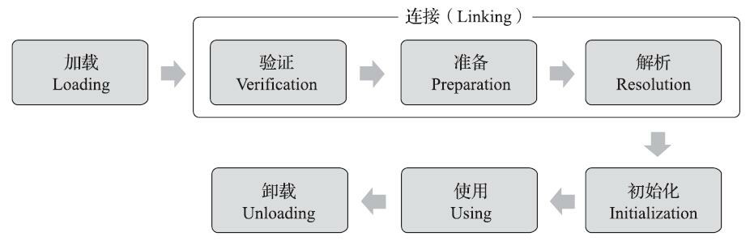
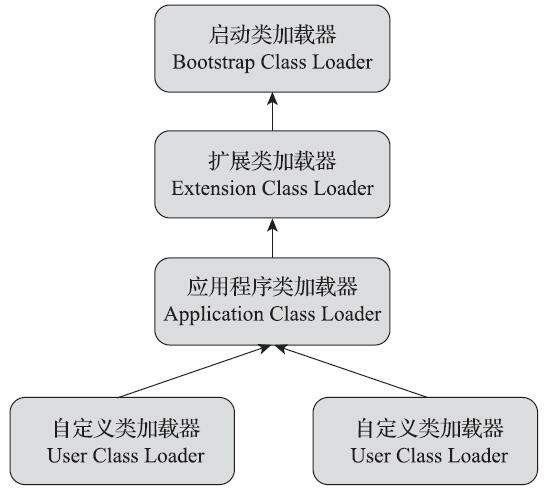
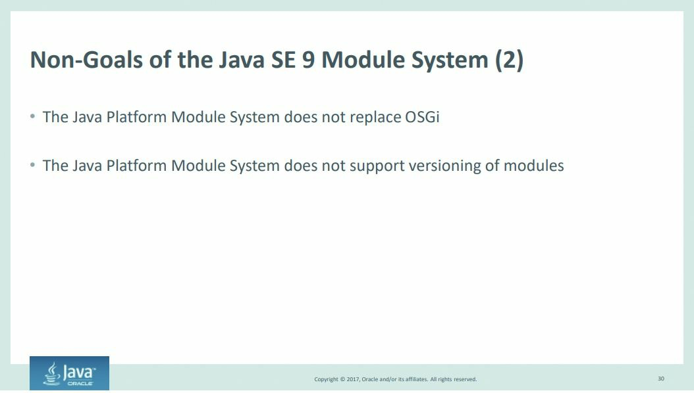
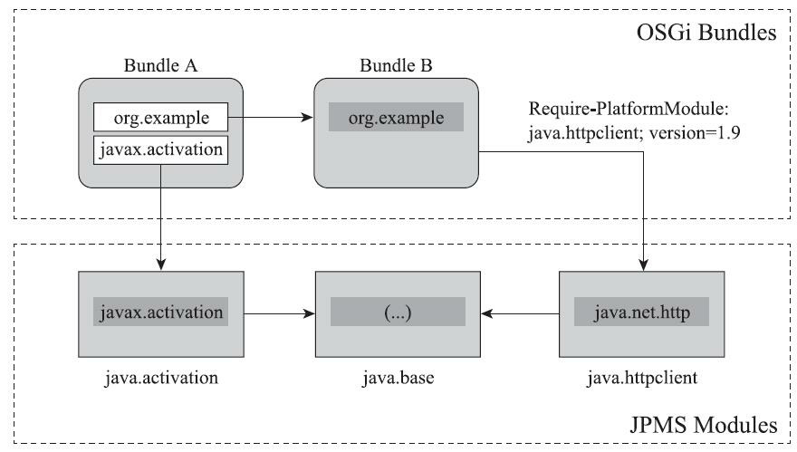
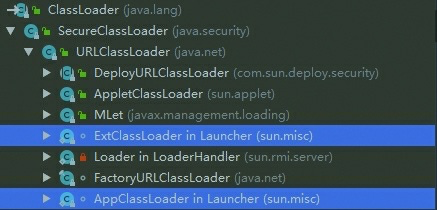
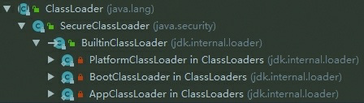
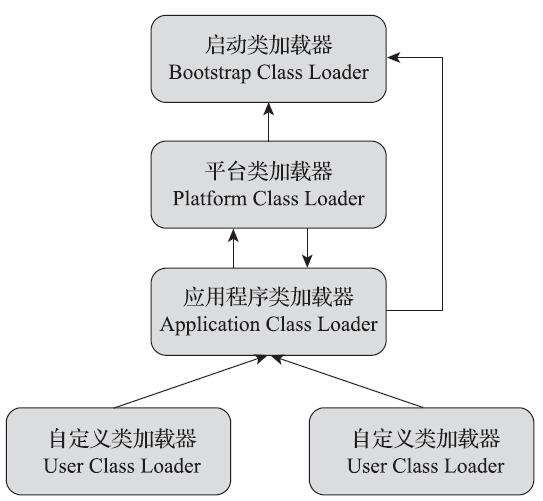

# 第7章 虚拟机类加载机制

代码编译的结果从本地机器码转变为字节码，是存储格式发展的一小步，却是编程语言发展的一大步。

## 7.1 概述

上一章我们学习了Class文件存储格式的具体细节，在Class文件中描述的各类信息，最终都需要加 到虚拟机中之后才能被运行和使用。而虚拟机如何加载这些Class文件，Class文件中的信息进入到虚拟机后会发生什么变化，这些都是本章将要讲解的内容。

**Java虚拟机把描述类的数据从Class文件加载到内存，并对数据进行校验、转换解析和初始化，最终形成可以被虚拟机直接使用的Java类型，这个过程被称作虚拟机的类加载机制。**与那些在编译时需要进行连接的语言不同，在Java语言里面，类型的加载、连接和初始化过程都是在程序运行期间完成的，这种策略让Java语言进行提前编译会面临额外的困难，也会让类加载时稍微增加一些性能开销，但是却为Java应用提供了极高的扩展性和灵活性，Java天生可以动态扩展的语言特性就是依赖运行期动态加载和动态连接这个特点实现的。例如，编写一个面向接口的应用程序，可以等到运行时再指定其实际的实现类，用户可以通过Java预置的或自定义类加载器，让某个本地的应用程序在运行时从网络或其他地方上加载一个二进制流作为其程序代码的一部分。这种动态组装应用的方式目前已广泛应用于Java程序之中，从最基础的Applet、JSP到相对复杂的OSGi技术，都依赖着Java语言运行期类加载才得以诞生。

为了避免语言表达中可能产生的偏差，在正式开始本章以前，笔者先设立两个语言上的约定：

第一，在实际情况中，每个Class文件都有代表着Java语言中的一个类或接口的可能，后文中直接对“类型”的描述都同时蕴含着类和接口的可能性，而需要对类和接口分开描述的场景，笔者会特别指明；

第二，与前面介绍Class文件格式时的约定一致，本章所提到的“Class文件”也并非特指某个存在于具体磁盘中的文件，而应当是一串二进制字节流，无论其以何种形式存在，包括但不限于磁盘文件、 网络、数据库、内存或者动态产生等。

## 7.2 类加载的时机

一个类型从被加载到虚拟机内存中开始，到卸载出内存为止，它的整个生命周期将会经历**加载（`Loading`）**、**验证（`Verification`）**、**准备（`Preparation`）**、**解析（`Resolution`）**、**初始化（`Initialization`）**、**使用（`Using`）**和**卸载（`Unloading`）**七个阶段，其中验证、准备、解析三个部分统称为**连接（`Linking`）**。这七个阶段的发生顺序如图7-1所示。



图7-1中，加载、验证、准备、初始化和卸载这五个阶段的顺序是确定的，类型的加载过程必须按照这种顺序按部就班地开始，而解析阶段则不一定：它在某些情况下可以在初始化阶段之后再开始，这是为了支持Java语言的运行时绑定特性（也称为动态绑定或晚期绑定）。请注意，这里笔者写的是按部就班地“开始”，而不是按部就班地“进行”或按部就班地“完成”，强调这点是因为这些阶段通常都是互相交叉地混合进行的，会在一个阶段执行的过程中调用、激活另一个阶段。

关于在什么情况下需要开始类加载过程的第一个阶段“加载”，《Java虚拟机规范》中并没有进行强制约束，这点可以交给虚拟机的具体实现来自由把握。但是对于初始化阶段，《Java虚拟机规范》 则是严格规定了有且只有六种情况必须立即对类进行“初始化”（而加载、验证、准备自然需要在此之前开始）：

1. 遇到`new`、`getstatic`、`putstatic`或`invokestatic`这四条字节码指令时，如果类型没有进行过初始化，则需要先触发其初始化阶段。能够生成这四条指令的典型Java代码场景有：
   * 使用`new`关键字实例化对象的时候。
   * 读取或设置一个类型的静态字段（被final修饰、已在编译期把结果放入常量池的静态字段除外）的时候。
   * 调用一个类型的静态方法的时候。

2. 使用`java.lang.reflect`包的方法对类型进行反射调用的时候，如果类型没有进行过初始化，则需要先触发其初始化。

3. 当初始化类的时候，如果发现其父类还没有进行过初始化，则需要先触发其父类的初始化。

4. 当虚拟机启动时，用户需要指定一个要执行的主类（包含`main()`方法的那个类），虚拟机会先初始化这个主类。

5. 当使用JDK 7新加入的动态语言支持时，如果一个`java.lang.invoke.MethodHandle`实例最后的解析结果为`REF_getStatic`、`REF_putStatic`、`REF_invokeStatic`、`REF_newInvokeSpecial`四种类型的方法句柄，并且这个方法句柄对应的类没有进行过初始化，则需要先触发其初始化。

6. 当一个接口中定义了JDK 8新加入的默认方法（被`default`关键字修饰的接口方法）时，如果有这个接口的实现类发生了初始化，那该接口要在其之前被初始化。

对于这六种会触发类型进行初始化的场景，《Java虚拟机规范》中使用了一个非常强烈的限定语 ——“有且只有”，这六种场景中的行为称为对一个类型进行主动引用。除此之外，所有引用类型的方式都不会触发初始化，称为被动引用。下面举三个例子来说明何为被动引用，分别见代码清单7-1、代 码清单7-2和代码清单7-3。

* 代码清单7-1　被动引用的例子之一

```java
package org.fenixsoft.classloading;

/**
 * 被动使用类字段演示一：
 * 通过子类引用父类的静态字段，不会导致子类初始化
 **/
public class SuperClass {
    static {
 	System.out.println("SuperClass init!"); 
    }
    public static int value = 123;
}

public class SubClass extends SuperClass {
    static {
        System.out.println("SubClass init!"); 
    }
}

/**
 * 非主动使用类字段演示
 **/
public class NotInitialization {
    public static void main(String[] args) {
 	System.out.println(SubClass.value);
    }
}
```

上述代码运行之后，只会输出“`SuperClass init！`”，而不会输出“`SubClass init！`”。对于静态字段， 只有直接定义这个字段的类才会被初始化，因此通过其子类来引用父类中定义的静态字段，只会触发父类的初始化而不会触发子类的初始化。至于是否要触发子类的加载和验证阶段，在《Java虚拟机规 范》中并未明确规定，所以这点取决于虚拟机的具体实现。对于HotSpot虚拟机来说，可通过`-XX：+TraceClassLoading`参数观察到此操作是会导致子类加载的。

* 代码清单7-2　被动引用的例子之二

```java
package org.fenixsoft.classloading;

/**
 * 被动使用类字段演示二：
 * 通过数组定义来引用类，不会触发此类的初始化
 **/
public class NotInitialization {
    public static void main(String[] args) {
        SuperClass[] sca = new SuperClass[10];
    }
}
```

 为了节省版面，这段代码复用了代码清单7-1中的SuperClass，运行之后发现没有输出“`SuperClass init！`”，说明并没有触发类`org.fenixsoft.classloading.SuperClass`的初始化阶段。但是这段代码里面触发了另一个名为“`[Lorg.fenixsoft.classloading.SuperClass`”的类的初始化阶段，对于用户代码来说，这并不是一个合法的类型名称，它是一个由虚拟机自动生成的、直接继承于java.lang.Object的子类，创建动作由字节码指令`newarray`触发。

这个类代表了一个元素类型为`org.fenixsoft.classloading.SuperClass`的一维数组，数组中应有的属性和方法（用户可直接使用的只有被修饰为`public`的`length`属性和`clone()`方法）都实现在这个类里。Java语言中对数组的访问要比C/C++相对安全，很大程度上就是因为这个类包装了数组元素的访问[^array]，而C/C++中则是直接翻译为对数组指针的移动。在Java语言里，当检查到发生数组越界时会抛出`java.lang.ArrayIndexOutOfBoundsException`异常，避免了直接造成非法内存访问。

* 代码清单7-3　被动引用的例子之三

```java
package org.fenixsoft.classloading;

/**
 * 被动使用类字段演示三：
 * 常量在编译阶段会存入调用类的常量池中，本质上没有直接引用到定义常量的类，因此不会触发定义常量的
 类的初始化
 **/
public class ConstClass {
    static {
        System.out.println("ConstClass init!"); 
    }
    public static final String HELLOWORLD = "hello world";
}

/**
 * 非主动使用类字段演示
 **/
public class NotInitialization {
    public static void main(String[] args) {
        System.out.println(ConstClass.HELLOWORLD); 
    }
}
```

上述代码运行之后，也没有输出“`ConstClass init！`”，这是因为虽然在Java源码中确实引用了`ConstClass`类的常量`HELLOWORLD`，但其实在编译阶段通过常量传播优化，已经将此常量的值“`hello world`”直接存储在`NotInitialization`类的常量池中，以后`NotInitialization`对常量`ConstClass.HELLOWORLD`的引用，实际都被转化为`NotInitialization`类对自身常量池的引用了。也就是说，实际上`NotInitialization`的Class文件之中并没有`ConstClass`类的符号引用入口，这两个类在编译成Class文件后就已不存在任何联系了。

接口的加载过程与类加载过程稍有不同，针对接口需要做一些特殊说明：接口也有初始化过程，这点与类是一致的，上面的代码都是用静态语句块“`static{}`”来输出初始化信息的，而接口中不能使用“`static{}`”语句块，但编译器仍然会为接口生成“`<clinit>()`”类构造器[^clinit]，用于初始化接口中所定义的成员变量。接口与类真正有所区别的是前面讲述的六种“有且仅有”需要触发初始化场景中的第三种：当一个类在初始化时，要求其父类全部都已经初始化过了，但是一个接口在初始化时，并不要求其父接口全部都完成了初始化，只有在真正使用到父接口的时候（如引用接口中定义的常量）才会初始化。

[^array]: 准确地说，越界检查不是封装在数组元素访问的类中，而是封装在数组访问的`xaload`、`xastore`字节码指令中。
[^clinit]: 关于类构造器`＜clinit＞()`和方法构造器`＜init＞()`的生成过程和作用，可参见第10章的相关内容。

## 7.3 类加载的过程

接下来我们会详细了解Java虚拟机中类加载的全过程，即加载、验证、准备、解析和初始化这五个阶段所执行的具体动作。

### 7.3.1 加载

“加载”（Loading）阶段是整个“类加载”（Class Loading）过程中的一个阶段，希望读者没有混淆这两个看起来很相似的名词。在加载阶段，Java虚拟机需要完成以下三件事情：

1. 通过一个类的全限定名来获取定义此类的二进制字节流。

2. 将这个字节流所代表的静态存储结构转化为方法区的运行时数据结构。

3. 在内存中生成一个代表这个类的`java.lang.Class`对象，作为方法区这个类的各种数据的访问入口。

《Java虚拟机规范》对这三点要求其实并不是特别具体，留给虚拟机实现与Java应用的灵活度都是相当大的。例如“通过一个类的全限定名来获取定义此类的二进制字节流”这条规则，它并没有指明二进制字节流必须得从某个Class文件中获取，确切地说是根本没有指明要从哪里获取、如何获取。仅仅这一点空隙，Java虚拟机的使用者们就可以在加载阶段搭构建出一个相当开放广阔的舞台，Java发展历程中，充满创造力的开发人员则在这个舞台上玩出了各种花样，许多举足轻重的Java技术都建立在这一基础之上，例如：

* 从ZIP压缩包中读取，这很常见，最终成为日后JAR、EAR、WAR格式的基础。

* 从网络中获取，这种场景最典型的应用就是Web Applet。

* 运行时计算生成，这种场景使用得最多的就是动态代理技术，在`java.lang.reflect.Proxy`中，就是用了`ProxyGenerator.generateProxyClass()`来为特定接口生成形式为“`*$Proxy`”的代理类的二进制字节流。

* 由其他文件生成，典型场景是JSP应用，由JSP文件生成对应的Class文件。

* 从数据库中读取，这种场景相对少见些，例如有些中间件服务器（如SAP Netweaver）可以选择把程序安装到数据库中来完成程序代码在集群间的分发。

* 可以从加密文件中获取，这是典型的防Class文件被反编译的保护措施，通过加载时解密Class文件来保障程序运行逻辑不被窥探。

……

相对于类加载过程的其他阶段，非数组类型的加载阶段（准确地说，是加载阶段中获取类的二进制字节流的动作）是开发人员可控性最强的阶段。加载阶段既可以使用Java虚拟机里内置的引导类加载器来完成，也可以由用户自定义的类加载器去完成，开发人员通过定义自己的类加载器去控制字节流的获取方式（重写一个类加载器的`findClass()`或`loadClass()`方法），实现根据自己的想法来赋予应用 程序获取运行代码的动态性。

对于数组类而言，情况就有所不同，数组类本身不通过类加载器创建，它是由Java虚拟机直接在内存中动态构造出来的。但数组类与类加载器仍然有很密切的关系，因为数组类的元素类型（Element Type，指的是数组去掉所有维度的类型）最终还是要靠类加载器来完成加载，一个数组类（下面简称为C）创建过程遵循以下规则：

* 如果数组的组件类型（Component Type，指的是数组去掉一个维度的类型，注意和前面的元素类型区分开来）是引用类型，那就递归采用本节中定义的加载过程去加载这个组件类型，数组C将被标识在加载该组件类型的类加载器的类名称空间上（这点很重要，在7.4节会介绍，一个类型必须与类加载器一起确定唯一性）。

* 如果数组的组件类型不是引用类型（例如int[]数组的组件类型为int），Java虚拟机将会把数组C标记为与引导类加载器关联。

* 数组类的可访问性与它的组件类型的可访问性一致，如果组件类型不是引用类型，它的数组类的可访问性将默认为public，可被所有的类和接口访问到。

加载阶段结束后，Java虚拟机外部的二进制字节流就按照虚拟机所设定的格式存储在方法区之中了，方法区中的数据存储格式完全由虚拟机实现自行定义，《Java虚拟机规范》未规定此区域的具体数据结构。类型数据妥善安置在方法区之后，会在Java堆内存中实例化一个`java.lang.Class`类的对象， 这个对象将作为程序访问方法区中的类型数据的外部接口。

加载阶段与连接阶段的部分动作（如一部分字节码文件格式验证动作）是交叉进行的，加载阶段尚未完成，连接阶段可能已经开始，但这些夹在加载阶段之中进行的动作，仍然属于连接阶段的一部分，这两个阶段的开始时间仍然保持着固定的先后顺序。

### 7.3.2 验证

验证是连接阶段的第一步，这一阶段的目的是确保Class文件的字节流中包含的信息符合《Java虚拟机规范》的全部约束要求，保证这些信息被当作代码运行后不会危害虚拟机自身的安全。

Java语言本身是相对安全的编程语言（起码对于C/C++来说是相对安全的），使用纯粹的Java代码无法做到诸如访问数组边界以外的数据、将一个对象转型为它并未实现的类型、跳转到不存在的代码行之类的事情，如果尝试这样去做了，编译器会毫不留情地抛出异常、拒绝编译。但前面也曾说过，Class文件并不一定只能由Java源码编译而来，它可以使用包括靠键盘0和1直接在二进制编辑器中敲出Class文件在内的任何途径产生。上述Java代码无法做到的事情在字节码层面上都是可以实现的，至少语义上是可以表达出来的。Java虚拟机如果不检查输入的字节流，对其完全信任的话，很可能会因为载入了有错误或有恶意企图的字节码流而导致整个系统受攻击甚至崩溃，所以验证字节码是Java虚拟机保护自身的一项必要措施。

验证阶段是非常重要的，这个阶段是否严谨，直接决定了Java虚拟机是否能承受恶意代码的攻击，从代码量和耗费的执行性能的角度上讲，验证阶段的工作量在虚拟机的类加载过程中占了相当大的比重。但是《Java虚拟机规范》的早期版本（第1、2版）对这个阶段的检验指导是相当模糊和笼统的，规范中仅列举了一些对Class文件格式的静态和结构化的约束，要求虚拟机验证到输入的字节流如不符合Class文件格式的约束，就应当抛出一个`java.lang.VerifyError`异常或其子类异常，但具体应当检查哪些内容、如何检查、何时进行检查等，都没有足够具体的要求和明确的说明。直到2011年《Java虚拟机规范（Java SE 7版）》出版，规范中大幅增加了验证过程的描述（篇幅从不到10页增加到130 页），这时验证阶段的约束和验证规则才变得具体起来。受篇幅所限，本书中无法逐条规则去讲解，但从整体上看，验证阶段大致上会完成下面四个阶段的检验动作：文件格式验证、元数据验证、字节 码验证和符号引用验证。

1. 文件格式验证

第一阶段要验证字节流是否符合Class文件格式的规范，并且能被当前版本的虚拟机处理。这一阶段可能包括下面这些验证点：

* 是否以魔数0xCAFEBABE开头。

* 主、次版本号是否在当前Java虚拟机接受范围之内。

* 常量池的常量中是否有不被支持的常量类型（检查常量tag标志）。

* 指向常量的各种索引值中是否有指向不存在的常量或不符合类型的常量。

* `CONSTANT_Utf8_info`型的常量中是否有不符合UTF-8编码的数据。

* Class文件中各个部分及文件本身是否有被删除的或附加的其他信息。

……

实际上第一阶段的验证点还远不止这些，上面所列的只是从HotSpot虚拟机源码[1]中摘抄的一小部分内容，该验证阶段的主要目的是保证输入的字节流能正确地解析并存储于方法区之内，格式上符合描述一个Java类型信息的要求。这阶段的验证是基于二进制字节流进行的，只有通过了这个阶段的验证之后，这段字节流才被允许进入Java虚拟机内存的方法区中进行存储，所以后面的三个验证阶段全部是基于方法区的存储结构上进行的，不会再直接读取、操作字节流了。

2. 元数据验证

第二阶段是对字节码描述的信息进行语义分析，以保证其描述的信息符合《Java语言规范》的要求，这个阶段可能包括的验证点如下：

* 这个类是否有父类（除了`java.lang.Object`之外，所有的类都应当有父类）。

* 这个类的父类是否继承了不允许被继承的类（被`final`修饰的类）。

* 如果这个类不是抽象类，是否实现了其父类或接口之中要求实现的所有方法。

* 类中的字段、方法是否与父类产生矛盾（例如覆盖了父类的`final`字段，或者出现不符合规则的方法重载，例如方法参数都一致，但返回值类型却不同等）。

……

第二阶段的主要目的是对类的元数据信息进行语义校验，保证不存在与《Java语言规范》定义相悖的元数据信息。

3. 字节码验证

第三阶段是整个验证过程中最复杂的一个阶段，主要目的是通过数据流分析和控制流分析，确定程序语义是合法的、符合逻辑的。在第二阶段对元数据信息中的数据类型校验完毕以后，这阶段就要对类的方法体（Class文件中的Code属性）进行校验分析，保证被校验类的方法在运行时不会做出危害虚拟机安全的行为，例如：

* 保证任意时刻操作数栈的数据类型与指令代码序列都能配合工作，例如不会出现类似于“在操作栈放置了一个int类型的数据，使用时却按long类型来加载入本地变量表中”这样的情况。

* 保证任何跳转指令都不会跳转到方法体以外的字节码指令上。

* 保证方法体中的类型转换总是有效的，例如可以把一个子类对象赋值给父类数据类型，这是安全的，但是把父类对象赋值给子类数据类型，甚至把对象赋值给与它毫无继承关系、完全不相干的一个数据类型，则是危险和不合法的。

……

如果一个类型中有方法体的字节码没有通过字节码验证，那它肯定是有问题的；但如果一个方法体通过了字节码验证，也仍然不能保证它一定就是安全的。即使字节码验证阶段中进行了再大量、再严密的检查，也依然不能保证这一点。这里涉及了离散数学中一个很著名的问题——**“停机问题”（`Halting Problem`）**[^Halting Problem]，即不能通过程序准确地检查出程序是否能在有限的时间之内结束运行。在我们讨论字节码校验的上下文语境里，通俗一点的解释是通过程序去校验程序逻辑是无法做到绝对准确的，不可能用程序来准确判定一段程序是否存在Bug。

由于数据流分析和控制流分析的高度复杂性，Java虚拟机的设计团队为了避免过多的执行时间消耗在字节码验证阶段中，在JDK 6之后的Javac编译器和Java虚拟机里进行了一项联合优化，把尽可能多的校验辅助措施挪到Javac编译器里进行。具体做法是给方法体Code属性的属性表中新增加了一项名 为“`StackMapTable`”的新属性，这项属性描述了方法体所有的**基本块（`Basic Block`，指按照控制流拆分 的代码块）**开始时本地变量表和操作栈应有的状态，在字节码验证期间，Java虚拟机就不需要根据程序推导这些状态的合法性，只需要检查`StackMapTable`属性中的记录是否合法即可。这样就将字节码验证的类型推导转变为类型检查，从而节省了大量校验时间。理论上`StackMapTable`属性也存在错误或被篡改的可能，所以是否有可能在恶意篡改了Code属性的同时，也生成相应的`StackMapTable`属性来骗过虚拟机的类型校验，则是虚拟机设计者们需要仔细思考的问题。

JDK 6的HotSpot虚拟机中提供了`-XX：-UseSplitVerifier`选项来关闭掉这项优化，或者使用参数`-XX：+FailOverToOldVerifier`要求在类型校验失败的时候退回到旧的类型推导方式进行校验。而到了JDK 7之后，尽管虚拟机中仍然保留着类型推导验证器的代码，但是对于主版本号大于50（对应JDK 6）的Class文件，使用类型检查来完成数据流分析校验则是唯一的选择，不允许再退回到原来的类型推导的校验方式。

4. 符号引用验证

最后一个阶段的校验行为发生在虚拟机将符号引用转化为直接引用[3]的时候，这个转化动作将在连接的第三阶段——解析阶段中发生。符号引用验证可以看作是对类自身以外（常量池中的各种符号引用）的各类信息进行匹配性校验，通俗来说就是，该类是否缺少或者被禁止访问它依赖的某些外部类、方法、字段等资源。本阶段通常需要校验下列内容：

* 符号引用中通过字符串描述的全限定名是否能找到对应的类。

* 在指定类中是否存在符合方法的字段描述符及简单名称所描述的方法和字段。

* 符号引用中的类、字段、方法的可访问性（`private`、`protected`、`public`、`<package>`）是否可被当前类访问。

……

符号引用验证的主要目的是确保解析行为能正常执行，如果无法通过符号引用验证，Java虚拟机将会抛出一个`java.lang.IncompatibleClassChangeError`的子类异常，典型的如：`java.lang.IllegalAccessError`、`java.lang.NoSuchFieldError`、`java.lang.NoSuchMethodError`等。

验证阶段对于虚拟机的类加载机制来说，是一个非常重要的、但却不是必须要执行的阶段，因为验证阶段只有通过或者不通过的差别，只要通过了验证，其后就对程序运行期没有任何影响了。如果程序运行的全部代码（包括自己编写的、第三方包中的、从外部加载的、动态生成的等所有代码）都已经被反复使用和验证过，在生产环境的实施阶段就可以考虑使用`-Xverify：none`参数来关闭大部分的 类验证措施，以缩短虚拟机类加载的时间。

[1] JDK 12源码中的位置：src\hotspot\share\classfile\classFileParser.cpp。

[^Halting Problem]: 停机问题就是判断任意一个程序是否会在有限的时间之内结束运行的问题。如果这个问题可以在有 限的时间之内解决，可以有一个程序判断其本身是否会停机并做出相反的行为。这时候显然不管停机 问题的结果是什么都不会符合要求，所以这是一个不可解的问题。具体的证明过程可参考链接http://zh.wikipedia.org/zh/停机问题。

[3] 关于符号引用和直接引用的具体解释，见7.3.4节。

### 7.3.3 准备

准备阶段是正式为类中定义的变量（即静态变量，被static修饰的变量）分配内存并设置类变量初始值的阶段，从概念上讲，这些变量所使用的内存都应当在方法区中进行分配，但必须注意到方法区本身是一个逻辑上的区域，在JDK 7及之前，HotSpot使用永久代来实现方法区时，实现是完全符合这种逻辑概念的；而在JDK 8及之后，类变量则会随着Class对象一起存放在Java堆中，这时候“类变量在方法区”就完全是一种对逻辑概念的表述了，关于这部分内容，笔者已在4.3.1节介绍并且验证过。

关于准备阶段，还有两个容易产生混淆的概念笔者需要着重强调，首先是这时候进行内存分配的仅包括类变量，而不包括实例变量，实例变量将会在对象实例化时随着对象一起分配在Java堆中。其次是这里所说的初始值“通常情况”下是数据类型的零值，假设一个类变量的定义为：

```java
public static int value = 123;
```

那变量value在准备阶段过后的初始值为0而不是123，因为这时尚未开始执行任何Java方法，而把`value`赋值为`123`的`putstatic`指令是程序被编译后，存放于类构造器`<clinit>()`方法之中，所以把`value`赋值为`123`的动作要到类的初始化阶段才会被执行。表7-1列出了Java中所有基本数据类型的零值。

| 数据类型  |   零值   |
| :-------: | :------: |
|    int    |    0     |
|   long    |    0L    |
|   short   | (short)0 |
|   char    | '\u0000' |
|   byte    | (byte)0  |
|  boolean  |  false   |
|   float   |   0.0f   |
|  double   |   0.0d   |
| Reference |   Null   |

 上面提到在“通常情况”下初始值是零值，那言外之意是相对的会有某些“特殊情况”：如果类字段的字段属性表中存在`ConstantValue`属性，那在准备阶段变量值就会被初始化为`ConstantValue`属性所指定的初始值，假设上面类变量`value`的定义修改为：

```java
public static final int value = 123;
```

编译时Javac将会为value生成`ConstantValue`属性，在准备阶段虚拟机就会根据`Con-stantValue`的设置将value赋值为123。

### 7.3.4 解析

解析阶段是Java虚拟机将常量池内的符号引用替换为直接引用的过程，符号引用在第6章讲解Class文件格式的时候已经出现过多次，在Class文件中它以`CONSTANT_Class_info`、`CONSTANT_Fieldref_info`、`CONSTANT_Methodref_info`等类型的常量出现，那解析阶段中所说的直接引用与符号引用又有什么关联呢？

* **符号引用（`Symbolic References`）**：符号引用以一组符号来描述所引用的目标，符号可以是任何形式的字面量，只要使用时能无歧义地定位到目标即可。符号引用与虚拟机实现的内存布局无关，引用的目标并不一定是已经加载到虚拟机内存当中的内容。各种虚拟机实现的内存布局可以各不相同，但是它们能接受的符号引用必须都是一致的，因为符号引用的字面量形式明确定义在《Java虚拟机规 范》的Class文件格式中。

* **直接引用（`Direct References`）**：直接引用是可以直接指向目标的指针、相对偏移量或者是一个能间接定位到目标的句柄。直接引用是和虚拟机实现的内存布局直接相关的，同一个符号引用在不同虚拟机实例上翻译出来的直接引用一般不会相同。如果有了直接引用，那引用的目标必定已经在虚拟机的内存中存在。

《Java虚拟机规范》之中并未规定解析阶段发生的具体时间，只要求了在执行`ane-warray`、`checkcast`、`getfield`、`getstatic`、`instanceof`、`invokedynamic`、`invokeinterface`、`invoke-special`、`invokestatic`、`invokevirtual`、`ldc`、`ldc_w`、`ldc2_w`、`multianewarray`、`new`、`putfield`、和`putstatic`这17个用于操作符号引用的字节码指令之前，先对它们所使用的符号引用进行解析。所以虚拟机实现可以根据需要来自行判断，到底是在类被加载器加载时就对常量池中的符号引用进行解析，还是等到一个符号引用将要被使用前才去解析它。

类似地，对方法或者字段的访问，也会在解析阶段中对它们的可访问性（`public`、`protected`、 `private`、`<package>`）进行检查，至于其中的约束规则已经是Java语言的基本常识，笔者就不再赘述 了。

对同一个符号引用进行多次解析请求是很常见的事情，除`invokedynamic`指令以外，虚拟机实现可以对第一次解析的结果进行缓存，譬如在运行时直接引用常量池中的记录，并把常量标识为已解析状态，从而避免解析动作重复进行。无论是否真正执行了多次解析动作，Java虚拟机都需要保证的是在同一个实体中，如果一个符号引用之前已经被成功解析过，那么后续的引用解析请求就应当一直能够成功；同样地，如果第一次解析失败了，其他指令对这个符号的解析请求也应该收到相同的异常，哪怕这个请求的符号在后来已成功加载进Java虚拟机内存之中。

不过对于`invokedynamic`指令，上面的规则就不成立了。当碰到某个前面已经由`invokedynamic`指令触发过解析的符号引用时，并不意味着这个解析结果对于其他`invokedynamic`指令也同样生效。因为`invokedynamic`指令的目的本来就是用于动态语言支持[1]，它对应的引用称为**“动态调用点限定符 （`Dynamically-Computed Call Site Specifier`）”**，这里“动态”的含义是指必须等到程序实际运行到这条指令时，解析动作才能进行。相对地，其余可触发解析的指令都是“静态”的，可以在刚刚完成加载阶段，还没有开始执行代码时就提前进行解析。

解析动作主要针对类或接口、字段、类方法、接口方法、方法类型、方法句柄和调用点限定符这7类符号引用进行，分别对应于常量池的`CONSTANT_Class_info`、`CON-STANT_Fieldref_info`、`CONSTANT_Methodref_info`、`CONSTANT_InterfaceMethodref_info`、`CONSTANT_MethodType_info`、`CONSTANT_MethodHandle_info`、`CONSTANT_Dyna-mic_info`和`CONSTANT_InvokeDynamic_info` 8种常量类型[2]。下面笔者将讲解前4种引用的解析过程，对于后4 种，它们都和动态语言支持密切相关，由于Java语言本身是一门静态类型语言，在没有讲解清楚`invokedynamic`指令的语意之前，我们很难将它们直观地和现在的Java语言语法对应上，因此笔者将延后到第8章介绍动态语言调用时一起分析讲解。

**1. 类或接口的解析**

假设当前代码所处的类为D，如果要把一个从未解析过的符号引用N解析为一个类或接口C的直接引用，那虚拟机完成整个解析的过程需要包括以下3个步骤：

	1. 如果C不是一个数组类型，那虚拟机将会把代表N的全限定名传递给D的类加载器去加载这个类C。在加载过程中，由于元数据验证、字节码验证的需要，又可能触发其他相关类的加载动作，例如加载这个类的父类或实现的接口。一旦这个加载过程出现了任何异常，解析过程就将宣告失败。
 	2. 如果C是一个数组类型，并且数组的元素类型为对象，也就是N的描述符会是类似“`[Ljava/lang/Integer`”的形式，那将会按照第一点的规则加载数组元素类型。如果N的描述符如前面所假设的形式，需要加载的元素类型就是“`java.lang.Integer`”，接着由虚拟机生成一个代表该数组维度和元素的数组对象。
 	3. 如果上面两步没有出现任何异常，那么C在虚拟机中实际上已经成为一个有效的类或接口了，但在解析完成前还要进行符号引用验证，确认D是否具备对C的访问权限。如果发现不具备访问权限， 将抛出`java.lang.IllegalAccessError`异常。

针对上面第3点访问权限验证，在JDK 9引入了模块化以后，一个`public`类型也不再意味着程序任何位置都有它的访问权限，我们还必须检查模块间的访问权限。

如果我们说一个D拥有C的访问权限，那就意味着以下3条规则中至少有其中一条成立：

* 被访问类C是`public`的，并且与访问类D处于同一个模块。

* 被访问类C是`public`的，不与访问类D处于同一个模块，但是被访问类C的模块允许被访问类D的模块进行访问。

* 被访问类C不是`public`的，但是它与访问类D处于同一个包中。

在后续涉及可访问性时，都必须考虑模块间访问权限隔离的约束，即以上列举的3条规则，这些内容在后面就不再复述了。

**2. 字段解析**

要解析一个未被解析过的字段符号引用，首先将会对字段表内`class_index[3]`项中索引的`CONSTANT_Class_info`符号引用进行解析，也就是字段所属的类或接口的符号引用。如果在解析这个类或接口符号引用的过程中出现了任何异常，都会导致字段符号引用解析的失败。如果解析成功完成，那把这个字段所属的类或接口用C表示，《Java虚拟机规范》要求按照如下步骤对C进行后续字段的搜索：

1. 如果C本身就包含了简单名称和字段描述符都与目标相匹配的字段，则返回这个字段的直接引用，查找结束。

2. 否则，如果在C中实现了接口，将会按照继承关系从下往上递归搜索各个接口和它的父接口，如果接口中包含了简单名称和字段描述符都与目标相匹配的字段，则返回这个字段的直接引用，查找结束。

3. 否则，如果C不是`java.lang.Object`的话，将会按照继承关系从下往上递归搜索其父类，如果在父类中包含了简单名称和字段描述符都与目标相匹配的字段，则返回这个字段的直接引用，查找结束。

4. 否则，查找失败，抛出`java.lang.NoSuchFieldError`异常。

如果查找过程成功返回了引用，将会对这个字段进行权限验证，如果发现不具备对字段的访问权限，将抛出`java.lang.IllegalAccessError`异常。

以上解析规则能够确保Java虚拟机获得字段唯一的解析结果，但在实际情况中，Javac编译器往往会采取比上述规范更加严格一些的约束，譬如有一个同名字段同时出现在某个类的接口和父类当中， 或者同时在自己或父类的多个接口中出现，按照解析规则仍是可以确定唯一的访问字段，但Javac编译器就可能直接拒绝其编译为Class文件。在代码清单7-4中演示了这种情况，如果注释了Sub类中的“`public static int A=4；`”，接口与父类同时存在字段A，那Oracle公司实现的Javac编译器将提示“`The field Sub.A is ambiguous`”，并且会拒绝编译这段代码。

* 代码清单7-4　字段解析

```java
package org.fenixsoft.classloading;

public class FieldResolution {
    interface Interface0 {
        int A = 0;
    }

    interface Interface1 extends Interface0 {
        int A = 1;
    }

    interface Interface2 {
        int A = 2;
    }

    static class Parent implements Interface1 {
        public static int A = 3;
    }

    static class Sub extends Parent implements Interface2 {
        public static int A = 4;
    }

    public static void main(String[] args) {
        System.out.println(Sub.A);
    }
}
```

**3. 方法解析**

方法解析的第一个步骤与字段解析一样，也是需要先解析出方法表的`class_index[4]`项中索引的方法所属的类或接口的符号引用，如果解析成功，那么我们依然用C表示这个类，接下来虚拟机将会按照如下步骤进行后续的方法搜索：

1. 由于Class文件格式中类的方法和接口的方法符号引用的常量类型定义是分开的，如果在类的方法表中发现`class_index`中索引的C是个接口的话，那就直接抛出`java.lang.IncompatibleClassChangeError`异常。

2. 如果通过了第一步，在类C中查找是否有简单名称和描述符都与目标相匹配的方法，如果有则返回这个方法的直接引用，查找结束。

3. 否则，在类C的父类中递归查找是否有简单名称和描述符都与目标相匹配的方法，如果有则返回这个方法的直接引用，查找结束。

4. 否则，在类C实现的接口列表及它们的父接口之中递归查找是否有简单名称和描述符都与目标相匹配的方法，如果存在匹配的方法，说明类C是一个抽象类，这时候查找结束，抛出`java.lang.AbstractMethodError`异常。

5. 否则，宣告方法查找失败，抛出`java.lang.NoSuchMethodError`。

最后，如果查找过程成功返回了直接引用，将会对这个方法进行权限验证，如果发现不具备对此方法的访问权限，将抛出`java.lang.IllegalAccessError`异常。

**4. 接口方法解析**

接口方法也是需要先解析出接口方法表的`class_index[5]`项中索引的方法所属的类或接口的符号引用，如果解析成功，依然用C表示这个接口，接下来虚拟机将会按照如下步骤进行后续的接口方法搜索：

1. 与类的方法解析相反，如果在接口方法表中发现`class_index`中的索引C是个类而不是接口，那么就直接抛出`java.lang.IncompatibleClassChangeError`异常。

2. 否则，在接口C中查找是否有简单名称和描述符都与目标相匹配的方法，如果有则返回这个方法的直接引用，查找结束。

3. 否则，在接口C的父接口中递归查找，直到`java.lang.Object`类（接口方法的查找范围也会包括`Object`类中的方法）为止，看是否有简单名称和描述符都与目标相匹配的方法，如果有则返回这个方法的直接引用，查找结束。

4. 对于规则3，由于Java的接口允许多重继承，如果C的不同父接口中存有多个简单名称和描述符都与目标相匹配的方法，那将会从这多个方法中返回其中一个并结束查找，《Java虚拟机规范》中并没有进一步规则约束应该返回哪一个接口方法。但与之前字段查找类似地，不同发行商实现的Javac编译器有可能会按照更严格的约束拒绝编译这种代码来避免不确定性。

5. 否则，宣告方法查找失败，抛出`java.lang.NoSuchMethodError`异常。

在JDK 9之前，Java接口中的所有方法都默认是`public`的，也没有模块化的访问约束，所以不存在访问权限的问题，接口方法的符号解析就不可能抛出`java.lang.IllegalAccessError`异常。但在JDK 9中增加了接口的静态私有方法，也有了模块化的访问约束，所以从JDK 9起，接口方法的访问也完全有可能因访问权限控制而出现`java.lang.IllegalAccessError`异常。

[1] invokedynamic指令是在JDK 7时加入到字节码中的，当时确实只为了做动态语言（如JRuby、 Scala）支持，Java语言本身并不会用到它。而到了JDK 8时代，Java有了Lambda表达式和接口的默认方法，它们在底层调用时就会用到invokedynamic指令，这时再提动态语言支持其实已不完全切合，我们就只把它当个代称吧。笔者将会在第8章中介绍这部分内容。

[2] 严格来说，CONSTANT_String_info这种类型的常量也有解析过程，但是很简单而且直观，不再做 独立介绍。

[3] 参见第6章中关于CONSTANT_Fieldref_info常量的相关内容。

[4] 参见第6章关于CONSTANT_Methodref_info常量的相关内容。

[5] 参见第6章中关于CONSTANT_InterfaceMethodref_info常量的相关内容。

### 7.3.5 初始化

类的初始化阶段是类加载过程的最后一个步骤，之前介绍的几个类加载的动作里，除了在加载阶段用户应用程序可以通过自定义类加载器的方式局部参与外，其余动作都完全由Java虚拟机来主导控制。直到初始化阶段，Java虚拟机才真正开始执行类中编写的Java程序代码，将主导权移交给应用程序。

进行准备阶段时，变量已经赋过一次系统要求的初始零值，而在初始化阶段，则会根据程序员通过程序编码制定的主观计划去初始化类变量和其他资源。我们也可以从另外一种更直接的形式来表达：初始化阶段就是执行类构造器`<clinit>()`方法的过程。`<clinit>()`并不是程序员在Java代码中直接编写的方法，它是Javac编译器的自动生成物，但我们非常有必要了解这个方法具体是如何产生的，以及`<clinit>()`方法执行过程中各种可能会影响程序运行行为的细节，这部分比起其他类加载过程更贴近于普通的程序开发人员的实际工作[1]。

`<clinit>()`方法是由编译器自动收集类中的所有类变量的赋值动作和静态语句块（`static{}`块）中的语句合并产生的，编译器收集的顺序是由语句在源文件中出现的顺序决定的，静态语句块中只能访问到定义在静态语句块之前的变量，定义在它之后的变量，在前面的静态语句块可以赋值，但是不能访问，如代码清单7-5所示。

* 代码清单7-5　非法前向引用变量

```java
public class Test {
 static {
     i = 0; // 给变量复制可以正常编译通过
     System.out.print(i); // 这句编译器会提示“非法向前引用”
 }
 static int i = 1;
}
```

 `<clinit>()`方法与类的构造函数（即在虚拟机视角中的实例构造器`<init>()`方法）不同，它不需要显式地调用父类构造器，Java虚拟机会保证在子类的`<clinit>()`方法执行前，父类的`<clinit>()`方法已经执行完毕。因此在Java虚拟机中第一个被执行的`<clinit>()`方法的类型肯定是`java.lang.Object`。

 由于父类的`<clinit>()`方法先执行，也就意味着父类中定义的静态语句块要优先于子类的变量赋值操作，如代码清单7-6中，字段B的值将会是2而不是1。

* 代码清单7-6　`<clinit>()`方法执行顺序

```java
static class Parent {
    public static int A = 1;
    static {
        A = 2;
    }
}
static class Sub extends Parent {
    public static int B = A;
}
```

`<clinit>()`方法对于类或接口来说并不是必需的，如果一个类中没有静态语句块，也没有对变量的赋值操作，那么编译器可以不为这个类生成`<clinit>()`方法。

接口中不能使用静态语句块，但仍然有变量初始化的赋值操作，因此接口与类一样都会生成`<clinit>()`方法。但接口与类不同的是，执行接口的`<clinit>()`方法不需要先执行父接口的`<clinit>()`方法， 因为只有当父接口中定义的变量被使用时，父接口才会被初始化。此外，接口的实现类在初始化时也一样不会执行接口的`<clinit>()`方法。

 Java虚拟机必须保证一个类的`<clinit>()`方法在多线程环境中被正确地加锁同步，如果多个线程同时去初始化一个类，那么只会有其中一个线程去执行这个类的`<clinit>()`方法，其他线程都需要阻塞等待，直到活动线程执行完毕`<clinit>()`方法。如果在一个类的`<clinit>()`方法中有耗时很长的操作，那就可能造成多个进程阻塞[2]，在实际应用中这种阻塞往往是很隐蔽的。代码清单7-7演示了这种场景。

* 代码清单7-7　字段解析

```java
static class DeadLoopClass {
    static {
        // 如果不加上这个if语句，编译器将提示“Initializer does not complete normally”并拒绝编译
        if (true) {
            System.out.println(Thread.currentThread() + "init DeadLoopClass");
            while (true) {}
        }
    }
}

public static void main(String[] args) {
    Runnable script = new Runnable() {
        public void run() {
            System.out.println(Thread.currentThread() + "start");
            DeadLoopClass dlc = new DeadLoopClass();
            System.out.println(Thread.currentThread() + " run over");
        }
    };
    Thread thread1 = new Thread(script); 
    Thread thread2 = new Thread(script); 
    thread1.start();
    thread2.start();
}
```

运行结果如下，一条线程在死循环以模拟长时间操作，另外一条线程在阻塞等待：

```shell
Thread[Thread-0,5,main]start
Thread[Thread-1,5,main]start
Thread[Thread-0,5,main]init DeadLoopClass
```

[1] 这里的讨论只限于Java语言编译产生的Class文件，不包括其他Java虚拟机语言。

[2] 需要注意，其他线程虽然会被阻塞，但如果执行＜clinit＞()方法的那条线程退出＜clinit＞()方法后，其他线程唤醒后则不会再次进入＜clinit＞()方法。同一个类加载器下，一个类型只会被初始化一 次。

## 7.4 类加载器

Java虚拟机设计团队有意把类加载阶段中的“通过一个类的全限定名来获取描述该类的二进制字节流”这个动作放到Java虚拟机外部去实现，以便让应用程序自己决定如何去获取所需的类。实现这个动作的代码被称为“类加载器”（Class Loader）。

类加载器可以说是Java语言的一项创新，它是早期Java语言能够快速流行的重要原因之一。类加载器最初是为了满足Java Applet的需求而设计出来的，在今天用在浏览器上的Java Applet技术基本上已经被淘汰[^Java Applet]，但类加载器却在类层次划分、OSGi、程序热部署、代码加密等领域大放异彩，成为Java 技术体系中一块重要的基石，可谓是失之桑榆，收之东隅。

[^Java Applet]: 特指浏览器上的Java Applets，在其他领域，如智能卡上，Java Applets仍然有很广阔的市场。

### 7.4.1 类与类加载器

类加载器虽然只用于实现类的加载动作，但它在Java程序中起到的作用却远超类加载阶段。对于任意一个类，都必须由加载它的类加载器和这个类本身一起共同确立其在Java虚拟机中的唯一性，每一个类加载器，都拥有一个独立的类名称空间。这句话可以表达得更通俗一些：比较两个类是否“相等”，只有在这两个类是由同一个类加载器加载的前提下才有意义，否则，即使这两个类来源于同一个Class文件，被同一个Java虚拟机加载，只要加载它们的类加载器不同，那这两个类就必定不相等。

这里所指的“相等”，包括代表类的Class对象的`equals()`方法、`isAssignableFrom()`方法、`isInstance() `方法的返回结果，也包括了使用`instanceof`关键字做对象所属关系判定等各种情况。如果没有注意到类加载器的影响，在某些情况下可能会产生具有迷惑性的结果，代码清单7-8中演示了不同的类加载器对`instanceof`关键字运算的结果的影响。

* 代码清单7-8　不同的类加载器对`instanceof`关键字运算的结果的影响

```java
/**
 * 类加载器与instanceof关键字演示
 *
 * @author zzm
 */
public class ClassLoaderTest {
    public static void main(String[] args) throws Exception {
        ClassLoader myLoader = new ClassLoader() {
            public Class<?> loadClass(String name) throws ClassNotFoundException {
                try {
                    String fileName = name.substring(name.lastIndexOf(".") + 1)+".class";
                    InputStream is = getClass().getResourceAsStream(fileName);
                    if (is == null) {
                        return super.loadClass(name);
                    }
                    byte[] b = new byte[is.available()];
                    is.read(b);
                    return defineClass(name, b, 0, b.length);
                } catch (IOException e) {
                    throw new ClassNotFoundException(name);
                }
            }
        };
        
        Object obj = myLoader.loadClass("org.fenixsoft.classloading.ClassLoaderTest").newInstance();
        System.out.println(obj.getClass());
        System.out.println(obj instanceof org.fenixsoft.classloading.ClassLoaderTest);
    }
}          
```

* 运行结果：

```shell
class org.fenixsoft.classloading.ClassLoaderTest 
false
```

代码清单7-8中构造了一个简单的类加载器，尽管它极为简陋，但是对于这个演示来说已经足够。它可以加载与自己在同一路径下的Class文件，我们使用这个类加载器去加载了一个名为“`org.fenixsoft.classloading.ClassLoaderTest`”的类，并实例化了这个类的对象。

两行输出结果中，从第一行可以看到这个对象确实是类`org.fenixsoft.classloading.ClassLoaderTest`实例化出来的，但在第二行的输出中却发现这个对象与类`org.fenixsoft.classloading.ClassLoaderTest`做所属类型检查的时候返回了`false`。这是因为Java虚拟机中同时存在了两个`ClassLoaderTest`类，一个是由虚拟机的应用程序类加载器所加载的，另外一个是由我们自定义的类加载器加载的，虽然它们都来自同一 个Class文件，但在Java虚拟机中仍然是两个互相独立的类，做对象所属类型检查时的结果自然为false。

### 7.4.2 双亲委派模型

站在Java虚拟机的角度来看，只存在两种不同的类加载器：一种是**启动类加载器（`Bootstrap ClassLoader`）**，这个类加载器使用C++语言实现[1]，是虚拟机自身的一部分；另外一种就是其他所有的类加载器，这些类加载器都由Java语言实现，独立存在于虚拟机外部，并且全都继承自抽象类`java.lang.ClassLoader`。

站在Java开发人员的角度来看，类加载器就应当划分得更细致一些。自JDK 1.2以来，Java一直保持着三层类加载器、双亲委派的类加载架构，尽管这套架构在Java模块化系统出现后有了一些调整变动，但依然未改变其主体结构，我们将在7.5节中专门讨论模块化系统下的类加载器。

本节内容将针对JDK 8及之前版本的Java来介绍什么是三层类加载器，以及什么是双亲委派模型。 对于这个时期的Java应用，绝大多数Java程序都会使用到以下3个系统提供的类加载器来进行加载。

* **启动类加载器（`Bootstrap Class Loader`）**：前面已经介绍过，这个类加载器负责加载存放在`<JAVA_HOME>\lib`目录，或者被`-Xbootclasspath`参数所指定的路径中存放的，而且是Java虚拟机能够识别的（按照文件名识别，如rt.jar、tools.jar，名字不符合的类库即使放在lib目录中也不会被加载）类库加载到虚拟机的内存中。启动类加载器无法被Java程序直接引用，用户在编写自定义类加载器时，如果需要把加载请求委派给引导类加载器去处理，那直接使用`null`代替即可，代码清单7-9展示的就是 `java.lang.ClassLoader.getClassLoader()`方法的代码片段，其中的注释和代码实现都明确地说明了以`null`值来代表引导类加载器的约定规则。

代码清单7-9　ClassLoader.getClassLoader()方法的代码片段

* **扩展类加载器（`Extension Class Loader`）**：这个类加载器是在类`sun.misc.Launcher$ExtClassLoader`中以Java代码的形式实现的。它负责加载`<JAVA_HOME>\lib\ext`目录中，或者被`java.ext.dirs`系统变量所指定的路径中所有的类库。根据“扩展类加载器”这个名称，就可以推断出这是一种Java系统类库的扩展机制，JDK的开发团队允许用户将具有通用性的类库放置在ext目录里以扩展Java SE的功能，在JDK 9之后，这种扩展机制被模块化带来的天然的扩展能力所取代。由于扩展类加载器是由Java代码实现的，开发者可以直接在程序中使用扩展类加载器来加载Class文件。

* **应用程序类加载器（`Application Class Loader`）**：这个类加载器由`sun.misc.Launcher$AppClassLoader`来实现。由于应用程序类加载器是`ClassLoader`类中的`getSystemClassLoader()`方法的返回值，所以有些场合中也称它为“系统类加载器”。它负责加载用户类路径（ClassPath）上所有的类库，开发者同样可以直接在代码中使用这个类加载器。如果应用程序中没有 自定义过自己的类加载器，一般情况下这个就是程序中默认的类加载器。

 JDK 9之前的Java应用都是由这三种类加载器互相配合来完成加载的，如果用户认为有必要，还可以加入自定义的类加载器来进行拓展，典型的如增加除了磁盘位置之外的Class文件来源，或者通过类加载器实现类的隔离、重载等功能。这些类加载器之间的协作关系“通常”会如图7-2所示。



图7-2中展示的各种类加载器之间的层次关系被称为类加载器的“**双亲委派模型（`Parents Delegation Model`）**”。双亲委派模型要求除了顶层的启动类加载器外，其余的类加载器都应有自己的父类加载器。不过这里类加载器之间的父子关系一般不是以继承（Inheritance）的关系来实现的，而是通常使用组合（Composition）关系来复用父加载器的代码。

读者可能注意到前面描述这种类加载器协作关系时，笔者专门用双引号强调这是“通常”的协作关系。类加载器的双亲委派模型在JDK 1.2时期被引入，并被广泛应用于此后几乎所有的Java程序中，但它并不是一个具有强制性约束力的模型，而是Java设计者们推荐给开发者的一种类加载器实现的最佳实践。

双亲委派模型的工作过程是：如果一个类加载器收到了类加载的请求，它首先不会自己去尝试加载这个类，而是把这个请求委派给父类加载器去完成，每一个层次的类加载器都是如此，因此所有的加载请求最终都应该传送到最顶层的启动类加载器中，只有当父加载器反馈自己无法完成这个加载请求（它的搜索范围中没有找到所需的类）时，子加载器才会尝试自己去完成加载。

使用双亲委派模型来组织类加载器之间的关系，一个显而易见的好处就是Java中的类随着它的类加载器一起具备了一种带有优先级的层次关系。例如类`java.lang.Object`，它存放在rt.jar之中，无论哪一个类加载器要加载这个类，最终都是委派给处于模型最顶端的启动类加载器进行加载，因此Object类在程序的各种类加载器环境中都能够保证是同一个类。反之，如果没有使用双亲委派模型，都由各个类加载器自行去加载的话，如果用户自己也编写了一个名为`java.lang.Object`的类，并放在程序的ClassPath中，那系统中就会出现多个不同的Object类，Java类型体系中最基础的行为也就无从保证，应用程序将会变得一片混乱。如果读者有兴趣的话，可以尝试去写一个与rt.jar类库中已有类重名的Java类，将会发现它可以正常编译，但永远无法被加载运行[^java.lang]。

双亲委派模型对于保证Java程序的稳定运作极为重要，但它的实现却异常简单，用以实现双亲委派的代码只有短短十余行，全部集中在`java.lang.ClassLoader`的`loadClass()`方法之中，如代码清单7-10所 示。

* 代码清单7-10　双亲委派模型的实现

```java

    protected Class<?> loadClass(String name, boolean resolve)
        throws ClassNotFoundException
    {
        synchronized (getClassLoadingLock(name)) {
            // First, check if the class has already been loaded
            Class<?> c = findLoadedClass(name);
            if (c == null) {
                long t0 = System.nanoTime();
                try {
                    if (parent != null) {
                        c = parent.loadClass(name, false);
                    } else {
                        c = findBootstrapClassOrNull(name);
                    }
                } catch (ClassNotFoundException e) {
                    // ClassNotFoundException thrown if class not found
                    // from the non-null parent class loader
                }

                if (c == null) {
                    // If still not found, then invoke findClass in order
                    // to find the class.
                    long t1 = System.nanoTime();
                    c = findClass(name);

                    // this is the defining class loader; record the stats
                    sun.misc.PerfCounter.getParentDelegationTime().addTime(t1 - t0);
                    sun.misc.PerfCounter.getFindClassTime().addElapsedTimeFrom(t1);
                    sun.misc.PerfCounter.getFindClasses().increment();
                }
            }
            if (resolve) {
                resolveClass(c);
            }
            return c;
        }
    }
```

这段代码的逻辑清晰易懂：先检查请求加载的类型是否已经被加载过，若没有则调用父加载器的`loadClass()`方法，若父加载器为空则默认使用启动类加载器作为父加载器。假如父类加载器加载失败，抛出`ClassNotFoundException`异常的话，才调用自己的`findClass()`方法尝试进行加载。

[1] 这里只限于HotSpot，像MRP、Maxine这些虚拟机，整个虚拟机本身都是由Java编写的，自然Boot- strap ClassLoader也是由Java语言而不是C++实现的。退一步说，除了HotSpot外的其他两个高性能虚拟机JRockit和J9都有一个代表Bootstrap ClassLoader的Java类存在，但是关键方法的实现仍然是使用JNI回调到C（而不是C++）的实现上，这个Bootstrap ClassLoader的实例也无法被用户获取到。在JDK 9以后，HotSpot虚拟机也采用了类似的虚拟机与Java类互相配合来实现Bootstrap ClassLoader的方式，所以 在JDK 9后HotSpot也有一个无法获取实例的代表Bootstrap ClassLoader的Java类存在了。

[^java.lang]: 即使自定义了自己的类加载器，强行用defineClass()方法去加载一个以“java.lang”开头的类也不会成功。如果读者尝试这样做的话，将会收到一个由Java虚拟机内部抛出的“java.lang.SecurityException： Prohibited package name：java.lang”异常。

### 7.4.3 破坏双亲委派模型

上文提到过双亲委派模型并不是一个具有强制性约束的模型，而是Java设计者推荐给开发者们的类加载器实现方式。在Java的世界中大部分的类加载器都遵循这个模型，但也有例外的情况，直到Java模块化出现为止，双亲委派模型主要出现过3次较大规模“被破坏”的情况。

双亲委派模型的第一次“被破坏”其实发生在双亲委派模型出现之前——即JDK 1.2面世以前的“远古”时代。由于双亲委派模型在JDK 1.2之后才被引入，但是类加载器的概念和抽象类`java.lang.ClassLoader`则在Java的第一个版本中就已经存在，面对已经存在的用户自定义类加载器的代码，Java设计者们引入双亲委派模型时不得不做出一些妥协，为了兼容这些已有代码，无法再以技术手段避免loadClass()被子类覆盖的可能性，只能在JDK 1.2之后的`java.lang.ClassLoader`中添加一个新的`protected`方法`findClass()`，并引导用户编写的类加载逻辑时尽可能去重写这个方法，而不是在`loadClass()`中编写代码。上节我们已经分析过`loadClass()`方法，双亲委派的具体逻辑就实现在这里面，按照`loadClass()`方法的逻辑，如果父类加载失败，会自动调用自己的`findClass()`方法来完成加载，这样既不影响用户按照自己的意愿去加载类，又可以保证新写出来的类加载器是符合双亲委派规则的。

双亲委派模型的第二次“被破坏”是由这个模型自身的缺陷导致的，双亲委派很好地解决了各个类加载器协作时基础类型的一致性问题（越基础的类由越上层的加载器进行加载），基础类型之所以被称为“基础”，是因为它们总是作为被用户代码继承、调用的API存在，但程序设计往往没有绝对不变的完美规则，如果有基础类型又要调用回用户的代码，那该怎么办呢？

这并非是不可能出现的事情，一个典型的例子便是JNDI服务，JNDI现在已经是Java的标准服务，它的代码由启动类加载器来完成加载（在JDK 1.3时加入到rt.jar的），肯定属于Java中很基础的类型了。但JNDI存在的目的就是对资源进行查找和集中管理，它需要调用由其他厂商实现并部署在应用程序的ClassPath下的JNDI服务提供者接口（`Service Provider Interface，SPI`）的代码，现在问题来了，启 动类加载器是绝不可能认识、加载这些代码的，那该怎么办？

为了解决这个困境，Java的设计团队只好引入了一个不太优雅的设计：线程上下文类加载器 （`Thread Context ClassLoader`）。这个类加载器可以通过`java.lang.Thread`类的`setContextClassLoader()`方法进行设置，如果创建线程时还未设置，它将会从父线程中继承一个，如果在应用程序的全局范围内都没有设置过的话，那这个类加载器默认就是应用程序类加载器。

有了线程上下文类加载器，程序就可以做一些“舞弊”的事情了。JNDI服务使用这个线程上下文类加载器去加载所需的SPI服务代码，这是一种父类加载器去请求子类加载器完成类加载的行为，这种行为实际上是打通了双亲委派模型的层次结构来逆向使用类加载器，已经违背了双亲委派模型的一般性原则，但也是无可奈何的事情。Java中涉及SPI的加载基本上都采用这种方式来完成，例如JNDI、JDBC、JCE、JAXB和JBI等。不过，当SPI的服务提供者多于一个的时候，代码就只能根据具体提供者的类型来硬编码判断，为了消除这种极不优雅的实现方式，在JDK 6时，JDK提供了`java.util.ServiceLoader`类，以`META-INF/services`中的配置信息，辅以责任链模式，这才算是给SPI的加载提供了一种相对合理的解决方案。

双亲委派模型的第三次“被破坏”是由于用户对程序动态性的追求而导致的，这里所说的“动态性”指的是一些非常“热”门的名词：代码热替换（Hot Swap）、模块热部署（Hot Deployment）等。说白了就是希望Java应用程序能像我们的电脑外设那样，接上鼠标、U盘，不用重启机器就能立即使用，鼠标有问题或要升级就换个鼠标，不用关机也不用重启。对于个人电脑来说，重启一次其实没有什么大不了的，但对于一些生产系统来说，关机重启一次可能就要被列为生产事故，这种情况下热部署就对软件开发者，尤其是大型系统或企业级软件开发者具有很大的吸引力。

早在2008年，在Java社区关于模块化规范的第一场战役里，由Sun/Oracle公司所提出的JSR-294[1]、JSR-277[2]规范提案就曾败给以IBM公司主导的JSR-291（即OSGi R4.2）提案。尽管Sun/Oracle 并不甘心就此失去Java模块化的主导权，随即又再拿出Jigsaw项目迎战，但此时OSGi已经站稳脚跟，成为业界“事实上”的Java模块化标准[3]。曾经在很长一段时间内，IBM凭借着OSGi广泛应用基础让Jigsaw吃尽苦头，其影响一直持续到Jigsaw随JDK 9面世才算告一段落。而且即使Jigsaw现在已经是Java的标准功能了，它仍需小心翼翼地避开OSGi运行期动态热部署上的优势，仅局限于静态地解决模块间封装隔离和访问控制的问题，这部分内容笔者在7.5节中会继续讲解，现在我们先来简单看一看OSGi是如何通过类加载器实现热部署的。

OSGi实现模块化热部署的关键是它自定义的类加载器机制的实现，每一个程序模块（OSGi中称为Bundle）都有一个自己的类加载器，当需要更换一个Bundle时，就把Bundle连同类加载器一起换掉以实现代码的热替换。在OSGi环境下，类加载器不再双亲委派模型推荐的树状结构，而是进一步发展为更加复杂的网状结构，当收到类加载请求时，OSGi将按照下面的顺序进行类搜索：

1. 将以java.*开头的类，委派给父类加载器加载。

2. 否则，将委派列表名单内的类，委派给父类加载器加载。

3. 否则，将Import列表中的类，委派给Export这个类的Bundle的类加载器加载。

4. 否则，查找当前Bundle的ClassPath，使用自己的类加载器加载。

5. 否则，查找类是否在自己的Fragment Bundle中，如果在，则委派给Fragment Bundle的类加载器加载。

6. 否则，查找Dynamic Import列表的Bundle，委派给对应Bundle的类加载器加载。

7. 否则，类查找失败。

上面的查找顺序中只有开头两点仍然符合双亲委派模型的原则，其余的类查找都是在平级的类加载器中进行的，关于OSGi的其他内容，笔者就不再展开了。

本节中笔者虽然使用了“被破坏”这个词来形容上述不符合双亲委派模型原则的行为，但这里“被破坏”并不一定是带有贬义的。只要有明确的目的和充分的理由，突破旧有原则无疑是一种创新。正如OSGi中的类加载器的设计不符合传统的双亲委派的类加载器架构，且业界对其为了实现热部署而带来的额外的高复杂度还存在不少争议，但对这方面有了解的技术人员基本还是能达成一个共识，认为OSGi中对类加载器的运用是值得学习的，完全弄懂了OSGi的实现，就算是掌握了类加载器的精粹。

[1] JSR-294：Improved Modularity Support in the Java Programming Language（Java编程语言中的改进模块性支持）。

[2] JSR-277：Java Module System（Java模块系统）。

[3] 如果读者对Java模块化之争或者OSGi本身感兴趣，欢迎阅读笔者的另一本书《深入理解OSGi： Equinox原理、应用与最佳实践》。

## 7.5 Java模块化系统

在JDK 9中引入的Java模块化系统（`Java Platform Module System，JPMS`）是对Java技术的一次重要升级，为了能够实现模块化的关键目标——可配置的封装隔离机制，Java虚拟机对类加载架构也做出了相应的变动调整，才使模块化系统得以顺利地运作。JDK 9的模块不仅仅像之前的JAR包那样只是简单地充当代码的容器，除了代码外，Java的模块定义还包含以下内容：

* 依赖其他模块的列表。

* 导出的包列表，即其他模块可以使用的列表。

* 开放的包列表，即其他模块可反射访问模块的列表。

* 使用的服务列表。

* 提供服务的实现列表。

可配置的封装隔离机制首先要解决JDK 9之前基于类路径（ClassPath）来查找依赖的可靠性问题。此前，如果类路径中缺失了运行时依赖的类型，那就只能等程序运行到发生该类型的加载、链接时才会报出运行的异常。而在JDK 9以后，如果启用了模块化进行封装，模块就可以声明对其他模块的显式依赖，这样Java虚拟机就能够在启动时验证应用程序开发阶段设定好的依赖关系在运行期是否完备，如有缺失那就直接启动失败，从而避免了很大一部分[1]由于类型依赖而引发的运行时异常。

可配置的封装隔离机制还解决了原来类路径上跨JAR文件的public类型的可访问性问题。JDK 9中 的`public`类型不再意味着程序的所有地方的代码都可以随意访问到它们，模块提供了更精细的可访问性控制，必须明确声明其中哪一些`public`的类型可以被其他哪一些模块访问，这种访问控制也主要是在类加载过程中完成的，具体内容笔者在前文对解析阶段的讲解中已经介绍过。

[1] 并不是说模块化下就不可能出现`ClassNotFoundExcepiton`这类异常了，假如将某个模块中的、原本公开的包中把某些类型移除，但不修改模块的导出信息，这样程序能够顺利启动，但仍然会在运行期出现类加载异常。

### 7.5.1 模块的兼容性

为了使可配置的封装隔离机制能够兼容传统的类路径查找机制，JDK 9提出了与“类路径”（ClassPath）相对应的“模块路径”（ModulePath）的概念。简单来说，就是某个类库到底是模块还是传统的JAR包，只取决于它存放在哪种路径上。只要是放在类路径上的JAR文件，无论其中是否包含模块化信息（是否包含了module-info.class文件），它都会被当作传统的JAR包来对待；相应地，只要放在模块路径上的JAR文件，即使没有使用JMOD后缀，甚至说其中并不包含module-info.class文 件，它也仍然会被当作一个模块来对待。

模块化系统将按照以下规则来保证使用传统类路径依赖的Java程序可以不经修改地直接运行在 JDK 9及以后的Java版本上，即使这些版本的JDK已经使用模块来封装了Java SE的标准类库，模块化系统的这套规则也仍然保证了传统程序可以访问到所有标准类库模块中导出的包。

* **JAR文件在类路径的访问规则**：所有类路径下的JAR文件及其他资源文件，都被视为自动打包在一个匿名模块（Unnamed Module）里，这个匿名模块几乎是没有任何隔离的，它可以看到和使用类路径上所有的包、JDK系统模块中所有的导出包，以及模块路径上所有模块中导出的包。

* **模块在模块路径的访问规则**：模块路径下的具名模块（Named Module）只能访问到它依赖定义中列明依赖的模块和包，匿名模块里所有的内容对具名模块来说都是不可见的，即具名模块看不见传统JAR包的内容。

* **JAR文件在模块路径的访问规则**：如果把一个传统的、不包含模块定义的JAR文件放置到模块路径中，它就会变成一个自动模块（Automatic Module）。尽管不包含module-info.class，但自动模块将默认依赖于整个模块路径中的所有模块，因此可以访问到所有模块导出的包，自动模块也默认导出自己所有的包。

以上3条规则保证了即使Java应用依然使用传统的类路径，升级到JDK 9对应用来说几乎（类加载器上的变动还是可能会导致少许可见的影响，将在下节介绍）不会有任何感觉，项目也不需要专门为了升级JDK版本而去把传统JAR包升级成模块。

除了向后兼容性外，随着JDK 9模块化系统的引入，更值得关注的是它本身面临的模块间的管理和兼容性问题：如果同一个模块发行了多个不同的版本，那只能由开发者在编译打包时人工选择好正确版本的模块来保证依赖的正确性。Java模块化系统目前不支持在模块定义中加入版本号来管理和约束依赖，本身也不支持多版本号的概念和版本选择功能。前面这句话引来过很多的非议，但它确实是Oracle官方对模块化系统的明确的目标说明[1]。我们不论是在Java命令、Java类库的API抑或是《Java 虚拟机规范》定义的Class文件格式里都能轻易地找到证据，表明模块版本应是编译、加载、运行期间都可以使用的。譬如输入“java--list-modules”，会得到明确带着版本号的模块列表：

在JDK 9时加入Class文件格式的Module属性，里面有module_version_index这样的字段，用户可以在编译时使用“`javac--module-version`”来指定模块版本，在Java类库API中也存在`java.lang.module.ModuleDescriptor.Version`这样的接口可以在运行时获取到模块的版本号。这一切迹象都证明了Java模块化系统对版本号的支持本可以不局限在编译期。而官方却在Jigsaw的规范文件、JavaOne大会的宣讲和与专家的讨论列表中，都反复强调“JPMS的目的不是代替OSGi”，“JPMS不支持模块版本”这样的话语，如图7-3所示。



Oracle给出的理由是希望维持一个足够简单的模块化系统，避免技术过于复杂。但结合JCP执行委员会关于的Jigsaw投票中Oracle与IBM、RedHat的激烈冲突[2]，实在很难让人信服这种设计只是单纯地基于技术原因，而不是厂家之间互相博弈妥协的结果。Jigsaw仿佛在刻意地给OSGi让出一块生存空间，以换取IBM支持或者说不去反对Jigsaw，其代价就是几乎宣告Java模块化系统不可能拥有像OSGi那样支持多版本模块并存、支持运行时热替换、热部署模块的能力，可这却往往是一个应用进行模块化的最大驱动力所在。如果要在JDK 9之后实现这种目的，就只能将OSGi和JPMS混合使用，如图7-4所示，这无疑带来了更高的复杂度。模块的运行时部署、替换能力没有内置在Java模块化系统和Java虚拟机之中，仍然必须通过类加载器去实现，实在不得不说是一个缺憾。



其实Java虚拟机内置的JVMTI接口（`java.lang.instrument.Instrumentation`）提供了一定程度的运行时修改类的能力（RedefineClass、RetransformClass），但这种修改能力会受到很多限制[3]，不可能直接用来实现OSGi那样的热替换和多版本并存，用在IntelliJ IDE、Eclipse这些IDE上做HotSwap（是指IDE 编辑方法的代码后不需要重启即可生效）倒是非常的合适。也曾经有一个研究性项目Dynamic Code Evolution VM（DECVM）探索过在虚拟机内部支持运行时类型替换的可行性，允许任意修改已加载到内存中的Class，并不损失任何性能，但可惜已经很久没有更新了，最新版只支持到JDK 7。

[1] 源自Jigsaw本身的项目目标定义：http://openjdk.java.net/projects/jigsaw/goals-reqs/03#versioning。

[2] 具体可参见1.3节对JDK 9期间描述的部分内容。

[3] 譬如只能修改已有方法的方法体，而不能添加新成员、删除已有成员、修改已有成员的签名等。

[4] 图片来源：https://www.infoq.com/articles/java9-osgi-future-modularity-part-2/。

### 7.5.2 模块化下的类加载器

为了保证兼容性，JDK 9并没有从根本上动摇从JDK 1.2以来运行了二十年之久的三层类加载器架构以及双亲委派模型。但是为了模块化系统的顺利施行，模块化下的类加载器仍然发生了一些应该被注意到变动，主要包括以下几个方面。

首先，是扩展类加载器（Extension Class Loader）被平台类加载器（Platform Class Loader）取代。 这其实是一个很顺理成章的变动，既然整个JDK都基于模块化进行构建（原来的rt.jar和tools.jar被拆分成数十个JMOD文件），其中的Java类库就已天然地满足了可扩展的需求，那自然无须再保留`<JAVA_HOME>\lib\ext`目录，此前使用这个目录或者`java.ext.dirs`系统变量来扩展JDK功能的机制已经没有继续存在的价值了，用来加载这部分类库的扩展类加载器也完成了它的历史使命。类似地，在新版的JDK中也取消了`<JAVA_HOME>\jre`目录，因为随时可以组合构建出程序运行所需的JRE来，譬如假设我们只使用`java.base`模块中的类型，那么随时可以通过以下命令打包出一个“JRE”：

```shell
jlink -p $JAVA_HOME/jmods --add-modules java.base --output jre
```

其次，平台类加载器和应用程序类加载器都不再派生自`java.net.URLClassLoader`，如果有程序直接依赖了这种继承关系，或者依赖了`URLClassLoader`类的特定方法，那代码很可能会在JDK 9及更高版本的JDK中崩溃。现在启动类加载器、平台类加载器、应用程序类加载器全都继承于`jdk.internal.loader.BuiltinClassLoader`，在`BuiltinClassLoader`中实现了新的模块化架构下类如何从模块中加载的逻辑，以及模块中资源可访问性的处理。两者的前后变化如图7-5和7-6所示。





另外，读者可能已经注意到图7-6中有“`BootClassLoader`”存在，启动类加载器现在是在Java虚拟机内部和Java类库共同协作实现的类加载器，尽管有了`BootClassLoader`这样的Java类，但为了与之前的代码保持兼容，所有在获取启动类加载器的场景（譬如`Object.class.getClassLoader()`）中仍然会返回`null`来代替，而不会得到`BootClassLoader`的实例。

最后，JDK 9中虽然仍然维持着三层类加载器和双亲委派的架构，但类加载的委派关系也发生了变动。当平台及应用程序类加载器收到类加载请求，在委派给父加载器加载前，要先判断该类是否能够归属到某一个系统模块中，如果可以找到这样的归属关系，就要优先委派给负责那个模块的加载器完成加载，也许这可以算是对双亲委派的第四次破坏。在JDK 9以后的三层类加载器的架构如图7-7所 示，请读者对照图7-2进行比较。



 在Java模块化系统明确规定了三个类加载器负责各自加载的模块，即前面所说的归属关系，如下所示。

* 启动类加载器负责加载的模块：

```java
java.base 
    java.datatransfer 
    java.desktop
    java.instrument 
    java.logging 
    java.management 
    java.management.rmi 
    java.naming 
    java.prefs
java.rmi
    java.security.sasl 
    java.xml 
    jdk.httpserver
    jdk.internal.vm.ci 
    jdk.management 
    jdk.management.agent 
    jdk.naming.rmi 
    jdk.net
jdk.sctp jdk.unsupported
```

* 平台类加载器负责加载的模块：

```java
java.activation* 
java.compiler* 
java.corba* 
java.scripting
java.se
java.se.ee 
java.security.jgss
java.smartcardio
java.sql 
java.sql.rowset 
java.transaction* 
java.xml.bind* 
java.xml.crypto 
java.xml.ws* 
java.xml.ws.annotation*
jdk.accessibility 
jdk.charsets 
jdk.crypto.cryptoki 
jdk.crypto.ec 
jdk.dynalink 
jdk.incubator.httpclient 
jdk.internal.vm.compiler* 
jdk.jsobject 
jdk.localedata 
jdk.naming.dns 
jdk.scripting.nashorn 
jdk.security.auth
jdk.security.jgss 
jdk.xml.dom
jdk.zipfs
```

* 应用程序类加载器负责加载的模块：

```java
jdk.aot
jdk.attach 
jdk.compiler 
jdk.editpad 
jdk.hotspot.agent 
jdk.internal.ed 
jdk.internal.jvmstat 
jdk.internal.le 
jdk.internal.opt 
jdk.jartool 
jdk.javadoc
jdk.jcmd 
jdk.jconsole
jdk.jdeps
jdk.jdi
jdk.jdwp.agent
jdk.jlink
jdk.jshell
jdk.jstatd
jdk.pack
jdk.policytool
jdk.rmic 
jdk.scripting.nashorn.shell 
jdk.xml.bind*
jdk.xml.ws*
```


## 7.6 本章小结

本章介绍了类加载过程的“加载”“验证”“准备”“解析”和“初始化”这5个阶段中虚拟机进行了哪些动作，还介绍了类加载器的工作原理及其对虚拟机的意义。

经过第6、7章的讲解，相信读者已经对如何在Class文件中定义类，以及如何将类加载到虚拟机之中这两个问题有了一个比较系统的了解，第8章我们将探索Java虚拟机的执行引擎，一起来看看虚拟机如何执行定义在Class文件里的字节码。

