# 第3章 垃圾收集器与内存分配策略

 Java与C++之间有一堵由内存动态分配和垃圾收集技术所围成的高墙，墙外面的人想进去，墙里面的人却想出来。

## 3.1 概述

 说起**垃圾收集（`Garbage Collection`，下文简称GC）**，有不少人把这项技术当作Java语言的伴生产 物。事实上，垃圾收集的历史远远比Java久远，在1960年诞生于麻省理工学院的Lisp是第一门开始使用内存动态分配和垃圾收集技术的语言。当Lisp还在胚胎时期时，其作者John McCarthy就思考过垃圾收集需要完成的三件事情：

* 哪些内存需要回收？
* 什么时候回收？
* 如何回收？

 经过半个世纪的发展，今天的内存动态分配与内存回收技术已经相当成熟，一切看起来都进入了“自动化”时代，那为什么我们还要去了解垃圾收集和内存分配？答案很简单：当需要排查各种内存溢出、内存泄漏问题时，当垃圾收集成为系统达到更高并发量的瓶颈时，我们就必须对这些“自动化”的技术实施必要的监控和调节。

 把时间从大半个世纪以前拨回到现在，舞台也回到我们熟悉的Java语言。第2章介绍了Java内存运行时区域的各个部分，其中程序计数器、虚拟机栈、本地方法栈3个区域随线程而生，随线程而灭，栈中的栈帧随着方法的进入和退出而有条不紊地执行着出栈和入栈操作。每一个栈帧中分配多少内存基本上是在类结构确定下来时就已知的（尽管在运行期会由即时编译器进行一些优化，但在基于概念模型的讨论里，大体上可以认为是编译期可知的），因此这几个区域的内存分配和回收都具备确定性， 在这几个区域内就不需要过多考虑如何回收的问题，当方法结束或者线程结束时，内存自然就跟随着回收了。

 而Java堆和方法区这两个区域则有着很显著的不确定性：一个接口的多个实现类需要的内存可能会不一样，一个方法所执行的不同条件分支所需要的内存也可能不一样，只有处于运行期间，我们才能知道程序究竟会创建哪些对象，创建多少个对象，这部分内存的分配和回收是动态的。垃圾收集器所关注的正是这部分内存该如何管理，本文后续讨论中的“内存”分配与回收也仅仅特指这一部分内存。

## 3.2 对象已死？

 在堆里面存放着Java世界中几乎所有的对象实例，垃圾收集器在对堆进行回收前，第一件事情就是要确定这些对象之中哪些还“存活”着，哪些已经“死去”（“死去”即不可能再被任何途径使用的对象）了。

### 3.2.1 引用计数算法

很多教科书判断对象是否存活的算法是这样的：在对象中添加一个引用计数器，每当有一个地方引用它时，计数器值就加一；当引用失效时，计数器值就减一；任何时刻计数器为零的对象就是不可能再被使用的。笔者面试过很多应届生和一些有多年工作经验的开发人员，他们对于这个问题给予的都是这个答案。

客观地说，**引用计数算法（`Reference Counting`）**虽然占用了一些额外的内存空间来进行计数，但它的原理简单，判定效率也很高，在大多数情况下它都是一个不错的算法。也有一些比较著名的应用案例，例如微软**COM（`Component Object Model`）**技术、使用`ActionScript 3`的`FlashPlayer`、`Python`语言以及在游戏脚本领域得到许多应用的`Squirrel`中都使用了引用计数算法进行内存管理。但是，在Java领域，至少主流的Java虚拟机里面都没有选用引用计数算法来管理内存，主要原因是，这个看似简单的算法有很多例外情况要考虑，必须要配合大量额外处理才能保证正确地工作，譬如单纯的引用计数就很难解决**对象之间相互循环引用**的问题。

举个简单的例子，请看代码清单3-1中的`testGC()`方法：对象`objA`和`objB`都有字段`instance`，赋值令 `objA.instance=objB`及`objB.instance=objA`，除此之外，这两个对象再无任何引用，实际上这两个对象已 经不可能再被访问，但是它们因为互相引用着对方，导致它们的引用计数都不为零，引用计数算法也就无法回收它们。

* 代码清单3-1　引用计数算法的缺陷

```java
/**
 * testGC()方法执行后，objA和objB会不会被GC呢？
 * @author zzm
 */
public class ReferenceCountingGC {
    public Object instance = null;
    private static final int _1MB = 1024 * 1024;
    /**
    * 这个成员属性的唯一意义就是占点内存，以便能在GC日志中看清楚是否有回收过
    */
    private byte[] bigSize = new byte[2 * _1MB];
    public static void testGC() {
        ReferenceCountingGC objA = new ReferenceCountingGC(); 
        ReferenceCountingGC objB = new ReferenceCountingGC(); 
        objA.instance = objB;
        objB.instance = objA;
        objA = null; 
        objB = null;
        // 假设在这行发生GC，objA和objB是否能被回收？ 
        System.gc();
    }
}
```

* 运行结果

```shell
[Full GC (System) [Tenured: 0K->210K(10240K), 0.0149142 secs] 4603K->210K(19456K), [Perm : 2999K->2999K(21248K)] Heap
def new generation total 9216K, used 82K [0x00000000055e0000, 0x0000000005fe0000, 0x0000000005fe0000)
Eden space 8192K, 1% used [0x00000000055e0000, 0x00000000055f4850, 0x0000000005de0000)
from space 1024K, 0% used [0x0000000005de0000, 0x0000000005de0000, 0x0000000005ee0000)
to space 1024K, 0% used [0x0000000005ee0000, 0x0000000005ee0000, 0x0000000005fe0000)
tenured generation total 10240K, used 210K [0x0000000005fe0000, 0x00000000069e0000, 0x00000000069e0000) the space 10240K, 2% used [0x0000000005fe0000, 0x0000000006014a18, 0x0000000006014c00, 0x00000000069e0000) compacting perm gen total 21248K, used 3016K [0x00000000069e0000, 0x0000000007ea0000, 0x000000000bde0000) the space 21248K, 14% used [0x00000000069e0000, 0x0000000006cd2398, 0x0000000006cd2400, 0x0000000007ea0000) No shared spaces configured.
```

从运行结果中可以清楚看到内存回收日志中包含“4603K->210K”，意味着虚拟机并没有因为这两个对象互相引用就放弃回收它们，这也从侧面说明了Java虚拟机并不是通过引用计数算法来判断对象是否存活的。

### 3.2.2 可达性分析算法

 当前主流的商用程序语言（Java、C#，上溯至前面提到的古老的Lisp）的内存管理子系统，都是通过**可达性分析（`Reachability Analysis`）算法**来判定对象是否存活的。这个算法的基本思路就是通过一系列称为“**GC Roots**”的根对象作为起始节点集，从这些节点开始，根据引用关系向下搜索，搜索过程所走过的路径称为**“引用链”（`Reference Chain`）**，**如果某个对象到`GC Roots`间没有任何引用链相连， 或者用图论的话来说就是从GC Roots到这个对象不可达时，则证明此对象是不可能再被使用的。**

 如图3-1所示，对象`object 5`、`object 6`、`object 7`虽然互有关联，但是它们到`GC Roots`是不可达的， 因此它们将会被判定为可回收的对象。

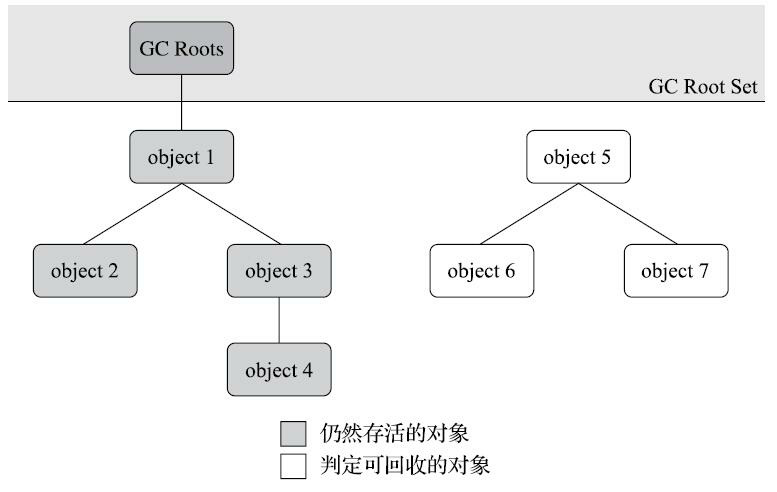

在Java技术体系里面，固定可作为`GC Roots`的对象包括以下几种：

*  在虚拟机栈（栈帧中的本地变量表）中引用的对象，譬如各个线程被调用的方法堆栈中使用到的参数、局部变量、临时变量等。
* 在方法区中类静态属性引用的对象，譬如Java类的引用类型静态变量。
* 在方法区中常量引用的对象，譬如字符串常量池（String Table）里的引用。
* 在本地方法栈中JNI（即通常所说的Native方法）引用的对象。
* Java虚拟机内部的引用，如基本数据类型对应的Class对象，一些常驻的异常对象（比如 `NullPointExcepiton`、`OutOfMemoryError`）等，还有系统类加载器。
* 所有被同步锁（`synchronized`关键字）持有的对象。
* 反映Java虚拟机内部情况的`JMXBean`、`JVMTI`中注册的回调、本地代码缓存等。

除了这些固定的`GC Roots`集合以外，根据用户所选用的垃圾收集器以及当前回收的内存区域不同，还可以有其他对象“临时性”地加入，共同构成完整`GC Roots`集合。譬如后文将会提到的**分代收集**和**局部回收（`Partial GC`）**，如果只针对Java堆中某一块区域发起垃圾收集时（如最典型的只针对新生代的垃圾收集），必须考虑到内存区域是虚拟机自己的实现细节（在用户视角里任何内存区域都是不可见的），更不是孤立封闭的，所以某个区域里的对象完全有可能被位于堆中其他区域的对象所引用，这时候就需要将这些关联区域的对象也一并加入`GC Roots`集合中去，才能保证可达性分析的正确性。

目前最新的几款垃圾收集器[^gc]无一例外都具备了局部回收的特征，为了避免`GC Roots`包含过多对象而过度膨胀，它们在实现上也做出了各种优化处理。关于这些概念、优化技巧以及各种不同收集器实现等内容，都将在本章后续内容中一一介绍。

[^gc]: 如OpenJDK中的G1、Shenandoah、ZGC以及Azul的PGC、C4这些收集器。

### 3.2.3 再谈引用

 无论是通过引用计数算法判断对象的引用数量，还是通过可达性分析算法判断对象是否引用链可达，判定对象是否存活都和**“引用”**离不开关系。在JDK 1.2版之前，Java里面的引用是很传统的定义： **如果`reference`类型的数据中存储的数值代表的是另外一块内存的起始地址，就称该`reference`数据是代表某块内存、某个对象的引用**。这种定义并没有什么不对，只是现在看来有些过于狭隘了，一个对象在这种定义下只有“被引用”或者“未被引用”两种状态，对于描述一些“食之无味，弃之可惜”的对象就显得无能为力。譬如我们希望能描述一类对象：当内存空间还足够时，能保留在内存之中，如果内存空间在进行垃圾收集后仍然非常紧张，那就可以抛弃这些对象——很多系统的缓存功能都符合这样的应用场景。

 在JDK 1.2版之后，Java对引用的概念进行了扩充，将引用分为**强引用（`Strongly Re-ference`）**、**软 引用（`Soft Reference`）**、**弱引用（`Weak Reference`）**和**虚引用（`Phantom Reference`）**4种，这4种引用强度依次逐渐减弱。

* **强引用**是最传统的“引用”的定义，是指在程序代码之中普遍存在的引用赋值，即类似“`Objectobj=new Object()`”这种引用关系。无论任何情况下，只要强引用关系还存在，垃圾收集器就永远不会回收掉被引用的对象。
* **软引用**是用来描述一些还有用，但非必须的对象。只被软引用关联着的对象，在系统将要发生内存溢出异常前，会把这些对象列进回收范围之中进行第二次回收，如果这次回收还没有足够的内存，才会抛出内存溢出异常。在JDK 1.2版之后提供了`SoftReference`类来实现软引用。
* **弱引用**也是用来描述那些非必须对象，但是它的强度比软引用更弱一些，被弱引用关联的对象只能生存到下一次垃圾收集发生为止。当垃圾收集器开始工作，无论当前内存是否足够，都会回收掉只被弱引用关联的对象。在JDK 1.2版之后提供了`WeakReference`类来实现弱引用。
* **虚引用**也称为“幽灵引用”或者“幻影引用”，它是最弱的一种引用关系。一个对象是否有虚引用的存在，完全不会对其生存时间构成影响，也无法通过虚引用来取得一个对象实例。为一个对象设置虚引用关联的唯一目的只是为了能在这个对象被收集器回收时收到一个系统通知。在JDK 1.2版之后提供了`PhantomReference`类来实现虚引用。

### 3.2.4 生存还是死亡？

即使在可达性分析算法中判定为不可达的对象，也不是“非死不可”的，这时候它们暂时还处于“缓刑”阶段，要真正宣告一个对象死亡，至少要经历两次标记过程：如果对象在进行可达性分析后发现没有与GC Roots相连接的引用链，那它将会被第一次标记，随后进行一次筛选，筛选的条件是此对象是否有必要执行`finalize()`方法。假如对象没有覆盖`finalize()`方法，或者`finalize()`方法已经被虚拟机调用过，那么虚拟机将这两种情况都视为“没有必要执行”。

如果这个对象被判定为确有必要执行`finalize()`方法，那么该对象将会被放置在一个名为`F-Queue`的 队列之中，并在稍后由一条由虚拟机自动建立的、低调度优先级的Finalizer线程去执行它们的`finalize() `方法。这里所说的“执行”是指虚拟机会触发这个方法开始运行，但并不承诺一定会等待它运行结束。 这样做的原因是，如果某个对象的`finalize()`方法执行缓慢，或者更极端地发生了死循环，将很可能导致`F-Queue`队列中的其他对象永久处于等待，甚至导致整个内存回收子系统的崩溃。`finalize()`方法是对象逃脱死亡命运的最后一次机会，稍后收集器将对F-Queue中的对象进行第二次小规模的标记，如果对象要在`finalize()`中成功拯救自己——只要重新与引用链上的任何一个对象建立关联即可，譬如把自己（this关键字）赋值给某个类变量或者对象的成员变量，那在第二次标记时它将被移出“即将回收”的集 合；如果对象这时候还没有逃脱，那基本上它就真的要被回收了。从代码清单3-2中我们可以看到一个 对象的`finalize()`被执行，但是它仍然可以存活。

* 代码清单3-2　一次对象自我拯救的演示

```java

/**
 * 此代码演示了两点：
 * 1.对象可以在被GC时自我拯救。
 * 2.这种自救的机会只有一次，因为一个对象的finalize()方法最多只会被系统自动调用一次
 * @author likly
 * @version 1.0
 * @date 2020-08-08 19:05:52
 * @since 1.0
 */
public class FinalizeEscapeGC {
    public static FinalizeEscapeGC SAVE_HOOK = null;

    public void isAlive() {
        System.out.println("yes, i am still alive :)");
    }

    @Override
    protected void finalize() throws Throwable {
        super.finalize();
        System.out.println("finalize method executed!");
        FinalizeEscapeGC.SAVE_HOOK = this;
    }

    public static void main(String[] args) throws InterruptedException {
        SAVE_HOOK = new FinalizeEscapeGC();
        //对象第一次成功拯救自己
        SAVE_HOOK = null;
        System.gc();
        // 因为Finalizer方法优先级很低，暂停0.5秒，以等待它
        Thread.sleep(500);
        if (SAVE_HOOK != null) {
            SAVE_HOOK.isAlive();
        } else {
            System.out.println("no, i am dead :(");
        }

        SAVE_HOOK = null;
        System.gc();
        // 因为Finalizer方法优先级很低，暂停0.5秒，以等待它
        Thread.sleep(500);
        if (SAVE_HOOK != null) {
            SAVE_HOOK.isAlive();
        } else {
            System.out.println("no, i am dead :(");
        }
    }
}
```

* 运行结果

```shell
finalize method executed!
yes, i am still alive :)
no, i am dead :(
```

从代码清单3-2的运行结果可以看到，SAVE_HOOK对象的`finalize()`方法确实被垃圾收集器触发过，并且在被收集前成功逃脱了。

另外一个值得注意的地方就是，代码中有两段完全一样的代码片段，执行结果却是一次逃脱成功，一次失败了。这是因为任何一个对象的`finalize()`方法都只会被系统自动调用一次，如果对象面临 下一次回收，它的`finalize()`方法不会被再次执行，因此第二段代码的自救行动失败了。

还有一点需要特别说明，上面关于对象死亡时`finalize()`方法的描述可能带点悲情的艺术加工，笔者并不鼓励大家使用这个方法来拯救对象。相反，笔者建议大家尽量避免使用它，因为它并不能等同于C和C++语言中的析构函数，而是Java刚诞生时为了使传统C、C++程序员更容易接受Java所做出的一项妥协。它的运行代价高昂，不确定性大，无法保证各个对象的调用顺序，如今已被官方明确声明为不推荐使用的语法。有些教材中描述它适合做“关闭外部资源”之类的清理性工作，这完全是对`finalize() `方法用途的一种自我安慰。`finalize()`能做的所有工作，使用`try-finally`或者其他方式都可以做得更好、更及时，所以笔者建议大家完全可以忘掉Java语言里面的这个方法。

### 3.2.5 回收方法区

有些人认为方法区（如HotSpot虚拟机中的元空间或者永久代）是没有垃圾收集行为的，《Java虚拟机规范》中提到过可以不要求虚拟机在方法区中实现垃圾收集，事实上也确实有未实现或未能完整实现方法区类型卸载的收集器存在（如JDK 11时期的ZGC收集器就不支持类卸载），方法区垃圾收集的“性价比”通常也是比较低的：在Java堆中，尤其是在新生代中，对常规应用进行一次垃圾收集通常可以回收70%至99%的内存空间，相比之下，方法区回收囿于苛刻的判定条件，其区域垃圾收集的回收成果往往远低于此。

方法区的垃圾收集主要回收两部分内容：废弃的常量和不再使用的类型。回收废弃常量与回收Java堆中的对象非常类似。举个常量池中字面量回收的例子，假如一个字符串“java”曾经进入常量池中，但是当前系统又没有任何一个字符串对象的值是“java”，换句话说，已经没有任何字符串对象引用常量池中的“java”常量，且虚拟机中也没有其他地方引用这个字面量。如果在这时发生内存回收，而且垃圾收集器判断确有必要的话，这个“java”常量就将会被系统清理出常量池。常量池中其他类（接口）、方法、字段的符号引用也与此类似。

判定一个常量是否“废弃”还是相对简单，而要判定一个类型是否属于“不再被使用的类”的条件就比较苛刻了。需要同时满足下面三个条件：

* 该类所有的实例都已经被回收，也就是Java堆中不存在该类及其任何派生子类的实例。
* 加载该类的类加载器已经被回收，这个条件除非是经过精心设计的可替换类加载器的场景，如 OSGi、JSP的重加载等，否则通常是很难达成的。
* 该类对应的`java.lang.Class`对象没有在任何地方被引用，无法在任何地方通过反射访问该类的方 法。

Java虚拟机被允许对满足上述三个条件的无用类进行回收，这里说的仅仅是“被允许”，而并不是和对象一样，没有引用了就必然会回收。关于是否要对类型进行回收，HotSpot虚拟机提供了`-Xnoclassgc`参数进行控制，还可以使用`-verbose：class`以及`-XX：+TraceClass-Loading`、`-XX：+TraceClassUnLoading`查看类加载和卸载信息，其中`-verbose：class`和`-XX：+TraceClassLoading`可以在Product版的虚拟机中使用，`-XX：+TraceClassUnLoading`参数需要FastDebug版[^FastDebug]的虚拟机支持。

 在大量使用反射、动态代理、CGLib等字节码框架，动态生成JSP以及OSGi这类频繁自定义类加载器的场景中，通常都需要Java虚拟机具备类型卸载的能力，以保证不会对方法区造成过大的内存压力。

[^FastDebug]: Product版、FastDebug版HotSpot虚拟机的差别可参见前文1.6节。

## 3.3 垃圾收集算法

垃圾收集算法的实现涉及大量的程序细节，且各个平台的虚拟机操作内存的方法都有差异，在本 节中我们暂不过多讨论算法实现，只重点介绍分代收集理论和几种算法思想及其发展过程。如果读者对其中的理论细节感兴趣，推荐阅读Richard Jones撰写的《垃圾回收算法手册》[^The Garbage Collection Handbook]的第2～4章的相关内容。

从如何判定对象消亡的角度出发，垃圾收集算法可以划分为**“引用计数式垃圾收集”（`Reference Counting GC`）**和**“追踪式垃圾收集”（`Tracing GC`）**两大类，这两类也常被称作“直接垃圾收集”和“间接垃圾收集”。由于引用计数式垃圾收集算法在本书讨论到的主流Java虚拟机中均未涉及，所以我们暂不把它作为正文主要内容来讲解，本节介绍的所有算法均属于追踪式垃圾收集的范畴。

[^The Garbage Collection Handbook]: 原著名为《The Garbage Collection Handbook》，2011年出版，中文版在2016年由机械工业出版社翻译引进国内。

### 3.3.1 分代收集理论

当前商业虚拟机的垃圾收集器，大多数都遵循了**“分代收集”（`Generational Collection`）**[^Generational Collection]的理论进行设计，分代收集名为理论，实质是一套符合大多数程序运行实际情况的经验法则，它建立在两个分代假说之上：

1. **弱分代假说（`Weak Generational Hypothesis`）：绝大多数对象都是朝生夕灭的。**
2. **强分代假说（`Strong Generational Hypothesis`）：熬过越多次垃圾收集过程的对象就越难以消亡。**

 这两个分代假说共同奠定了多款常用的垃圾收集器的一致的设计原则：**收集器应该将Java堆划分出不同的区域，然后将回收对象依据其年龄（年龄即对象熬过垃圾收集过程的次数）分配到不同的区域之中存储。**显而易见，如果一个区域中大多数对象都是朝生夕灭，难以熬过垃圾收集过程的话，那么把它们集中放在一起，每次回收时只关注如何保留少量存活而不是去标记那些大量将要被回收的对象，就能以较低代价回收到大量的空间；如果剩下的都是难以消亡的对象，那把它们集中放在一块， 虚拟机便可以使用较低的频率来回收这个区域，这就同时兼顾了垃圾收集的时间开销和内存的空间有效利用。

 在Java堆划分出不同的区域之后，垃圾收集器才可以每次只回收其中某一个或者某些部分的区域——因而才有了“Minor GC”、“Major GC”、“Full GC”这样的回收类型的划分；也才能够针对不同的区域安排与里面存储对象存亡特征相匹配的垃圾收集算法——因而发展出了**“标记-复制算法”**、**“标记-清除算法”**、**“标记-整理算法”**等针对性的垃圾收集算法。这里笔者提前提及了一些新的名词，它们都是本章的重要角色，稍后都会逐一登场，现在读者只需要知道，这一切的出现都始于分代收集理论。

把分代收集理论具体放到现在的商用Java虚拟机里，设计者一般至少会把Java堆划分为**新生代（`Young Generation`）**和**老年代（`Old Generation`）**两个区域[^generation]。顾名思义，在新生代中，每次垃圾收集时都发现有大批对象死去，而每次回收后存活的少量对象，将会逐步晋升到老年代中存放。如果读者有兴趣阅读HotSpot虚拟机源码的话，会发现里面存在着一些名为“`*Generation`”的实现，如“`DefNewGeneration`”和“`ParNewGeneration`”等，这些就是HotSpot的“分代式垃圾收集器框架”。原本HotSpot鼓励开发者尽量在这个框架内开发新的垃圾收集器，但除了最早期的两组四款收集器之外，后来的开发者并没有继续遵循。导致此事的原因有很多，最根本的是分代收集理论仍在不断发展之中，如何实现也有许多细节可以改进，被既定的代码框架约束反而不便。其实我们只要仔细思考一下，也很容易发现分代收集并非只是简单划分一下内存区域那么容易，它至少存在一个明显的困难：**对象不是孤立的，对象之间会存在跨代引用。**

假如要现在进行一次只局限于新生代区域内的收集（`Minor GC`），但新生代中的对象是完全有可能被老年代所引用的，为了找出该区域中的存活对象，不得不在固定的GC Roots之外，再额外遍历整个老年代中所有对象来确保可达性分析结果的正确性，反过来也是一样[^scope gc]。遍历整个老年代所有对象的方案虽然理论上可行，但无疑会为内存回收带来很大的性能负担。为了解决这个问题，就需要对分代收集理论添加第三条经验法则：

3. **跨代引用假说（`Intergenerational Reference Hypothesis`）：跨代引用相对于同代引用来说仅占极少数。**

这其实是可根据前两条假说逻辑推理得出的隐含推论：存在互相引用关系的两个对象，是应该倾向于同时生存或者同时消亡的。举个例子，如果某个新生代对象存在跨代引用，由于老年代对象难以消亡，该引用会使得新生代对象在收集时同样得以存活，进而在年龄增长之后晋升到老年代中，这时跨代引用也随即被消除了。

依据这条假说，我们就不应再为了少量的跨代引用去扫描整个老年代，也不必浪费空间专门记录每一个对象是否存在及存在哪些跨代引用，只需在新生代上建立一个全局的数据结构（该结构被称为“记忆集”，`Remembered Set`），这个结构把老年代划分成若干小块，标识出老年代的哪一块内存会存在跨代引用。此后当发生`Minor GC`时，只有包含了跨代引用的小块内存里的对象才会被加入到GC Roots进行扫描。虽然这种方法需要在对象改变引用关系（如将自己或者某个属性赋值）时维护记录数据的正确性，会增加一些运行时的开销，但比起收集时扫描整个老年代来说仍然是划算的。

> **注意**:　刚才我们已经提到了“`Minor GC`”，后续文中还会出现其他针对不同分代的类似名词， 为避免读者产生混淆，在这里统一定义：
>
> * **部分收集（`Partial GC`）**：指目标不是完整收集整个Java堆的垃圾收集，其中又分为： 
>   * **新生代收集（`Minor GC/Young GC`）**：指目标只是新生代的垃圾收集。
>   * **老年代收集（`Major GC/Old GC`）**：指目标只是老年代的垃圾收集。目前只有**CMS收集器**会有单独收集老年代的行为。另外请注意“`Major GC`”这个说法现在有点混淆，在不同资料上常有不同所指，读者需按上下文区分到底是指老年代的收集还是整堆收集。
>   * **混合收集（`Mixed GC`）**：指目标是收集整个新生代以及部分老年代的垃圾收集。目前只有**G1收集器**会有这种行为。
> * **整堆收集（`Full GC`）**：收集整个Java堆和方法区的垃圾收集。

[^Generational Collection]: 值得注意的是，分代收集理论也有其缺陷，最新出现（或在实验中）的几款垃圾收集器都展现出了面向全区域收集设计的思想，或者可以支持全区域不分代的收集的工作模式。
[^generation]: 新生代（Young）、老年代（Old）是HotSpot虚拟机，也是现在业界主流的命名方式。在IBM J9虚拟机中对应称为婴儿区（Nursery）和长存区（Tenured），名字不同但其含义是一样的。
[^scope gc]: 通常能单独发生收集行为的只是新生代，所以这里“反过来”的情况只是理论上允许，实际上除了CMS收集器，其他都不存在只针对老年代的收集。

### 3.3.2 标记-清除算法

最早出现也是最基础的垃圾收集算法是**“标记-清除”（`Mark-Sweep`）算法**，在1960年由Lisp之父John McCarthy所提出。如它的名字一样，算法分为“标记”和“清除”两个阶段：首先标记出所有需要回收的对象，在标记完成后，统一回收掉所有被标记的对象，也可以反过来，标记存活的对象，统一回收所有未被标记的对象。标记过程就是对象是否属于垃圾的判定过程，这在前一节讲述垃圾对象标记判定算法时其实已经介绍过了。

之所以说它是最基础的收集算法，是因为后续的收集算法大多都是以标记-清除算法为基础，对其缺点进行改进而得到的。它的主要缺点有两个：

* 第一个是**执行效率不稳定**，如果Java堆中包含大量对象，而且其中大部分是需要被回收的，这时必须进行大量标记和清除的动作，导致标记和清除两个过程的执行效率都随对象数量增长而降低；
* 第二个是**内存空间的碎片化**问题，标记、清除之后会产生大量不连续的内存碎片，空间碎片太多可能会导致当以后在程序运行过程中需要分配较大对象时无法找到足够的连续内存而不得不提前触发另一次垃圾收集动作。标记-清除算法的执行过程如图3-2所示。

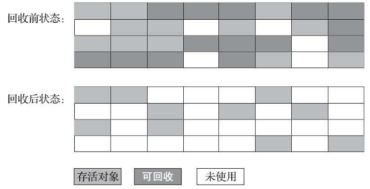

### 3.3.3 标记-复制算法

**标记-复制算法(`Mark-Copy`)**常被简称为复制算法。为了解决标记-清除算法面对大量可回收对象时执行效率低的问题，1969年Fenichel提出了一种称为“半区复制”（Semispace Copying）的垃圾收集算法，它将可用内存按容量划分为大小相等的两块，每次只使用其中的一块。当这一块的内存用完了，就将还存活着的对象复制到另外一块上面，然后再把已使用过的内存空间一次清理掉。如果内存中多数对象都是存活的，这种算法将会产生大量的内存间复制的开销，但对于多数对象都是可回收的情况，算法需要复制的就是占少数的存活对象，而且每次都是针对整个半区进行内存回收，分配内存时也就不用考虑有空间碎片的复杂情况，只要移动堆顶指针，按顺序分配即可。这样实现简单，运行高效，不过其缺陷也显而易见，这种复制回收算法的代价是将可用内存缩小为了原来的一半，空间浪费未免太多了一点。标记-复制算法的执行过程如图3-3所示。

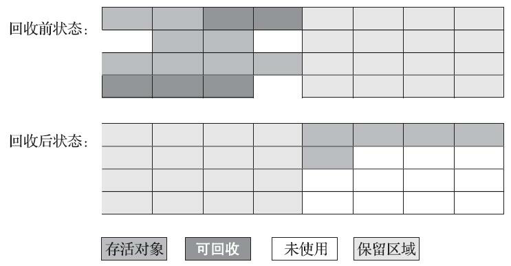

现在的商用Java虚拟机大多都优先采用了这种收集算法去回收新生代，IBM公司曾有一项专门研究对新生代“朝生夕灭”的特点做了更量化的诠释——**新生代中的对象有98%熬不过第一轮收集。**因此并不需要按照1∶1的比例来划分新生代的内存空间。

 在1989年，Andrew Appel针对具备“朝生夕灭”特点的对象，提出了一种更优化的半区复制分代策略，现在称为**“Appel式回收”**。HotSpot虚拟机的`Serial`、`ParNew`等新生代收集器均采用了这种策略来设计新生代的内存布局[^内存布局]。Appel式回收的具体做法是**把新生代分为一块较大的`Eden`空间和两块较小的 `Survivor`空间，每次分配内存只使用`Eden`和其中一块`Survivor`。发生垃圾搜集时，将`Eden`和`Survivor`中仍然存活的对象一次性复制到另外一块`Survivor`空间上，然后直接清理掉`Eden`和已用过的那块`Survivor`空间。**HotSpot虚拟机默认Eden和Survivor的大小比例是8∶1，也即每次新生代中可用内存空间为整个新生代容量的90%（Eden的80%加上一个Survivor的10%），只有一个Survivor空间，即10%的新生代是会被“浪费”的。当然，98%的对象可被回收仅仅是“普通场景”下测得的数据，任何人都没有办法百分百保证每次回收都只有不多于10%的对象存活，因此Appel式回收还有一个充当罕见情况的“逃生门”的安全设计，当Survivor空间不足以容纳一次Minor GC之后存活的对象时，就需要依赖其他内存区域（实际上大多就是老年代）进行分配担保（Handle Promotion）。

 内存的分配担保好比我们去银行借款，如果我们信誉很好，在98%的情况下都能按时偿还，于是银行可能会默认我们下一次也能按时按量地偿还贷款，只需要有一个担保人能保证如果我不能还款 时，可以从他的账户扣钱，那银行就认为没有什么风险了。内存的分配担保也一样，如果另外一块Survivor空间没有足够空间存放上一次新生代收集下来的存活对象，这些对象便将通过分配担保机制直接进入老年代，这对虚拟机来说就是安全的。关于对新生代进行分配担保的内容，在稍后的3.8.5节介绍垃圾收集器执行规则时还会再进行讲解。

[^内存布局]: 这里需要说明一下，HotSpot中的这种分代方式从最初就是这种布局，和IBM的研究并没有什么实际关系。这里笔者列举IBM的研究只是为了说明这种分代布局的意义所在。

### 3.3.4 标记-整理算法

标记-复制算法在对象存活率较高时就要进行较多的复制操作，效率将会降低。更关键的是，如果不想浪费50%的空间，就需要有额外的空间进行分配担保，以应对被使用的内存中所有对象都100%存活的极端情况，所以在老年代一般不能直接选用这种算法。

针对老年代对象的存亡特征，1974年Edward Lueders提出了另外一种有针对性的**“标记-整理”（`Mark-Compact`）算法**，其中的标记过程仍然与“标记-清除”算法一样，但后续步骤不是直接对可回收对象进行清理，而是让所有存活的对象都向内存空间一端移动，然后直接清理掉边界以外的内存，“标记-整理”算法的示意图如图3-4所示。


标记-清除算法与标记-整理算法的本质差异在于前者是一种非移动式的回收算法，而后者是移动式的。是否移动回收后的存活对象是一项优缺点并存的风险决策：

如果移动存活对象，尤其是在老年代这种每次回收都有大量对象存活区域，移动存活对象并更新所有引用这些对象的地方将会是一种极为负重的操作，而且这种对象移动操作必须全程暂停用户应用程序才能进行[^mark-compact]，这就更加让使用者不得不小心翼翼地权衡其弊端了，像这样的停顿被最初的虚拟机设计者形象地描述为**“Stop The World”**[^stop-the-world]。

但如果跟标记-清除算法那样完全不考虑移动和整理存活对象的话，弥散于堆中的存活对象导致的空间碎片化问题就只能依赖更为复杂的内存分配器和内存访问器来解决。譬如通过“分区空闲分配链表”来解决内存分配问题（计算机硬盘存储大文件就不要求物理连续的磁盘空间，能够在碎片化的硬盘上存储和访问就是通过硬盘分区表实现的）。内存的访问是用户程序最频繁的操作，甚至都没有之一，假如在这个环节上增加了额外的负担，势必会直接影响应用程序的吞吐量。

基于以上两点，是否移动对象都存在弊端，移动则内存回收时会更复杂，不移动则内存分配时会更复杂。从垃圾收集的停顿时间来看，不移动对象停顿时间会更短，甚至可以不需要停顿，但是从整个程序的吞吐量来看，移动对象会更划算。此语境中，**吞吐量的实质是赋值器（`Mutator，可以理解为使用垃圾收集的用户程序，本书为便于理解，多数地方用“用户程序”或“用户线程”代替`）与收集器的效率总和。**即使不移动对象会使得收集器的效率提升一些，但因内存分配和访问相比垃圾收集频率要高得多，这部分的耗时增加，总吞吐量仍然是下降的。HotSpot虚拟机里面**关注吞吐量的`Parallel Scavenge收集器`是基于`标记-整理算法`**的，而**关注延迟的`CMS收集器`则是基于`标记-清除算法`**的，这也从侧面印证这点。

另外，还有一种“和稀泥式”解决方案可以不在内存分配和访问上增加太大额外负担，做法是让虚拟机平时多数时间都采用标记-清除算法，暂时容忍内存碎片的存在，直到内存空间的碎片化程度已经大到影响对象分配时，再采用标记-整理算法收集一次，以获得规整的内存空间。前面提到的基于标记-清除算法的CMS收集器面临空间碎片过多时采用的就是这种处理办法。

[^mark-compact]: 最新的`ZGC`和`Shenandoah`收集器使用读屏障（`Read Barrier`）技术实现了整理过程与用户线程的并发执行，稍后将会介绍这种收集器的工作原理。
[^stop-the-world]: 通常标记-清除算法也是需要停顿用户线程来标记、清理可回收对象的，只是停顿时间相对而言要来的短而已。

## 3.4 HotSpot的算法细节实现

3.2、3.3节从理论原理上介绍了常见的对象存活判定算法和垃圾收集算法，Java虚拟机实现这些算法时，必须对算法的执行效率有严格的考量，才能保证虚拟机高效运行。本章设置这部分内容主要是为了稍后介绍各款垃圾收集器时做前置知识铺垫，如果读者对这部分内容感到枯燥或者疑惑，不妨先跳过去，等后续遇到要使用它们的实际场景、实际问题时再结合问题，重新翻阅和理解。

### 3.4.1 根节点枚举

我们以可达性分析算法中从GC Roots集合找引用链这个操作作为介绍虚拟机高效实现的第一个例子。固定可作为GC Roots的节点主要在全局性的引用（例如常量或类静态属性）与执行上下文（例如 栈帧中的本地变量表）中，尽管目标明确，但查找过程要做到高效并非一件容易的事情，现在Java应用越做越庞大，光是方法区的大小就常有数百上千兆，里面的类、常量等更是恒河沙数，若要逐个检查以这里为起源的引用肯定得消耗不少时间。

 迄今为止，所有收集器在根节点枚举这一步骤时都是必须暂停用户线程的，因此毫无疑问根节点枚举与之前提及的整理内存碎片一样会面临相似的“`Stop The World`”的困扰。现在可达性分析算法耗时最长的查找引用链的过程已经可以做到与用户线程一起并发（具体见3.4.6节），但根节点枚举始终还是必须在一个能保障一致性的快照中才得以进行——这里“一致性”的意思是整个枚举期间执行子系统看起来就像被冻结在某个时间点上，不会出现分析过程中，根节点集合的对象引用关系还在不断变化的情况，若这点不能满足的话，分析结果准确性也就无法保证。这是导致垃圾收集过程必须停顿所有用户线程的其中一个重要原因，即使是号称停顿时间可控，或者（几乎）不会发生停顿的CMS、G1、 ZGC等收集器，枚举根节点时也是必须要停顿的。

 由于目前主流Java虚拟机使用的都是准确式垃圾收集（这个概念在第1章介绍Exact VM相对于 Classic VM的改进时介绍过），所以当用户线程停顿下来之后，其实并不需要一个不漏地检查完所有执行上下文和全局的引用位置，虚拟机应当是有办法直接得到哪些地方存放着对象引用的。在HotSpot 的解决方案里，是使用一组称为`OopMap`的数据结构来达到这个目的。一旦类加载动作完成的时候， HotSpot就会把对象内什么偏移量上是什么类型的数据计算出来，在即时编译（见第11章）过程中，也会在特定的位置记录下栈里和寄存器里哪些位置是引用。这样收集器在扫描时就可以直接得知这些信 息了，并不需要真正一个不漏地从方法区等GC Roots开始查找。

 下面代码清单3-3是HotSpot虚拟机客户端模式下生成的一段`String::hashCode()`方法的本地代码，可以看到在`0x026eb7a9`处的`call`指令有`OopMap`记录，它指明了EBX寄存器和栈中偏移量为16的内存区域中各有一个普通对象指针（Ordinary Object Pointer，OOP）的引用，有效范围为从`call`指令开始直到`0x026eb730`（指令流的起始位置）+142（OopMap记录的偏移量）=`0x026eb7be`，即`hlt`指令为止。

* 代码清单3-3　`String.hashCode()`方法编译后的本地代码

```shell
[Verified Entry Point]
0x026eb730: mov %eax,-0x8000(%esp) …………
;; ImplicitNullCheckStub slow case 
0x026eb7a9: call 0x026e83e0	 ; OopMap{ebx=Oop [16]=Oop off=142}
        				     ; *caload
					   ; - java.lang.String::hashCode@48 (line 1489)
					   ; {runtime_call}
0x026eb7ae: push $0x83c5c18 ; {external_word}
0x026eb7b3: call 0x026eb7b8
0x026eb7b8: pusha
0x026eb7b9: call 0x0822bec0 ; {runtime_call}
0x026eb7be: hlt
```

### 3.4.2 安全点

在OopMap的协助下，HotSpot可以快速准确地完成GC Roots枚举，但一个很现实的问题随之而来：可能导致引用关系变化，或者说导致OopMap内容变化的指令非常多，如果为每一条指令都生成对应的OopMap，那将会需要大量的额外存储空间，这样垃圾收集伴随而来的空间成本就会变得无法忍受的高昂。

实际上HotSpot也的确没有为每条指令都生成OopMap，前面已经提到，只是在“特定的位置”记录了这些信息，这些位置被称为**安全点（`Safepoint`）**。有了安全点的设定，也就决定了用户程序执行时并非在代码指令流的任意位置都能够停顿下来开始垃圾收集，而是强制要求必须执行到达安全点后才能够暂停。因此，安全点的选定既不能太少以至于让收集器等待时间过长，也不能太过频繁以至于过分增大运行时的内存负荷。安全点位置的选取基本上是以**“是否具有让程序长时间执行的特征”**为标准进行选定的，因为每条指令执行的时间都非常短暂，程序不太可能因为指令流长度太长这样的原因而长时间执行，“长时间执行”的最明显特征就是指令序列的复用，例如方法调用、循环跳转、异常跳转等都属于指令序列复用，所以只有具有这些功能的指令才会产生安全点。

 对于安全点，另外一个需要考虑的问题是，如何在垃圾收集发生时让所有线程（这里其实不包括执行JNI调用的线程）都跑到最近的安全点，然后停顿下来。这里有两种方案可供选择：**抢先式中断（`Preemptive Suspension`）**和**主动式中断（`Voluntary Suspension`）**，抢先式中断不需要线程的执行代码主动去配合，在垃圾收集发生时，系统首先把所有用户线程全部中断，如果发现有用户线程中断的地方不在安全点上，就恢复这条线程执行，让它一会再重新中断，直到跑到安全点上。现在几乎没有虚拟机实现采用抢先式中断来暂停线程响应GC事件。

 而主动式中断的思想是当垃圾收集需要中断线程的时候，不直接对线程操作，仅仅简单地设置一个标志位，各个线程执行过程时会不停地主动去轮询这个标志，一旦发现中断标志为真时就自己在最近的安全点上主动中断挂起。轮询标志的地方和安全点是重合的，另外还要加上所有创建对象和其他需要在Java堆上分配内存的地方，这是为了检查是否即将要发生垃圾收集，避免没有足够内存分配新对象。

 由于轮询操作在代码中会频繁出现，这要求它必须足够高效。HotSpot使用内存保护陷阱的方式， 把轮询操作精简至只有一条汇编指令的程度。下面代码清单3-4中的`test`指令就是HotSpot生成的**轮询指令**，当需要暂停用户线程时，虚拟机把`0x160100`的内存页设置为不可读，那线程执行到`test`指令时就会产生一个自陷异常信号，然后在预先注册的异常处理器中挂起线程实现等待，这样仅通过一条汇编指令便完成安全点轮询和触发线程中断了。

* 代码清单3-4　轮询指令

```shell
0x01b6d627: call	0x01b2b210	     	  ; OopMap{[60]=Oop off=460}
								; *invokeinterface size
								; - Client1::main@113 (line 23) 
								; {virtual_call}
0x01b6d62c: nop				        	; OopMap{[60]=Oop off=461}
								; *if_icmplt
								; - Client1::main@118 (line 23) 
0x01b6d62d: test 	 %eax,0x160100		; {poll}
0x01b6d633: mov	      0x50(%esp),%esi
0x01b6d637: cmp         %eax,%esi
```

### 3.4.3 安全区域

使用安全点的设计似乎已经完美解决如何停顿用户线程，让虚拟机进入垃圾回收状态的问题了，但实际情况却并不一定。安全点机制保证了程序执行时，在不太长的时间内就会遇到可进入垃圾收集过程的安全点。但是，程序“不执行”的时候呢？所谓的程序不执行就是没有分配处理器时间，典型的场景便是用户线程处于`Sleep`状态或者`Blocked`状态，这时候线程无法响应虚拟机的中断请求，不能再走到安全的地方去中断挂起自己，虚拟机也显然不可能持续等待线程重新被激活分配处理器时间。对于这种情况，就必须引入**安全区域（`Safe Region`）**来解决。

 **安全区域是指能够确保在某一段代码片段之中，引用关系不会发生变化，因此，在这个区域中任意地方开始垃圾收集都是安全的。**我们也可以把安全区域看作被扩展拉伸了的安全点。

 当用户线程执行到安全区域里面的代码时，首先会标识自己已经进入了安全区域，那样当这段时间里虚拟机要发起垃圾收集时就不必去管这些已声明自己在安全区域内的线程了。当线程要离开安全区域时，它要检查虚拟机是否已经完成了根节点枚举（或者垃圾收集过程中其他需要暂停用户线程的阶段），如果完成了，那线程就当作没事发生过，继续执行；否则它就必须一直等待，直到收到可以离开安全区域的信号为止。

### 3.4.4 记忆集与卡表

讲解分代收集理论的时候，提到了为解决对象跨代引用所带来的问题，垃圾收集器在新生代中建立了名为**记忆集（`Remembered Set`）**的数据结构，用以避免把整个老年代加进GC Roots扫描范围。事实上并不只是新生代、老年代之间才有跨代引用的问题，所有涉及部分区域收集（Partial GC）行为的垃圾收集器，典型的如G1、ZGC和Shenandoah收集器，都会面临相同的问题，因此我们有必要进一步理清记忆集的原理和实现方式，以便在后续章节里介绍几款最新的收集器相关知识时能更好地理解。

**记忆集是一种用于记录从非收集区域指向收集区域的指针集合的抽象数据结构。**如果我们不考虑效率和成本的话，最简单的实现可以用非收集区域中所有含跨代引用的对象数组来实现这个数据结构，如代码清单3-5所示：

* 代码清单3-5　以对象指针来实现记忆集的伪代码

```java
Class RememberedSet {
    Object[] set[OBJECT_INTERGENERATIONAL_REFERENCE_SIZE]; 
}
```

这种记录全部含跨代引用对象的实现方案，无论是空间占用还是维护成本都相当高昂。而在垃圾收集的场景中，收集器只需要通过记忆集判断出某一块非收集区域是否存在有指向了收集区域的指针就可以了，并不需要了解这些跨代指针的全部细节。那设计者在实现记忆集的时候，便可以选择更为粗犷的记录粒度来节省记忆集的存储和维护成本，下面列举了一些可供选择（当然也可以选择这个范围以外的）的记录精度：

* **字长精度**：每个记录精确到一个机器字长（就是处理器的寻址位数，如常见的32位或64位，这个精度决定了机器访问物理内存地址的指针长度），该字包含跨代指针。
* **对象精度**：每个记录精确到一个对象，该对象里有字段含有跨代指针。
* **卡精度**：每个记录精确到一块内存区域，该区域内有对象含有跨代指针。

其中，第三种“卡精度”所指的是用一种称为**“卡表”（`Card Table`）**的方式去实现记忆集[^card table]，这也是目前最常用的一种记忆集实现形式，一些资料中甚至直接把它和记忆集混为一谈。前面定义中提到记忆集其实是一种“抽象”的数据结构，抽象的意思是只定义了记忆集的行为意图，并没有定义其行为的具体实现。卡表就是记忆集的一种具体实现，它定义了记忆集的记录精度、与堆内存的映射关系等。 关于卡表与记忆集的关系，读者不妨按照Java语言中`HashMap`与`Map`的关系来类比理解。

卡表最简单的形式可以只是一个字节数组[^byte array]，而HotSpot虚拟机确实也是这样做的。以下这行代码是HotSpot默认的卡表标记逻辑[^hotspot card table]:

```c++
CARD_TABLE [this address >> 9] = 0;
```

字节数组`CARD_TABLE`的每一个元素都对应着其标识的内存区域中一块特定大小的内存块，这个内存块被称作**“卡页”（`Card Page`）**。一般来说，卡页大小都是以2的N次幂的字节数，通过上面代码可以看出HotSpot中使用的卡页是2的9次幂，即512字节（地址右移9位，相当于用地址除以512）。那如果卡表标识内存区域的起始地址是0x0000的话，数组`CARD_TABLE`的第0、1、2号元素，分别对应了地址范围为`0x0000～0x01FF`、`0x0200～0x03FF`、`0x0400～0x05FF`的卡页内存块[^card table and card page]，如图3-5所示。

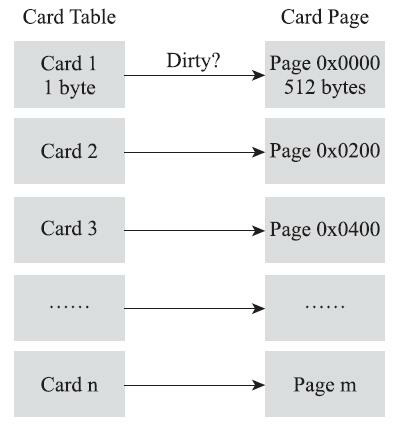

一个卡页的内存中通常包含不止一个对象，只要卡页内有一个（或更多）对象的字段存在着跨代指针，那就将对应卡表的数组元素的值标识为1，称为这个**元素变脏（`Dirty`）**，没有则标识为0。在垃圾收集发生时，只要筛选出卡表中变脏的元素，就能轻易得出哪些卡页内存块中包含跨代指针，把它们加入GC Roots中一并扫描。

[^card table]: 由Antony Hosking在1993年发表的论文《Remembered sets can also play cards》中提出。
[^byte array]: 之所以使用byte数组而不是bit数组主要是速度上的考量，现代计算机硬件都是最小按字节寻址的， 没有直接存储一个bit的指令，所以要用bit的话就不得不多消耗几条shift+mask指令。具体可见HotSpot应用写屏障实现记忆集的原始论文《A Fast Write Barrier for Generational Garbage Collectors》 （http://www.hoelzle.org/publications/write-barrier.pdf）。
[^hotspot card table]: 引用来源为http://psy-lob-saw.blogspot.com/2014/10/the-jvm-write-barrier-card-marking.html。
[^card table and card page]: 十六进制数200、400分别为十进制的512、1024，这3个内存块为从0开始、512字节容量的相邻区 域。

### 3.4.5 写屏障

我们已经解决了如何使用记忆集来缩减GC Roots扫描范围的问题，但还没有解决卡表元素如何维护的问题，例如它们何时变脏、谁来把它们变脏等。

卡表元素何时变脏的答案是很明确的——有其他分代区域中对象引用了本区域对象时，其对应的卡表元素就应该变脏，变脏时间点原则上应该发生在引用类型字段赋值的那一刻。但问题是如何变脏，即如何在对象赋值的那一刻去更新维护卡表呢？假如是解释执行的字节码，那相对好处理，虚拟机负责每条字节码指令的执行，有充分的介入空间；但在编译执行的场景中呢？经过即时编译后的代码已经是纯粹的机器指令流了，这就必须找到一个在机器码层面的手段，把维护卡表的动作放到每一个赋值操作之中。

在HotSpot虚拟机里是通过**写屏障（`Write Barrier`）**技术维护卡表状态的。先请读者注意将这里提到的“写屏障”，以及后面在低延迟收集器中会提到的“读屏障”与解决并发乱序执行问题中的“内存屏障”[^memory barrier]区分开来，避免混淆。写屏障可以看作在虚拟机层面对“引用类型字段赋值”这个动作的AOP切面[^aop]，在引用对象赋值时会产生一个环形（Around）通知，供程序执行额外的动作，也就是说赋值的前后都在写屏障的覆盖范畴内。在赋值前的部分的写屏障叫作**写前屏障（`Pre-Write Barrier`）**，在赋值后的则叫作**写后屏障（`Post-Write Barrier`）**。HotSpot虚拟机的许多收集器中都有使用到写屏障，但直至G1收集器出现之前，其他收集器都只用到了写后屏障。下面这段代码清单3-6是一段更新卡表状态的简化逻辑：

* 代码清单3-6　写后屏障更新卡表

```c++
void oop_field_store(oop* field, oop new_value) {
    // 引用字段赋值操作
    *field = new_value;
    // 写后屏障，在这里完成卡表状态更新
    post_write_barrier(field, new_value);
}
```

应用写屏障后，虚拟机就会为所有赋值操作生成相应的指令，一旦收集器在写屏障中增加了更新卡表操作，无论更新的是不是老年代对新生代对象的引用，每次只要对引用进行更新，就会产生额外的开销，不过这个开销与`Minor GC`时扫描整个老年代的代价相比还是低得多的。

除了写屏障的开销外，卡表在高并发场景下还面临着**“伪共享”（`False Sharing`）**问题。伪共享是处理并发底层细节时一种经常需要考虑的问题，现代中央处理器的缓存系统中是以**缓存行（`Cache Line`）** 为单位存储的，当多线程修改互相独立的变量时，如果这些变量恰好共享同一个缓存行，就会彼此影响（写回、无效化或者同步）而导致性能降低，这就是伪共享问题。

假设处理器的缓存行大小为64字节，由于一个卡表元素占1个字节，64个卡表元素将共享同一个缓存行。这64个卡表元素对应的卡页总的内存为32KB（64×512字节），也就是说如果不同线程更新的对象正好处于这32KB的内存区域内，就会导致更新卡表时正好写入同一个缓存行而影响性能。为了避免伪共享问题，一种简单的解决方案是不采用无条件的写屏障，而是先检查卡表标记，只有当该卡表元素未被标记过时才将其标记为变脏，即将卡表更新的逻辑变为以下代码所示：

```c++
if (CARD_TABLE [this address >> 9] != 0)
    CARD_TABLE [this address >> 9] = 0;
```

 在JDK 7之后，HotSpot虚拟机增加了一个新的参数`-XX：+UseCondCardMark`，用来决定是否开启卡表更新的条件判断。开启会增加一次额外判断的开销，但能够避免伪共享问题，两者各有性能损耗，是否打开要根据应用实际运行情况来进行测试权衡。

[^memory barrier]: 这个语境上的内存屏障（Memory Barrier）的目的是为了指令不因编译优化、CPU执行优化等原因而导致乱序执行，它也是可以细分为仅确保读操作顺序正确性和仅确保写操作顺序正确性的内存屏障的。关于并发问题中内存屏障的介绍，可以参考本书第12章中关于volatile型变量的讲解。
[^aop]: AOP为Aspect Oriented Programming的缩写，意为面向切面编程，通过预编译方式和运行期动态代理实现程序功能的统一维护的一种技术。后面提到的“环形通知”也是AOP中的概念，使用过Spring的读者应该都了解这些基础概念。

### 3.4.6 并发的可达性分析

在3.2节中曾经提到了当前主流编程语言的垃圾收集器基本上都是依靠可达性分析算法来判定对象是否存活的，可达性分析算法理论上要求全过程都基于一个能保障一致性的快照中才能够进行分析，这意味着必须全程冻结用户线程的运行。在根节点枚举（见3.4.1节）这个步骤中，由于GC Roots相比起整个Java堆中全部的对象毕竟还算是极少数，且在各种优化技巧（如OopMap）的加持下，它带来的停顿已经是非常短暂且相对固定（不随堆容量而增长）的了。可从GC Roots再继续往下遍历对象图，这一步骤的停顿时间就必定会与Java堆容量直接成正比例关系了：堆越大，存储的对象越多，对象图结构越复杂，要标记更多对象而产生的停顿时间自然就更长，这听起来是理所当然的事情。

要知道包含“标记”阶段是所有追踪式垃圾收集算法的共同特征，如果这个阶段会随着堆变大而等比例增加停顿时间，其影响就会波及几乎所有的垃圾收集器，同理可知，如果能够削减这部分停顿时间的话，那收益也将会是系统性的。

想解决或者降低用户线程的停顿，就要先搞清楚为什么必须在一个能保障一致性的快照上才能进行对象图的遍历？为了能解释清楚这个问题，我们引入**三色标记（`Tri-color Marking`）**[^Tri-color Marking]作为工具来辅 助推导，把遍历对象图过程中遇到的对象，按照**“是否访问过”**这个条件标记成以下三种颜色：

* **白色**：表示对象尚未被垃圾收集器访问过。显然在可达性分析刚刚开始的阶段，所有的对象都是白色的，若在分析结束的阶段，仍然是白色的对象，即代表不可达。
* **黑色**：表示对象已经被垃圾收集器访问过，且这个对象的所有引用都已经扫描过。黑色的对象代表已经扫描过，它是安全存活的，如果有其他对象引用指向了黑色对象，无须重新扫描一遍。黑色对象不可能直接（不经过灰色对象）指向某个白色对象。
* **灰色**：表示对象已经被垃圾收集器访问过，但这个对象上至少存在一个引用还没有被扫描过。

关于可达性分析的扫描过程，读者不妨发挥一下想象力，把它看作对象图上一股以灰色为波峰的波纹从黑向白推进的过程，如果用户线程此时是冻结的，只有收集器线程在工作，那不会有任何问题。但如果用户线程与收集器是并发工作呢？收集器在对象图上标记颜色，同时用户线程在修改引用关系——即修改对象图的结构，这样可能出现两种后果。一种是把原本消亡的对象错误标记为存活，这不是好事，但其实是可以容忍的，只不过产生了一点逃过本次收集的浮动垃圾而已，下次收集清理掉就好。另一种是把原本存活的对象错误标记为已消亡，这就是非常致命的后果了，程序肯定会因此发生错误，下面表3-1[^Shenandoah GC]演示了这样的致命错误具体是如何产生的。

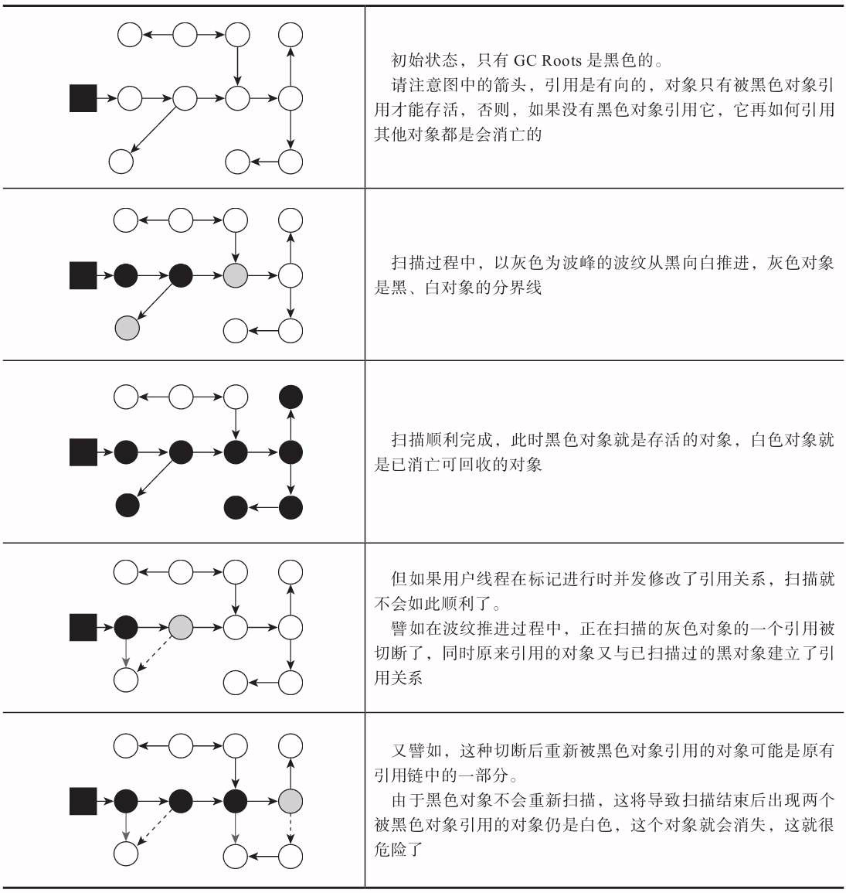

Wilson于1994年在理论上证明了，当且仅当以下两个条件同时满足时，会产生“对象消失”的问题，即原本应该是黑色的对象被误标为白色：

* **赋值器插入了一条或多条从黑色对象到白色对象的新引用；**

* **赋值器删除了全部从灰色对象到该白色对象的直接或间接引用。**

因此，我们要解决并发扫描时的对象消失问题，只需破坏这两个条件的任意一个即可。由此分别产生了两种解决方案：**增量更新（`Incremental Update`）**和**原始快照（`Snapshot At The Beginning， SATB`）**。

增量更新要破坏的是第一个条件，当黑色对象插入新的指向白色对象的引用关系时，就将这个新插入的引用记录下来，等并发扫描结束之后，再将这些记录过的引用关系中的黑色对象为根，重新扫描一次。这可以简化理解为，黑色对象一旦新插入了指向白色对象的引用之后，它就变回灰色对象了。

原始快照要破坏的是第二个条件，当灰色对象要删除指向白色对象的引用关系时，就将这个要删除的引用记录下来，在并发扫描结束之后，再将这些记录过的引用关系中的灰色对象为根，重新扫描一次。这也可以简化理解为，无论引用关系删除与否，都会按照刚刚开始扫描那一刻的对象图快照来进行搜索。

以上无论是对引用关系记录的插入还是删除，虚拟机的记录操作都是通过写屏障实现的。在HotSpot虚拟机中，增量更新和原始快照这两种解决方案都有实际应用，譬如，**`CMS`是基于`增量更新`来做并发标记的，`G1`、`Shenandoah`则是用`原始快照`来实现。**

到这里，笔者简要介绍了HotSpot虚拟机如何发起内存回收、如何加速内存回收，以及如何保证回收正确性等问题，但是虚拟机如何具体地进行内存回收动作仍然未涉及。因为内存回收如何进行是由虚拟机所采用哪一款垃圾收集器所决定的，而通常虚拟机中往往有多种垃圾收集器，下面笔者将逐一介绍HotSpot虚拟机中出现过的垃圾收集器。

[^Tri-color Marking]: 三色标记的介绍可参见https://en.wikipedia.org/wiki/Tracing_garbage_collection#Tri-color_marking。
[^Shenandoah GC]: 此例子中的图片引用了Aleksey Shipilev在DEVOXX 2017上的主题演讲：《Shenandoah GC Part I： The Garbage Collector That Could》。

## 3.5 经典垃圾收集器

如果说收集算法是内存回收的方法论，那垃圾收集器就是内存回收的实践者。《Java虚拟机规范》中对垃圾收集器应该如何实现并没有做出任何规定，因此不同的厂商、不同版本的虚拟机所包含的垃圾收集器都可能会有很大差别，不同的虚拟机一般也都会提供各种参数供用户根据自己的应用特点和要求组合出各个内存分代所使用的收集器。

本节标题中“经典”二字并非情怀，它其实是讨论范围的限定语，这里讨论的是在JDK 7 Update 4 之后（在这个版本中正式提供了商用的G1收集器，此前G1仍处于实验状态）、JDK 11正式发布之前，OracleJDK中的HotSpot虚拟机[^OracleJDK]所包含的全部可用的垃圾收集器。使用“经典”二字是为了与几款目前仍处于实验状态，但执行效果上有革命性改进的高性能低延迟收集器区分开来，这些经典的收集器尽管已经算不上是最先进的技术，但它们曾在实践中千锤百炼，足够成熟，基本上可认为是现在到未来两、三年内，能够在商用生产环境上放心使用的全部垃圾收集器了。各款经典收集器之间的关系[^collectors]如图3-6所示。

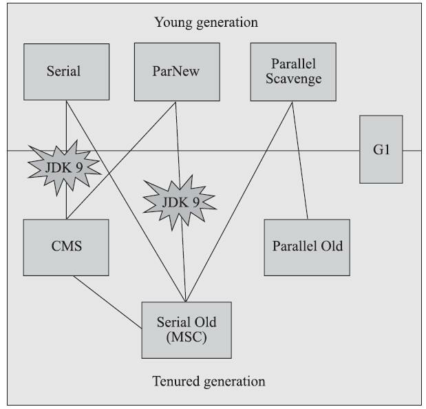

图3-6展示了七种作用于不同分代的收集器，如果两个收集器之间存在连线，就说明它们可以搭配使用[^搭配使用]，图中收集器所处的区域，则表示它是属于新生代收集器抑或是老年代收集器。接下来笔者将逐一介绍这些收集器的目标、特性、原理和使用场景，并重点分析CMS和G1这两款相对复杂而又广泛使用的收集器，深入了解它们的部分运作细节。

在介绍这些收集器各自的特性之前，让我们先来明确一个观点：虽然我们会对各个收集器进行比较，但并非为了挑选一个最好的收集器出来，虽然垃圾收集器的技术在不断进步，但直到现在还没有最好的收集器出现，更加不存在“万能”的收集器，所以我们选择的只是对具体应用最合适的收集器。

这点不需要多加论述就能证明：如果有一种放之四海皆准、任何场景下都适用的完美收集器存在， HotSpot虚拟机完全没必要实现那么多种不同的收集器了。

[^OracleJDK]: 这里专门强调了OracleJDK是因为要把OpenJDK，尤其是OpenJDK-Shenandoah-JDK8这种Backports 项目排除在外，在本书故事的时间线里，Shenandoah要到OpenJDK 12才会登场，请读者耐心等待。
[^collectors]: 图片来源：https://blogs.oracle.com/jonthecollector/our_collectors。
[^搭配使用]: 这个关系不是一成不变的，由于维护和兼容性测试的成本，在JDK 8时将Serial+CMS、 ParNew+Serial Old这两个组合声明为废弃（JEP 173），并在JDK 9中完全取消了这些组合的支持（JEP 214）。

### 3.5.1 Serial收集器

**Serial收集器**是最基础、历史最悠久的收集器，曾经（在JDK 1.3.1之前）是HotSpot虚拟机新生代收集器的唯一选择。大家只看名字就能够猜到，这个收集器是一个单线程工作的收集器，但它的“单线程”的意义并不仅仅是说明它只会使用一个处理器或一条收集线程去完成垃圾收集工作，更重要的是强调在它进行垃圾收集时，必须暂停其他所有工作线程，直到它收集结束。**“Stop The World”**这个词语也许听起来很酷，但这项工作是由虚拟机在后台自动发起和自动完成的，在用户不可知、不可控的情况下把用户的正常工作的线程全部停掉，这对很多应用来说都是不能接受的。读者不妨试想一下，要是你的电脑每运行一个小时就会暂停响应五分钟，你会有什么样的心情？图3-7示意了Serial/Serial Old收集器的运行过程。

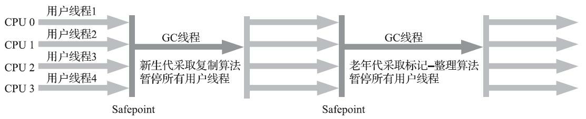

对于“Stop The World”带给用户的恶劣体验，早期HotSpot虚拟机的设计者们表示完全理解，但也同时表示非常委屈：“你妈妈在给你打扫房间的时候，肯定也会让你老老实实地在椅子上或者房间外待着，如果她一边打扫，你一边乱扔纸屑，这房间还能打扫完？”这确实是一个合情合理的矛盾，虽然垃圾收集这项工作听起来和打扫房间属于一个工种，但实际上肯定还要比打扫房间复杂得多！

从JDK 1.3开始，一直到现在最新的JDK 13，HotSpot虚拟机开发团队为消除或者降低用户线程因垃圾收集而导致停顿的努力一直持续进行着，从Serial收集器到Parallel收集器，再到Concurrent MarkSweep（CMS）和Garbage First（G1）收集器，最终至现在垃圾收集器的最前沿成果Shenandoah和ZGC 等，我们看到了一个个越来越构思精巧，越来越优秀，也越来越复杂的垃圾收集器不断涌现，用户线程的停顿时间在持续缩短，但是仍然没有办法彻底消除（这里不去讨论RTSJ中的收集器），探索更优秀垃圾收集器的工作仍在继续。

写到这里，笔者似乎已经把Serial收集器描述成一个最早出现，但目前已经老而无用，食之无味， 弃之可惜的“鸡肋”了，但事实上，迄今为止，它依然是HotSpot虚拟机运行在客户端模式下的默认新生代收集器，有着优于其他收集器的地方，那就是简单而高效（与其他收集器的单线程相比），对于内存资源受限的环境，它是所有收集器里额外内存消耗（Memory Footprint）[^Memory Footprint]最小的；对于单核处理器或处理器核心数较少的环境来说，Serial收集器由于没有线程交互的开销，专心做垃圾收集自然可以获得最高的单线程收集效率。在用户桌面的应用场景以及近年来流行的部分微服务应用中，分配给虚拟机管理的内存一般来说并不会特别大，收集几十兆甚至一两百兆的新生代（仅仅是指新生代使用的内存，桌面应用甚少超过这个容量），垃圾收集的停顿时间完全可以控制在十几、几十毫秒，最多一百多毫秒以内，只要不是频繁发生收集，这点停顿时间对许多用户来说是完全可以接受的。所以，Serial收集器对于运行在客户端模式下的虚拟机来说是一个很好的选择。

[^Memory Footprint]: Memory Footprint：内存占用，此语境中指为保证垃圾收集能够顺利高效地进行而存储的额外信息。

### 3.5.2 ParNew收集器

ParNew收集器实质上是Serial收集器的多线程并行版本，除了同时使用多条线程进行垃圾收集之外，其余的行为包括Serial收集器可用的所有控制参数（例如：`-XX：SurvivorRatio`、`-XX：PretenureSizeThreshold`、`-XX：HandlePromotionFailure`等）、收集算法、Stop The World、对象分配规则、回收策略等都与Serial收集器完全一致，在实现上这两种收集器也共用了相当多的代码。ParNew收集器的工作过程如图3-8所示。

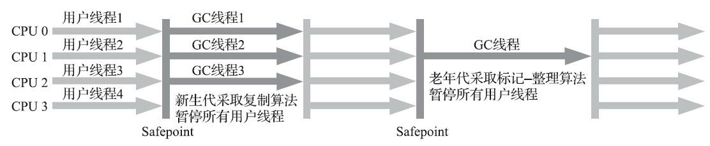

ParNew收集器除了支持多线程并行收集之外，其他与Serial收集器相比并没有太多创新之处，但它却是不少运行在服务端模式下的HotSpot虚拟机，尤其是JDK 7之前的遗留系统中首选的新生代收集器，其中有一个与功能、性能无关但其实很重要的原因是：除了Serial收集器外，目前只有它能与CMS 收集器配合工作。

在JDK 5发布时，HotSpot推出了一款在强交互应用中几乎可称为具有划时代意义的垃圾收集器 ——CMS收集器。这款收集器是HotSpot虚拟机中第一款真正意义上支持并发的垃圾收集器，它首次实现了让垃圾收集线程与用户线程（基本上）同时工作。

遗憾的是，CMS作为老年代的收集器，却无法与JDK 1.4.0中已经存在的新生代收集器ParallelScavenge配合工作[^Parallel Scavenge]，所以在JDK 5中使用CMS来收集老年代的时候，新生代只能选择ParNew或者Serial收集器中的一个。ParNew收集器是激活CMS后（使用`-XX：+UseConcMarkSweepGC`选项）的默认新生代收集器，也可以使用`-XX：+/-UseParNewGC`选项来强制指定或者禁用它。

可以说直到CMS的出现才巩固了ParNew的地位，但成也萧何败也萧何，随着垃圾收集器技术的不断改进，更先进的G1收集器带着CMS继承者和替代者的光环登场。G1是一个面向全堆的收集器，不再需要其他新生代收集器的配合工作。所以自JDK 9开始，ParNew加CMS收集器的组合就不再是官方推荐的服务端模式下的收集器解决方案了。官方希望它能完全被G1所取代，甚至还取消了ParNew加 Serial Old以及Serial加CMS这两组收集器组合的支持（其实原本也很少人这样使用），并直接取消了`-XX：+UseParNewGC`参数，这意味着ParNew和CMS从此只能互相搭配使用，再也没有其他收集器能够和它们配合了。读者也可以理解为从此以后，ParNew合并入CMS，成为它专门处理新生代的组成部分。ParNew可以说是HotSpot虚拟机中第一款退出历史舞台的垃圾收集器。

ParNew收集器在单核心处理器的环境中绝对不会有比Serial收集器更好的效果，甚至由于存在线程交互的开销，该收集器在通过超线程（Hyper-Threading）技术实现的伪双核处理器环境中都不能百分之百保证超越Serial收集器。当然，随着可以被使用的处理器核心数量的增加，ParNew对于垃圾收集时系统资源的高效利用还是很有好处的。它默认开启的收集线程数与处理器核心数量相同，在处理器核心非常多（譬如32个，现在CPU都是多核加超线程设计，服务器达到或超过32个逻辑核心的情况非常普遍）的环境中，可以使用`-XX：ParallelGCThreads`参数来限制垃圾收集的线程数。

> **注意**:　从ParNew收集器开始，后面还将会接触到若干款涉及“并发”和“并行”概念的收集器。 在大家可能产生疑惑之前，有必要先解释清楚这两个名词。并行和并发都是并发编程中的专业名词，在谈论垃圾收集器的上下文语境中，它们可以理解为：
>
> **并行（`Parallel`）**：并行描述的是多条垃圾收集器线程之间的关系，说明同一时间有多条这样的线 程在协同工作，通常默认此时用户线程是处于等待状态。
>
> **并发（`Concurrent`）**：并发描述的是垃圾收集器线程与用户线程之间的关系，说明同一时间垃圾收集器线程与用户线程都在运行。由于用户线程并未被冻结，所以程序仍然能响应服务请求，但由于垃圾收集器线程占用了一部分系统资源，此时应用程序的处理的吞吐量将受到一定影响。

[^Parallel Scavenge]: 除了一个面向低延迟一个面向高吞吐量的目标不一致外，技术上的原因是Parallel Scavenge收集器及后面提到的G1收集器等都没有使用HotSpot中原本设计的垃圾收集器的分代框架，而选择另外独立实现。Serial、ParNew收集器则共用了这部分的框架代码，详细可参考：https://blogs.oracle.com/jonthecollector/our_collectors。

### 3.5.3 Parallel Scavenge收集器

Parallel Scavenge收集器也是一款新生代收集器，它同样是基于标记-复制算法实现的收集器，也是能够并行收集的多线程收集器……Parallel Scavenge的诸多特性从表面上看和ParNew非常相似，那它有什么特别之处呢？

Parallel Scavenge收集器的特点是它的关注点与其他收集器不同，CMS等收集器的关注点是尽可能地缩短垃圾收集时用户线程的停顿时间，而Parallel Scavenge收集器的目标则是达到一个可控制的吞吐量（Throughput）。所谓吞吐量就是处理器用于运行用户代码的时间与处理器总消耗时间的比值， 即：
$$
吞吐量=\frac{运行用户代码时间}{运行用户代码时间+运行垃圾收集时间}
$$
如果虚拟机完成某个任务，用户代码加上垃圾收集总共耗费了100分钟，其中垃圾收集花掉1分钟，那吞吐量就是99%。停顿时间越短就越适合需要与用户交互或需要保证服务响应质量的程序，良好的响应速度能提升用户体验；而高吞吐量则可以最高效率地利用处理器资源，尽快完成程序的运算任务，主要适合在后台运算而不需要太多交互的分析任务。

Parallel Scavenge收集器提供了两个参数用于精确控制吞吐量，分别是控制最大垃圾收集停顿时间的`-XX：MaxGCPauseMillis`参数以及直接设置吞吐量大小的`-XX：GCTimeRatio`参数。

`-XX：MaxGCPauseMillis`参数允许的值是一个大于0的毫秒数，收集器将尽力保证内存回收花费的时间不超过用户设定值。不过大家不要异想天开地认为如果把这个参数的值设置得更小一点就能使得系统的垃圾收集速度变得更快，垃圾收集停顿时间缩短是以牺牲吞吐量和新生代空间为代价换取的：系统把新生代调得小一些，收集300MB新生代肯定比收集500MB快，但这也直接导致垃圾收集发生得更频繁，原来10秒收集一次、每次停顿100毫秒，现在变成5秒收集一次、每次停顿70毫秒。停顿时间的确在下降，但吞吐量也降下来了。

 `-XX：GCTimeRatio`参数的值则应当是一个大于0小于100的整数，也就是垃圾收集时间占总时间的比率，相当于吞吐量的倒数。譬如把此参数设置为19，那允许的最大垃圾收集时间就占总时间的5%（即1/(1+19)），默认值为99，即允许最大1%（即1/(1+99)）的垃圾收集时间。

由于与吞吐量关系密切，Parallel Scavenge收集器也经常被称作“吞吐量优先收集器”。除上述两个参数之外，Parallel Scavenge收集器还有一个参数`-XX：+UseAdaptiveSizePolicy`值得我们关注。这是一个开关参数，当这个参数被激活之后，就不需要人工指定新生代的大小（-Xmn）、Eden与Survivor区的比例（`-XX：SurvivorRatio`）、晋升老年代对象大小（`-XX：PretenureSizeThreshold`）等细节参数了，虚拟机会根据当前系统的运行情况收集性能监控信息，动态调整这些参数以提供最合适的停顿时间或者最大的吞吐量。这种调节方式称为垃圾收集的自适应的调节策略（GC Ergonomics）[^GC Ergonomics]。如果读者对于收集器运作不太了解，手工优化存在困难的话，使用Parallel Scavenge收集器配合自适应调节策略，把内存管理的调优任务交给虚拟机去完成也许是一个很不错的选择。只需要把基本的内存数据设置好（如-Xmx设置最大堆），然后使用`-XX：MaxGCPauseMillis`参数（更关注最大停顿时间）或`-XX：GCTimeRatio`（更关注吞吐量）参数给虚拟机设立一个优化目标，那具体细节参数的调节工作就由虚拟机完成了。自适应调节策略也是Parallel Scavenge收集器区别于ParNew收集器的一个重要特性。

[^GC Ergonomics]: 官方介绍：http://download.oracle.com/javase/1.5.0/docs/guide/vm/gc-ergonomics.html。

### 3.5.4 Serial Old收集器

Serial Old是Serial收集器的老年代版本，它同样是一个单线程收集器，使用标记-整理算法。这个收集器的主要意义也是供客户端模式下的HotSpot虚拟机使用。如果在服务端模式下，它也可能有两种用途：一种是在JDK 5以及之前的版本中与Parallel Scavenge收集器搭配使用[^Serial Old]，另外一种就是作为CMS 收集器发生失败时的后备预案，在并发收集发生Concurrent Mode Failure时使用。这两点都将在后面的内容中继续讲解。Serial Old收集器的工作过程如图3-9所示。

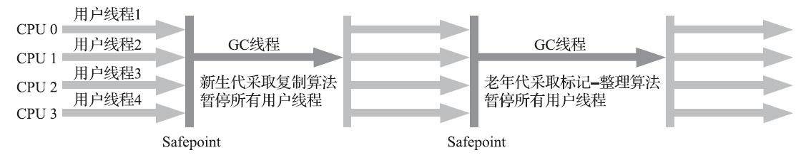

 图3-9　Serial/Serial Old收集器运行示意图

[^Serial Old]: 需要说明一下，Parallel Scavenge收集器架构中本身有PS MarkSweep收集器来进行老年代收集，并非 直接调用Serial Old收集器，但是这个PS MarkSweep收集器与Serial Old的实现几乎是一样的，所以在官 方的许多资料中都是直接以Serial Old代替PS MarkSweep进行讲解，这里笔者也采用这种方式。

### 3.5.5 Parallel Old收集器

Parallel Old是Parallel Scavenge收集器的老年代版本，支持多线程并发收集，基于标记-整理算法实现。这个收集器是直到JDK 6时才开始提供的，在此之前，新生代的Parallel Scavenge收集器一直处于相当尴尬的状态，原因是如果新生代选择了Parallel Scavenge收集器，老年代除了Serial Old（PSMarkSweep）收集器以外别无选择，其他表现良好的老年代收集器，如CMS无法与它配合工作。由于老年代Serial Old收集器在服务端应用性能上的“拖累”，使用Parallel Scavenge收集器也未必能在整体上获得吞吐量最大化的效果。同样，由于单线程的老年代收集中无法充分利用服务器多处理器的并行处理能力，在老年代内存空间很大而且硬件规格比较高级的运行环境中，这种组合的总吞吐量甚至不一定比ParNew加CMS的组合来得优秀。

直到Parallel Old收集器出现后，“吞吐量优先”收集器终于有了比较名副其实的搭配组合，在注重吞吐量或者处理器资源较为稀缺的场合，都可以优先考虑Parallel Scavenge加Parallel Old收集器这个组合。Parallel Old收集器的工作过程如图3-10所示。

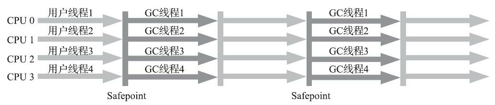

### 3.5.6 CMS收集器

**CMS（`Concurrent Mark Sweep`）收集器是一种以获取最短回收停顿时间为目标的收集器。**目前很大一部分的Java应用集中在互联网网站或者基于浏览器的B/S系统的服务端上，这类应用通常都会较为关注服务的响应速度，希望系统停顿时间尽可能短，以给用户带来良好的交互体验。CMS收集器就非常符合这类应用的需求。

从名字（包含“Mark Sweep”）上就可以看出CMS收集器是基于标记-清除算法实现的，它的运作过程相对于前面几种收集器来说要更复杂一些，整个过程分为四个步骤，包括：

1. 初始标记（CMS initial mark）
2. 并发标记（CMS concurrent mark）
3. 重新标记（CMS remark）
4. 并发清除（CMS concurrent sweep）

其中初始标记、重新标记这两个步骤仍然需要“Stop The World”。初始标记仅仅只是标记一下GCRoots能直接关联到的对象，速度很快；并发标记阶段就是从GC Roots的直接关联对象开始遍历整个对象图的过程，这个过程耗时较长但是不需要停顿用户线程，可以与垃圾收集线程一起并发运行；而重新标记阶段则是为了修正并发标记期间，因用户程序继续运作而导致标记产生变动的那一部分对象的标记记录（详见3.4.6节中关于增量更新的讲解），这个阶段的停顿时间通常会比初始标记阶段稍长一 些，但也远比并发标记阶段的时间短；最后是并发清除阶段，清理删除掉标记阶段判断的已经死亡的对象，由于不需要移动存活对象，所以这个阶段也是可以与用户线程同时并发的。

由于在整个过程中耗时最长的并发标记和并发清除阶段中，垃圾收集器线程都可以与用户线程一起工作，所以从总体上来说，CMS收集器的内存回收过程是与用户线程一起并发执行的。通过图3-11可以比较清楚地看到CMS收集器的运作步骤中并发和需要停顿的阶段。

 图3-11　Concurrent Mark Sweep收集器运行示意图

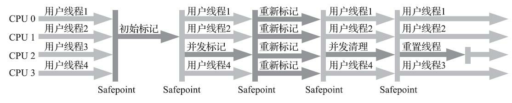

CMS是一款优秀的收集器，它最主要的优点在名字上已经体现出来：并发收集、低停顿，一些官方公开文档里面也称之为“并发低停顿收集器”（Concurrent Low Pause Collector）。CMS收集器是HotSpot虚拟机追求低停顿的第一次成功尝试，但是它还远达不到完美的程度，至少有以下三个明显的缺点：

首先，**CMS收集器对处理器资源非常敏感。**事实上，面向并发设计的程序都对处理器资源比较敏感。在并发阶段，它虽然不会导致用户线程停顿，但却会因为占用了一部分线程（或者说处理器的计算能力）而导致应用程序变慢，降低总吞吐量。CMS默认启动的回收线程数是（处理器核心数量+3）/4，也就是说，如果处理器核心数在四个或以上，并发回收时垃圾收集线程只占用不超过25%的处理器运算资源，并且会随着处理器核心数量的增加而下降。但是当处理器核心数量不足四个时，CMS对用户程序的影响就可能变得很大。如果应用本来的处理器负载就很高，还要分出一半的运算能力去执行收集器线程，就可能导致用户程序的执行速度忽然大幅降低。为了缓解这种情况，虚拟机提供了一种称为“增量式并发收集器”（Incremental Concurrent Mark Sweep/i-CMS）的CMS收集器变种，所做的事情和以前单核处理器年代PC机操作系统靠抢占式多任务来模拟多核并行多任务的思想一样， 是在并发标记、清理的时候让收集器线程、用户线程交替运行，尽量减少垃圾收集线程的独占资源的 时间，这样整个垃圾收集的过程会更长，但对用户程序的影响就会显得较少一些，直观感受是速度变慢的时间更多了，但速度下降幅度就没有那么明显。实践证明增量式的CMS收集器效果很一般，从JDK 7开始，i-CMS模式已经被声明为“deprecated”，即已过时不再提倡用户使用，到JDK 9发布后i-CMS模式被完全废弃。

然后，由于**CMS收集器无法处理“浮动垃圾”（`Floating Garbage`），有可能出现“Con-current Mode Failure”失败进而导致另一次完全“Stop The World”的Full GC的产生。**在CMS的并发标记和并发清理阶段，用户线程是还在继续运行的，程序在运行自然就还会伴随有新的垃圾对象不断产生，但这一部分垃圾对象是出现在标记过程结束以后，CMS无法在当次收集中处理掉它们，只好留待下一次垃圾收集时再清理掉。这一部分垃圾就称为“浮动垃圾”。同样也是由于在垃圾收集阶段用户线程还需要持续运行，那就还需要预留足够内存空间提供给用户线程使用，因此CMS收集器不能像其他收集器那样等待到老年代几乎完全被填满了再进行收集，必须预留一部分空间供并发收集时的程序运作使用。在JDK 5的默认设置下，CMS收集器当老年代使用了68%的空间后就会被激活，这是一个偏保守的设置，如果在实际应用中老年代增长并不是太快，可以适当调高参数`-XX：CMSInitiatingOccu-pancyFraction`的值来提高CMS的触发百分比，降低内存回收频率，获取更好的性能。到了JDK 6时，CMS收集器的启动阈值就已经默认提升至92%。但这又会更容易面临另一种风险：**要是CMS运行期间预留的内存无法满足程序分配新对象的需要，就会出现一次“并发失败”（`Concurrent Mode Failure`）**，这时候虚拟机将不得不启动后备预案：冻结用户线程的执行，临时启用Serial Old收集器来重新进行老年代的垃圾收集， 但这样停顿时间就很长了。所以参数`-XX：CMSInitiatingOccupancyFraction`设置得太高将会很容易导致大量的并发失败产生，性能反而降低，用户应在生产环境中根据实际应用情况来权衡设置。

还有最后一个缺点，在本节的开头曾提到，CMS是一款基于“标记-清除”算法实现的收集器，如果读者对前面这部分介绍还有印象的话，就可能想到这意味着收集结束时**会有大量空间碎片产生。**空间碎片过多时，将会给大对象分配带来很大麻烦，往往会出现老年代还有很多剩余空间，但就是无法找到足够大的连续空间来分配当前对象，而不得不提前触发一次Full GC的情况。为了解决这个问题，CMS收集器提供了一个`-XX：+UseCMS-CompactAtFullCollection`开关参数（默认是开启的，此参数从 JDK 9开始废弃），用于在CMS收集器不得不进行Full GC时开启内存碎片的合并整理过程，由于这个内存整理必须移动存活对象，（在Shenandoah和ZGC出现前）是无法并发的。这样空间碎片问题是解决了，但停顿时间又会变长，因此虚拟机设计者们还提供了另外一个参数`-XX：CMSFullGCsBefore-Compaction`（此参数从JDK 9开始废弃），这个参数的作用是要求CMS收集器在执行过若干次（数量由参数值决定）不整理空间的Full GC之后，下一次进入Full GC前会先进行碎片整理（默认值为0，表示每次进入Full GC时都进行碎片整理）。

### 3.5.7 Garbage First收集器

Garbage First（简称G1）收集器是垃圾收集器技术发展历史上的里程碑式的成果，它开创了收集器面向局部收集的设计思路和基于Region的内存布局形式。早在JDK 7刚刚确立项目目标、Oracle公司制定的JDK 7 RoadMap里面，G1收集器就被视作JDK 7中HotSpot虚拟机的一项重要进化特征。从JDK 6 Update 14开始就有Early Access版本的G1收集器供开发人员实验和试用，但由此开始G1收集器的“实验状态”（Experimental）持续了数年时间，直至JDK 7 Update 4，Oracle才认为它达到足够成熟的商用程度，移除了“Experimental”的标识；到了JDK 8 Update 40的时候，G1提供并发的类卸载的支持，补全了其计划功能的最后一块拼图。这个版本以后的G1收集器才被Oracle官方称为“全功能的垃圾收集器”（Fully-Featured Garbage Collector）。

G1是一款主要面向服务端应用的垃圾收集器。HotSpot开发团队最初赋予它的期望是（在比较长期的）未来可以替换掉JDK 5中发布的CMS收集器。现在这个期望目标已经实现过半了，JDK 9发布之日，G1宣告取代Parallel Scavenge加Parallel Old组合，成为服务端模式下的默认垃圾收集器，而CMS则沦落至被声明为不推荐使用（Deprecate）的收集器[^JEP-291]。如果对JDK 9及以上版本的HotSpot虚拟机使用参数`-XX+UseConcMarkSweepGC`来开启CMS收集器的话，用户会收到一个警告信息，提示CMS未来将会被废弃：

```shell
Java HotSpot(TM) 64-Bit Server VM warning: Option UseConcMarkSweepGC was deprecated in version 9.0 and will like
```

但作为一款曾被广泛运用过的收集器，经过多个版本的开发迭代后，CMS（以及之前几款收集器）的代码与HotSpot的内存管理、执行、编译、监控等子系统都有千丝万缕的联系，这是历史原因导致的，并不符合职责分离的设计原则。为此，规划JDK 10功能目标时，HotSpot虚拟机提出了“统一垃圾收集器接口”[^JEP-304]，将内存回收的“行为”与“实现”进行分离，CMS以及其他收集器都重构成基于这套接口的一种实现。以此为基础，日后要移除或者加入某一款收集器，都会变得容易许多，风险也可以控制，这算是在为CMS退出历史舞台铺下最后的道路了。

作为CMS收集器的替代者和继承人，设计者们希望做出一款能够建立起“停顿时间模型”（Pause Prediction Model）的收集器，停顿时间模型的意思是能够支持指定在一个长度为M毫秒的时间片段内，消耗在垃圾收集上的时间大概率不超过N毫秒这样的目标，这几乎已经是实时Java（RTSJ）的中软实时垃圾收集器特征了。

那具体要怎么做才能实现这个目标呢？首先要有一个思想上的改变，在G1收集器出现之前的所有其他收集器，包括CMS在内，垃圾收集的目标范围要么是整个新生代（Minor GC），要么就是整个老年代（Major GC），再要么就是整个Java堆（Full GC）。而G1跳出了这个樊笼，它可以面向堆内存任何部分来组成回收集（Collection Set，一般简称CSet）进行回收，衡量标准不再是它属于哪个分代，而是哪块内存中存放的垃圾数量最多，回收收益最大，这就是G1收集器的Mixed GC模式。

G1开创的基于Region的堆内存布局是它能够实现这个目标的关键。虽然G1也仍是遵循分代收集理论设计的，但其堆内存的布局与其他收集器有非常明显的差异：G1不再坚持固定大小以及固定数量的分代区域划分，而是把连续的Java堆划分为多个大小相等的独立区域（Region），每一个Region都可以根据需要，扮演新生代的Eden空间、Survivor空间，或者老年代空间。收集器能够对扮演不同角色的 Region采用不同的策略去处理，这样无论是新创建的对象还是已经存活了一段时间、熬过多次收集的旧对象都能获取很好的收集效果。

Region中还有一类特殊的Humongous区域，专门用来存储大对象。G1认为只要大小超过了一个Region容量一半的对象即可判定为大对象。每个Region的大小可以通过参数-XX：G1HeapRegionSize设 定，取值范围为1MB～32MB，且应为2的N次幂。而对于那些超过了整个Region容量的超级大对象，将会被存放在N个连续的Humongous Region之中，G1的大多数行为都把Humongous Region作为老年代的一部分来进行看待，如图3-12所示[^G1-Region]。

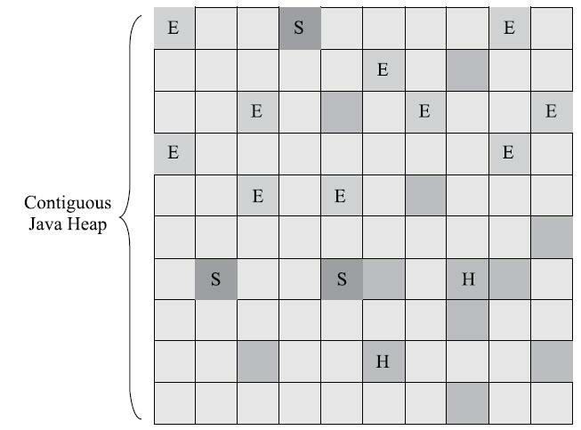

虽然G1仍然保留新生代和老年代的概念，但新生代和老年代不再是固定的了，它们都是一系列区域（不需要连续）的动态集合。G1收集器之所以能建立可预测的停顿时间模型，是因为它将Region作为单次回收的最小单元，即每次收集到的内存空间都是Region大小的整数倍，这样可以有计划地避免在整个Java堆中进行全区域的垃圾收集。更具体的处理思路是让G1收集器去跟踪各个Region里面的垃 圾堆积的“价值”大小，价值即回收所获得的空间大小以及回收所需时间的经验值，然后在后台维护一个优先级列表，每次根据用户设定允许的收集停顿时间（使用参数`-XX：MaxGCPauseMillis`指定，默认值是200毫秒），优先处理回收价值收益最大的那些Region，这也就是“Garbage First”名字的由来。

这种使用Region划分内存空间，以及具有优先级的区域回收方式，保证了G1收集器在有限的时间内获取尽可能高的收集效率。

G1将堆内存“化整为零”的“解题思路”，看起来似乎没有太多令人惊讶之处，也完全不难理解，但其中的实现细节可是远远没有想象中那么简单，否则就不会从2004年Sun实验室发表第一篇关于G1的论文后一直拖到2012年4月JDK 7 Update 4发布，用将近10年时间才倒腾出能够商用的G1收集器来。

G1收集器至少有（不限于）以下这些关键的细节问题需要妥善解决：

 譬如，*将Java堆分成多个独立Region后，Region里面存在的跨Region引用对象如何解决？*解决的思路我们已经知道（见3.3.1节和3.4.4节）：使用记忆集避免全堆作为GC Roots扫描，但在G1收集器上记忆集的应用其实要复杂很多，它的每个Region都维护有自己的记忆集，这些记忆集会记录下别的Region指向自己的指针，并标记这些指针分别在哪些卡页的范围之内。G1的记忆集在存储结构的本质上是一种哈希表，Key是别的Region的起始地址，Value是一个集合，里面存储的元素是卡表的索引号。这种“双向”的卡表结构（卡表是“我指向谁”，这种结构还记录了“谁指向我”）比原来的卡表实现起来更复杂，同时由于Region数量比传统收集器的分代数量明显要多得多，因此G1收集器要比其他的传统垃圾收集器有着更高的内存占用负担。根据经验，G1至少要耗费大约相当于Java堆容量10%至20%的额外内存来维持收集器工作。

譬如，*在并发标记阶段如何保证收集线程与用户线程互不干扰地运行？*这里首先要解决的是用户线程改变对象引用关系时，必须保证其不能打破原本的对象图结构，导致标记结果出现错误，该问题的解决办法笔者已经抽出独立小节来讲解过（见3.4.6节）：CMS收集器采用增量更新算法实现，而G1收集器则是通过原始快照（SATB）算法来实现的。此外，垃圾收集对用户线程的影响还体现在回收过程中新创建对象的内存分配上，程序要继续运行就肯定会持续有新对象被创建，G1为每一个Region设计了两个名为TAMS（Top at Mark Start）的指针，把Region中的一部分空间划分出来用于并发回收过程中的新对象分配，并发回收时新分配的对象地址都必须要在这两个指针位置以上。G1收集器默认在这个地址以上的对象是被隐式标记过的，即默认它们是存活的，不纳入回收范围。与CMS中的“Concurrent Mode Failure”失败会导致Full GC类似，如果内存回收的速度赶不上内存分配的速度，G1收集器也要被迫冻结用户线程执行，导致Full GC而产生长时间“Stop The World”。

譬如，*怎样建立起可靠的停顿预测模型？*用户通过`-XX：MaxGCPauseMillis`参数指定的停顿时间只意味着垃圾收集发生之前的期望值，但G1收集器要怎么做才能满足用户的期望呢？G1收集器的停顿预测模型是以衰减均值（Decaying Average）为理论基础来实现的，在垃圾收集过程中，G1收集器会记录每个Region的回收耗时、每个Region记忆集里的脏卡数量等各个可测量的步骤花费的成本，并分析得出平均值、标准偏差、置信度等统计信息。这里强调的“衰减平均值”是指它会比普通的平均值更容易受到新数据的影响，平均值代表整体平均状态，但衰减平均值更准确地代表“最近的”平均状态。换句话说，Region的统计状态越新越能决定其回收的价值。然后通过这些信息预测现在开始回收的话，由哪些Region组成回收集才可以在不超过期望停顿时间的约束下获得最高的收益。

如果我们不去计算用户线程运行过程中的动作（如使用写屏障维护记忆集的操作），G1收集器的运作过程大致可划分为以下四个步骤：

1. **初始标记（`Initial Marking`）**：仅仅只是标记一下GC Roots能直接关联到的对象，并且修改TAMS 指针的值，让下一阶段用户线程并发运行时，能正确地在可用的Region中分配新对象。这个阶段需要停顿线程，但耗时很短，而且是借用进行Minor GC的时候同步完成的，所以G1收集器在这个阶段实际并没有额外的停顿。
2. **并发标记（`Concurrent Marking`）**：从GC Root开始对堆中对象进行可达性分析，递归扫描整个堆里的对象图，找出要回收的对象，这阶段耗时较长，但可与用户程序并发执行。当对象图扫描完成以后，还要重新处理SATB记录下的在并发时有引用变动的对象。
3. **最终标记（`Final Marking`）**：对用户线程做另一个短暂的暂停，用于处理并发阶段结束后仍遗留下来的最后那少量的SATB记录。
4. **筛选回收（`Live Data Counting and Evacuation`）**：负责更新Region的统计数据，对各个Region的回收价值和成本进行排序，根据用户所期望的停顿时间来制定回收计划，可以自由选择任意多个Region构成回收集，然后把决定回收的那一部分Region的存活对象复制到空的Region中，再清理掉整个旧Region的全部空间。这里的操作涉及存活对象的移动，是必须暂停用户线程，由多条收集器线程并行 完成的。

从上述阶段的描述可以看出，G1收集器除了并发标记外，其余阶段也是要完全暂停用户线程的， 换言之，它并非纯粹地追求低延迟，官方给它设定的目标是在延迟可控的情况下获得尽可能高的吞吐量，所以才能担当起“全功能收集器”的重任与期望[^high throughput]。

从Oracle官方透露出来的信息可获知，回收阶段（Evacuation）其实本也有想过设计成与用户程序一起并发执行，但这件事情做起来比较复杂，考虑到G1只是回收一部分Region，停顿时间是用户可控制的，所以并不迫切去实现，而选择把这个特性放到了G1之后出现的低延迟垃圾收集器（即ZGC）中。另外，还考虑到G1不是仅仅面向低延迟，停顿用户线程能够最大幅度提高垃圾收集效率，为了保证吞吐量所以才选择了完全暂停用户线程的实现方案。通过图3-13可以比较清楚地看到G1收集器的运作步骤中并发和需要停顿的阶段。


毫无疑问，可以由用户指定期望的停顿时间是G1收集器很强大的一个功能，设置不同的期望停顿时间，可使得G1在不同应用场景中取得关注吞吐量和关注延迟之间的最佳平衡。不过，这里设置的“期望值”必须是符合实际的，不能异想天开，毕竟G1是要冻结用户线程来复制对象的，这个停顿时间再怎么低也得有个限度。它默认的停顿目标为两百毫秒，一般来说，回收阶段占到几十到一百甚至接近两百毫秒都很正常，但如果我们把停顿时间调得非常低，譬如设置为二十毫秒，很可能出现的结果就是由于停顿目标时间太短，导致每次选出来的回收集只占堆内存很小的一部分，收集器收集的速度逐渐跟不上分配器分配的速度，导致垃圾慢慢堆积。很可能一开始收集器还能从空闲的堆内存中获得一些喘息的时间，但应用运行时间一长就不行了，最终占满堆引发Full GC反而降低性能，所以通常把期望停顿时间设置为一两百毫秒或者两三百毫秒会是比较合理的。

从G1开始，最先进的垃圾收集器的设计导向都不约而同地变为追求能够应付应用的**内存分配速率 （`Allocation Rate`）**，而不追求一次把整个Java堆全部清理干净。这样，应用在分配，同时收集器在收集，只要收集的速度能跟得上对象分配的速度，那一切就能运作得很完美。这种新的收集器设计思路从工程实现上看是从G1开始兴起的，所以说G1是收集器技术发展的一个里程碑。

G1收集器常会被拿来与CMS收集器互相比较，毕竟它们都非常关注停顿时间的控制，官方资料[^The Mostly Concurrent Collectors]中将它们两个并称为“The Mostly Concurrent Collectors”。在未来，G1收集器最终还是要取代CMS 的，而当下它们两者并存的时间里，分个高低优劣就无可避免。

相比CMS，G1的优点有很多，暂且不论可以指定最大停顿时间、分Region的内存布局、按收益动态确定回收集这些创新性设计带来的红利，单从最传统的算法理论上看，G1也更有发展潜力。与CMS 的“标记-清除”算法不同，G1从整体来看是基于“标记-整理”算法实现的收集器，但从局部（两个Region 之间）上看又是基于“标记-复制”算法实现，无论如何，这两种算法都意味着G1运作期间不会产生内存空间碎片，垃圾收集完成之后能提供规整的可用内存。这种特性有利于程序长时间运行，在程序为大对象分配内存时不容易因无法找到连续内存空间而提前触发下一次收集。

不过，G1相对于CMS仍然不是占全方位、压倒性优势的，从它出现几年仍不能在所有应用场景中代替CMS就可以得知这个结论。比起CMS，G1的弱项也可以列举出不少，如在用户程序运行过程中，G1无论是为了垃圾收集产生的内存占用（Footprint）还是程序运行时的额外执行负载（Overload）都要比CMS要高。

就内存占用来说，虽然G1和CMS都使用卡表来处理跨代指针，但G1的卡表实现更为复杂，而且堆中每个Region，无论扮演的是新生代还是老年代角色，都必须有一份卡表，这导致G1的记忆集（和其他内存消耗）可能会占整个堆容量的20%乃至更多的内存空间；相比起来CMS的卡表就相当简单，只有唯一一份，而且只需要处理老年代到新生代的引用，反过来则不需要，由于新生代的对象具有朝生夕灭的不稳定性，引用变化频繁，能省下这个区域的维护开销是很划算的[^维护开销]。

在执行负载的角度上，同样由于两个收集器各自的细节实现特点导致了用户程序运行时的负载会有不同，譬如它们都使用到写屏障，CMS用写后屏障来更新维护卡表；而G1除了使用写后屏障来进行同样的（由于G1的卡表结构复杂，其实是更烦琐的）卡表维护操作外，为了实现原始快照搜索（SATB）算法，还需要使用写前屏障来跟踪并发时的指针变化情况。相比起增量更新算法，原始快照搜索能够减少并发标记和重新标记阶段的消耗，避免CMS那样在最终标记阶段停顿时间过长的缺点，但是在用户程序运行过程中确实会产生由跟踪引用变化带来的额外负担。由于G1对写屏障的复杂操作要比CMS消耗更多的运算资源，所以CMS的写屏障实现是直接的同步操作，而G1就不得不将其实现为类似于消息队列的结构，把写前屏障和写后屏障中要做的事情都放到队列里，然后再异步处理。

以上的优缺点对比仅仅是针对G1和CMS两款垃圾收集器单独某方面的实现细节的定性分析，通常我们说哪款收集器要更好、要好上多少，往往是针对具体场景才能做的定量比较。按照笔者的实践经验，目前在小内存应用上CMS的表现大概率仍然要会优于G1，而在大内存应用上G1则大多能发挥其优势，这个优劣势的Java堆容量平衡点通常在6GB至8GB之间，当然，以上这些也仅是经验之谈，不同应用需要量体裁衣地实际测试才能得出最合适的结论，随着HotSpot的开发者对G1的不断优化，也会让对比结果继续向G1倾斜。

[^JEP-291]: JEP 291：Deprecate the Concurrent Mark Sweep(CMS)Garbage Collector。
[^JEP-304]: JEP 304：Garbage Collector Interface。
[^G1-Region]: 图片来源：https://www.infoq.com/articles/G1-One-Garbage-Collector-To-Rule-Them-All。
[^high throughput]: 原文是：It meets garbage collection pause time goals with a high probability，while achieving high throughput。
[^The Mostly Concurrent Collectors]: 资料来源：https://docs.oracle.com/en/java/javase/11/gctuning/available-collectors.html。
[^维护开销]: 代价就是当CMS发生Old GC时（所有收集器中只有CMS有针对老年代的Old GC），要把整个新生 代作为GC Roots来进行扫描。

## 3.6 低延迟垃圾收集器

HotSpot的垃圾收集器从Serial发展到CMS再到G1，经历了逾二十年时间，经过了数百上千万台服务器上的应用实践，已经被淬炼得相当成熟了，不过它们距离“完美”还是很遥远。怎样的收集器才算是“完美”呢？这听起来像是一道主观题，其实不然，完美难以实现，但是我们确实可以把它客观描述出来。

衡量垃圾收集器的三项最重要的指标是：**内存占用（`Footprint`）**、**吞吐量（`Throughput`）**和**延迟 （`Latency`）**，三者共同构成了一个**“不可能三角[^不可能三角]”**。三者总体的表现会随技术进步而越来越好，但是 要在这三个方面同时具有卓越表现的“完美”收集器是极其困难甚至是不可能的，一款优秀的收集器通常最多可以同时达成其中的两项。

在内存占用、吞吐量和延迟这三项指标里，延迟的重要性日益凸显，越发备受关注。其原因是随着计算机硬件的发展、性能的提升，我们越来越能容忍收集器多占用一点点内存；硬件性能增长，对软件系统的处理能力是有直接助益的，硬件的规格和性能越高，也有助于降低收集器运行时对应用程序的影响，换句话说，吞吐量会更高。但对延迟则不是这样，硬件规格提升，准确地说是内存的扩大，对延迟反而会带来负面的效果，这点也是很符合直观思维的：虚拟机要回收完整的1TB的堆内存，毫无疑问要比回收1GB的堆内存耗费更多时间。由此，我们就不难理解为何延迟会成为垃圾收集器最被重视的性能指标了。现在我们来观察一下现在已接触过的垃圾收集器的停顿状况，如图3-14所示。

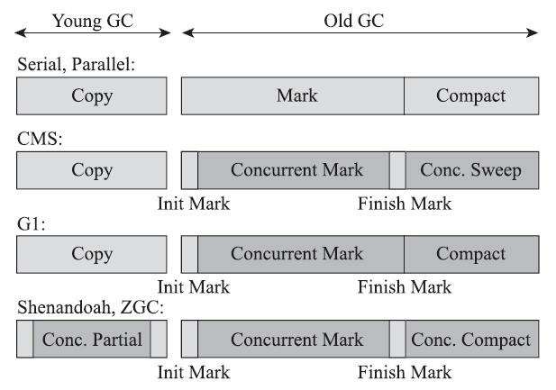

图3-14中浅色阶段表示必须挂起用户线程，深色表示收集器线程与用户线程是并发工作的。由图 3-14可见，在CMS和G1之前的全部收集器，其工作的所有步骤都会产生“Stop The World”式的停顿；CMS和G1分别使用增量更新和原始快照（见3.4.6节）技术，实现了标记阶段的并发，不会因管理的堆内存变大，要标记的对象变多而导致停顿时间随之增长。但是对于标记阶段之后的处理，仍未得到妥善解决。CMS使用标记-清除算法，虽然避免了整理阶段收集器带来的停顿，但是清除算法不论如何优化改进，在设计原理上避免不了空间碎片的产生，随着空间碎片不断淤积最终依然逃不过“Stop The World”的命运。G1虽然可以按更小的粒度进行回收，从而抑制整理阶段出现时间过长的停顿，但毕竟也还是要暂停的。

读者肯定也从图3-14中注意到了，最后的两款收集器，Shenandoah和ZGC，几乎整个工作过程全部都是并发的，只有初始标记、最终标记这些阶段有短暂的停顿，这部分停顿的时间基本上是固定的，与堆的容量、堆中对象的数量没有正比例关系。实际上，它们都可以在任意可管理的（譬如现在 ZGC只能管理4TB以内的堆）堆容量下，实现垃圾收集的停顿都不超过十毫秒这种以前听起来是天方夜谭、匪夷所思的目标。这两款目前仍处于实验状态的收集器，被官方命名为“低延迟垃圾收集器”（Low-Latency Garbage Collector或者Low-Pause-Time Garbage Collector）。

[^不可能三角]: 不可能三角：https://zh.wikipedia.org/wiki/三元悖论。

### 3.6.1 Shenandoah收集器

在本书所出现的众多垃圾收集器里，Shenandoah大概是最“孤独”的一个。现代社会竞争激烈，连一个公司里不同团队之间都存在“部门墙”，那Shenandoah作为第一款不由Oracle（包括以前的Sun）公司的虚拟机团队所领导开发的HotSpot垃圾收集器，不可避免地会受到一些来自“官方”的排挤。在笔者撰写这部分内容时[1]，Oracle仍明确拒绝在OracleJDK 12中支持Shenandoah收集器，并执意在打包OracleJDK时通过条件编译完全排除掉了Shenandoah的代码，换句话说，Shenandoah是一款只有OpenJDK才会包含，而OracleJDK里反而不存在的收集器，“免费开源版”比“收费商业版”功能更多，这是相对罕见的状况[2]。如果读者的项目要求用到Oracle商业支持的话，就不得不把Shenandoah排除在选择范围之外了。

最初Shenandoah是由RedHat公司独立发展的新型收集器项目，在2014年RedHat把Shenandoah贡献给了OpenJDK，并推动它成为OpenJDK 12的正式特性之一，也就是后来的JEP 189。这个项目的目标是实现一种能在任何堆内存大小下都可以把垃圾收集的停顿时间限制在十毫秒以内的垃圾收集器，该目标意味着相比CMS和G1，Shenandoah不仅要进行并发的垃圾标记，还要并发地进行对象清理后的整理动作。

从代码历史渊源上讲，比起稍后要介绍的有着Oracle正朔血统的ZGC，Shenandoah反而更像是G1的下一代继承者，它们两者有着相似的堆内存布局，在初始标记、并发标记等许多阶段的处理思路上都高度一致，甚至还直接共享了一部分实现代码，这使得部分对G1的打磨改进和Bug修改会同时反映在Shenandoah之上，而由于Shenandoah加入所带来的一些新特性，也有部分会出现在G1收集器中，譬如在并发失败后作为“逃生门”的Full GC[3]，G1就是由于合并了Shenandoah的代码才获得多线程Full GC的支持。

那Shenandoah相比起G1又有什么改进呢？虽然Shenandoah也是使用基于Region的堆内存布局，同样有着用于存放大对象的Humongous Region，默认的回收策略也同样是优先处理回收价值最大的Region……但在管理堆内存方面，它与G1至少有三个明显的不同之处，最重要的当然是支持并发的整理算法，G1的回收阶段是可以多线程并行的，但却不能与用户线程并发，这点作为Shenandoah最核心的功能稍后笔者会着重讲解。其次，Shenandoah（目前）是默认不使用分代收集的，换言之，不会有专门的新生代Region或者老年代Region的存在，没有实现分代，并不是说分代对Shenandoah没有价值， 这更多是出于性价比的权衡，基于工作量上的考虑而将其放到优先级较低的位置上。最后，Shenandoah摒弃了在G1中耗费大量内存和计算资源去维护的记忆集，改用名为“连接矩阵”（Connection Matrix）的全局数据结构来记录跨Region的引用关系，降低了处理跨代指针时的记忆集维护消耗，也降低了伪共享问题（见3.4.4节）的发生概率。连接矩阵可以简单理解为一张二维表格，如果Region N有对象指向Region M，就在表格的N行M列中打上一个标记，如图3-15所示，如果Region 5中的对象Baz引用了Region 3的Foo，Foo又引用了Region 1的Bar，那连接矩阵中的5行3列、3行1列就应该被打上标 记。在回收时通过这张表格就可以得出哪些Region之间产生了跨代引用。

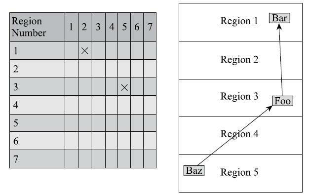

Shenandoah收集器的工作过程大致可以划分为以下九个阶段（此处以Shenandoah在2016年发表的原始论文[4]进行介绍。在最新版本的Shenandoah 2.0中，进一步强化了“部分收集”的特性，初始标记之前还有Initial Partial、Concurrent Partial和Final Partial阶段，它们可以不太严谨地理解为对应于以前分代收集中的Minor GC的工作）：

1. **初始标记（`Initial Marking`）**：与G1一样，首先标记与GC Roots直接关联的对象，这个阶段仍是“Stop The World”的，但停顿时间与堆大小无关，只与GC Roots的数量相关。
2. **并发标记（`Concurrent Marking`）**：与G1一样，遍历对象图，标记出全部可达的对象，这个阶段是与用户线程一起并发的，时间长短取决于堆中存活对象的数量以及对象图的结构复杂程度。
3. **最终标记（`Final Marking`）**：与G1一样，处理剩余的SATB扫描，并在这个阶段统计出回收价值最高的Region，将这些Region构成一组回收集（Collection Set）。最终标记阶段也会有一小段短暂的停 顿。
4. **并发清理（`Concurrent Cleanup`）**：这个阶段用于清理那些整个区域内连一个存活对象都没有找到的Region（这类Region被称为Immediate Garbage Region）。
5. **并发回收（`Concurrent Evacuation`）**：并发回收阶段是Shenandoah与之前HotSpot中其他收集器的核心差异。在这个阶段，Shenandoah要把回收集里面的存活对象先复制一份到其他未被使用的Region之中。复制对象这件事情如果将用户线程冻结起来再做那是相当简单的，但如果两者必须要同时并发进行的话，就变得复杂起来了。其困难点是在移动对象的同时，用户线程仍然可能不停对被移动的对象进行读写访问，移动对象是一次性的行为，但移动之后整个内存中所有指向该对象的引用都还是旧对象的地址，这是很难一瞬间全部改变过来的。对于并发回收阶段遇到的这些困难，Shenandoah将会通过读屏障和被称为“Brooks Pointers”的转发指针来解决（讲解完Shenandoah整个工作过程之后笔者还要再回头介绍它）。并发回收阶段运行的时间长短取决于回收集的大小。
6. **初始引用更新（`Initial Update Reference`）**：并发回收阶段复制对象结束后，还需要把堆中所有指向旧对象的引用修正到复制后的新地址，这个操作称为引用更新。引用更新的初始化阶段实际上并未 做什么具体的处理，设立这个阶段只是为了建立一个线程集合点，确保所有并发回收阶段中进行的收集器线程都已完成分配给它们的对象移动任务而已。初始引用更新时间很短，会产生一个非常短暂的停顿。
7. **并发引用更新（`Concurrent Update Reference`）**：真正开始进行引用更新操作，这个阶段是与用户线程一起并发的，时间长短取决于内存中涉及的引用数量的多少。并发引用更新与并发标记不同，它 不再需要沿着对象图来搜索，只需要按照内存物理地址的顺序，线性地搜索出引用类型，把旧值改为新值即可。
8. **最终引用更新（`Final Update Reference`）**：解决了堆中的引用更新后，还要修正存在于GC Roots 中的引用。这个阶段是Shenandoah的最后一次停顿，停顿时间只与GC Roots的数量相关。
9. **并发清理（`Concurrent Cleanup`）**：经过并发回收和引用更新之后，整个回收集中所有的Region已再无存活对象，这些Region都变成Immediate Garbage Regions了，最后再调用一次并发清理过程来回收 这些Region的内存空间，供以后新对象分配使用。

以上对Shenandoah收集器这九个阶段的工作过程的描述可能拆分得略为琐碎，读者只要抓住其中三个最重要的并发阶段（并发标记、并发回收、并发引用更新），就能比较容易理清Shenandoah是如何运作的了。图3-16[5]中黄色的区域代表的是被选入回收集的Region，绿色部分就代表还存活的对象，蓝色就是用户线程可以用来分配对象的内存Region了。图3-16中不仅展示了Shenandoah三个并发阶段的工作过程，还能形象地表示出并发标记阶段如何找出回收对象确定回收集，并发回收阶段如何移 动回收集中的存活对象，并发引用更新阶段如何将指向回收集中存活对象的所有引用全部修正，此后回收集便不存在任何引用可达的存活对象了。

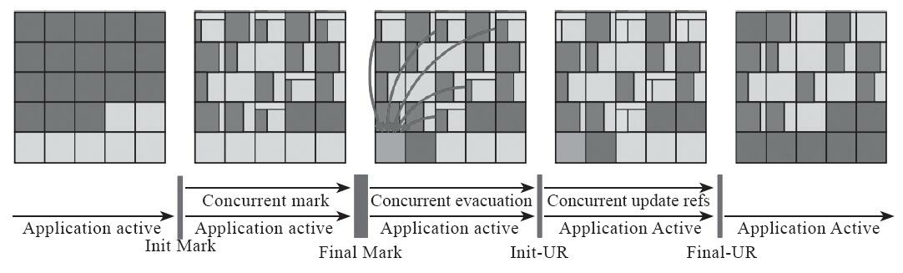

学习了Shenandoah收集器的工作过程，我们再来聊一下Shenandoah用以支持并行整理的核心概念——Brooks Pointer。“Brooks”是一个人的名字。1984年，Rodney A.Brooks在论文《Trading Data Space for Reduced Time and Code Space in Real-Time Garbage Collection on Stock Hardware》中提出了使用转发指针（Forwarding Pointer，也常被称为Indirection Pointer）来实现对象移动与用户程序并发的一种解决方案。此前，要做类似的并发操作，通常是在被移动对象原有的内存上设置保护陷阱（Memory Protection Trap），一旦用户程序访问到归属于旧对象的内存空间就会产生自陷中段，进入预设好的异常处理器中，再由其中的代码逻辑把访问转发到复制后的新对象上。虽然确实能够实现对象移动与用户线程并发，但是如果没有操作系统层面的直接支持，这种方案将导致用户态频繁切换到核心态[6]，代价是非常大的，不能频繁使用[7]。

Brooks提出的新方案不需要用到内存保护陷阱，而是在原有对象布局结构的最前面统一增加一个新的引用字段，在正常不处于并发移动的情况下，该引用指向对象自己，如图3-17所示。

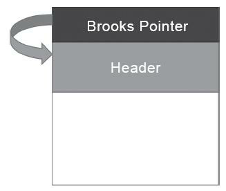

从结构上来看，Brooks提出的转发指针与某些早期Java虚拟机使用过的句柄定位（关于对象定位详见第2章）有一些相似之处，两者都是一种间接性的对象访问方式，差别是句柄通常会统一存储在专门的句柄池中，而转发指针是分散存放在每一个对象头前面。

有了转发指针之后，有何收益暂且不论，所有间接对象访问技术的缺点都是相同的，也是非常显著的——每次对象访问会带来一次额外的转向开销，尽管这个开销已经被优化到只有一行汇编指令的程度，譬如以下所示：

```c++
mov r13,QWORD PTR [r12+r14*8-0x8]
```

不过，毕竟对象定位会被频繁使用到，这仍是一笔不可忽视的执行成本，只是它比起内存保护陷阱的方案已经好了很多。转发指针加入后带来的收益自然是当对象拥有了一份新的副本时，只需要修改一处指针的值，即旧对象上转发指针的引用位置，使其指向新对象，便可将所有对该对象的访问转发到新的副本上。这样只要旧对象的内存仍然存在，未被清理掉，虚拟机内存中所有通过旧引用地址访问的代码便仍然可用，都会被自动转发到新对象上继续工作，如图3-18所示。


需要注意，Brooks形式的转发指针在设计上决定了它是必然会出现多线程竞争问题的，如果收集器线程与用户线程发生的只是并发读取，那无论读到旧对象还是新对象上的字段，返回的结果都应该是一样的，这个场景还可以有一些“偷懒”的处理余地；但如果发生的是并发写入，就一定必须保证写操作只能发生在新复制的对象上，而不是写入旧对象的内存中。读者不妨设想以下三件事情并发进行时的场景：

1. 收集器线程复制了新的对象副本；

2. 用户线程更新对象的某个字段；

3. 收集器线程更新转发指针的引用值为新副本地址。

如果不做任何保护措施，让事件2在事件1、事件3之间发生的话，将导致的结果就是用户线程对对象的变更发生在旧对象上，所以这里必须针对转发指针的访问操作采取同步措施，让收集器线程或者用户线程对转发指针的访问只有其中之一能够成功，另外一个必须等待，避免两者交替进行。实际上Shenandoah收集器是通过比较并交换（Compare And Swap，CAS）操作[8] 来保证并发时对象的访问正确性的。

转发指针另一点必须注意的是执行频率的问题，尽管通过对象头上的Brooks Pointer来保证并发时原对象与复制对象的访问一致性，这件事情只从原理上看是不复杂的，但是“对象访问”这四个字的分量是非常重的，对于一门面向对象的编程语言来说，对象的读取、写入，对象的比较，为对象哈希值计算，用对象加锁等，这些操作都属于对象访问的范畴，它们在代码中比比皆是，要覆盖全部对象访问操作，Shenandoah不得不同时设置读、写屏障去拦截。

之前介绍其他收集器时，或者是用于维护卡表，或者是用于实现并发标记，写屏障已被使用多次，累积了不少的处理任务了，这些写屏障有相当一部分在Shenandoah收集器中依然要被使用到。除此以外，为了实现Brooks Pointer，Shenandoah在读、写屏障中都加入了额外的转发处理，尤其是使用读屏障的代价，这是比写屏障更大的。代码里对象读取的出现频率要比对象写入的频率高出很多，读屏障数量自然也要比写屏障多得多，所以读屏障的使用必须更加谨慎，不允许任何的重量级操作。Shenandoah是本书中第一款使用到读屏障的收集器，它的开发者也意识到数量庞大的读屏障带来的性能开销会是Shenandoah被诟病的关键点之一[9]，所以计划在JDK 13中将Shenandoah的内存屏障模型改进为基于引用访问屏障（Load Reference Barrier）[10]的实现，所谓“引用访问屏障”是指内存屏障只拦截对象中数据类型为引用类型的读写操作，而不去管原生数据类型等其他非引用字段的读写，这能够省去大量对原生类型、对象比较、对象加锁等场景中设置内存屏障所带来的消耗。

最后来谈谈Shenandoah在实际应用中的性能表现，Shenandoah的开发团队或者其他第三方测试者在网上都公布了一系列测试，结果各有差异。笔者在此选择展示了一份RedHat官方在2016年所发表的Shenandoah实现论文中给出的应用实测数据，测试内容是使用ElasticSearch对200GB的维基百科数据进行索引[11]，如表3-2所示。从结果来看，应该说2016年做该测试时的Shenandoah并没有完全达成预定目标，停顿时间比其他几款收集器确实有了质的飞跃，但也并未实现最大停顿时间控制在十毫秒以内的目标，而吞吐量方面则出现了很明显的下降，其总运行时间是所有测试收集器中最长的。读者可以从这个官方的测试结果来对Shenandoah的弱项（高运行负担使得吞吐量下降）和强项（低延迟时间） 建立量化的概念，并对比一下稍后介绍的ZGC的测试结果。

Shenandoah收集器作为第一款由非Oracle开发的垃圾收集器，一开始就预计到了缺乏Oracle公司那样富有经验的研发团队可能会遇到很多困难。所以Shenandoah采取了“小步快跑”的策略，将最终目标进行拆分，分别形成Shenandoah 1.0、2.0、3.0……这样的小版本计划，在每个版本中迭代改进，现在已经可以看到Shenandoah的性能在日益改善，逐步接近“Low-Pause”的目标。此外，RedHat也积极拓展 Shenandoah的使用范围，将其Backport到JDK 11甚至是JDK 8之上，让更多不方便升级JDK版本的应用也能够享受到垃圾收集器技术发展的最前沿成果。

[1] 这部分内容的撰写时间是2019年5月，以后的版本中双方博弈可能存在变数。相关内容可参见： https://bugs.openjdk.java.net/browse/JDK-8215030。

[2] 这里主要是调侃，OpenJDK和OracleJDK之间的关系并不仅仅是收费和免费的问题，详情可参见本 书第1章。

[3] JEP 307：Parallel Full GC for G1。

[4] 论文地址：https://www.researchgate.net/publication/306112816_Shenandoah_An_open- source_concurrent_compacting_garbage_collector_for_OpenJDK。

[5] 此例子中的图片引用了Aleksey Shipilev在DEVOXX 2017上的主题演讲：《Shenandoah GC Part I： The Garbage Collector That Could》，地址为https://shipilev.net/talks/devoxx-Nov2017-shenandoah.pdf。因 本书是黑白印刷，颜色可能难以分辨，读者可以下载原文查看。

[6] 用户态、核心态是一种操作系统内核模式，具体见：https://zh.wikipedia.org/wiki/核心态。

[7] 但如果能有来自操作系统内核的支持的话，就不是没有办法解决，业界公认最优秀的Azul C4收集 器就使用了这种方案。

[8] 关于临界区、锁、CAS等概念，是计算机体系的基础知识，如果读者对此不了解的话，可以参考第 13章中的相关介绍。

[9] Roman Kennke（JEP 189的Owner）：It resolves one major point of criticism against Shenandoah，that is their expensive primitive read-barriers。

[10] 资料来源：https://rkennke.wordpress.com/2019/05/15/shenandoah-gc-in-jdk13-part-i-load-reference- barriers/。

[11] 该论文是以2014～2015年间最初版本的Shenandoah为测试对象，在2017年，Christine Flood在Java- One的演讲中，进行了相同测试，Shenandoah的运行时间已经优化到335秒。相信在读者阅读到这段文 字时，Shenandoah的实际表现在多数应用中均会优于结果中反映的水平。

### 3.6.2 ZGC收集器

ZGC（“Z”并非什么专业名词的缩写，这款收集器的名字就叫作Z Garbage Collector）是一款在JDK 11中新加入的具有实验性质[1]的低延迟垃圾收集器，是由Oracle公司研发的。2018年Oracle创建了JEP 333将ZGC提交给OpenJDK，推动其进入OpenJDK 11的发布清单之中。

ZGC和Shenandoah的目标是高度相似的，都希望在尽可能对吞吐量影响不太大的前提下[2]，实现在任意堆内存大小下都可以把垃圾收集的停顿时间限制在十毫秒以内的低延迟。但是ZGC和Shenandoah的实现思路又是差异显著的，如果说RedHat公司开发的Shen-andoah像是Oracle的G1收集器的实际继承者的话，那Oracle公司开发的ZGC就更像是Azul System公司独步天下的PGC（Pauseless GC）和C4（Concurrent Continuously Compacting Collector）收集器的同胞兄弟。

早在2005年，运行在Azul VM上的PGC就已经实现了标记和整理阶段都全程与用户线程并发运行的垃圾收集，而运行在Zing VM上的C4收集器是PGC继续演进的产物，主要增加了分代收集支持，大幅提升了收集器能够承受的对象分配速度。无论从算法还是实现原理上来讲，PGC和C4肯定算是一脉相承的，而ZGC虽然并非Azul公司的产品，但也应视为这条脉络上的另一个节点，因为ZGC几乎所有的关键技术上，与PGC和C4都只存在术语称谓上的差别，实质内容几乎是一模一样的。相信到这里读者应该已经对Java虚拟机收集器常见的专业术语都有所了解了，如果不避讳专业术语的话，我们可以给ZGC下一个这样的定义来概括它的主要特征：ZGC收集器是一款基于Region内存布局的，（暂时） 不设分代的，使用了读屏障、染色指针和内存多重映射等技术来实现可并发的标记-整理算法的，以低延迟为首要目标的一款垃圾收集器。接下来，笔者将逐项来介绍ZGC的这些技术特点。

首先从ZGC的内存布局说起。与Shenandoah和G1一样，ZGC也采用基于Region的堆内存布局，但与它们不同的是，ZGC的Region（在一些官方资料中将它称为Page或者ZPage，本章为行文一致继续称为Region）具有动态性——动态创建和销毁，以及动态的区域容量大小。在x64硬件平台下，ZGC的Region可以具有如图3-19所示的大、中、小三类容量：

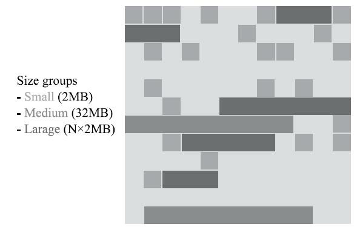

* **小型Region（`Small Region`）**：容量固定为2MB，用于放置小于256KB的小对象。

* **中型Region（`Medium Region`）**：容量固定为32MB，用于放置大于等于256KB但小于4MB的对 象。

* **大型Region（`Large Region`）**：容量不固定，可以动态变化，但必须为2MB的整数倍，用于放置4MB或以上的大对象。每个大型Region中只会存放一个大对象，这也预示着虽然名字叫作“大型Region”，但它的实际容量完全有可能小于中型Region，最小容量可低至4MB。大型Region在ZGC的实 现中是不会被重分配（重分配是ZGC的一种处理动作，用于复制对象的收集器阶段，稍后会介绍到） 的，因为复制一个大对象的代价非常高昂。

接下来是ZGC的核心问题——并发整理算法的实现。Shenandoah使用转发指针和读屏障来实现并发整理，ZGC虽然同样用到了读屏障，但用的却是一条与Shenandoah完全不同，更加复杂精巧的解题思路。

ZGC收集器有一个标志性的设计是它采用的染色指针技术（Colored Pointer，其他类似的技术中可能将它称为Tag Pointer或者Version Pointer）。从前，如果我们要在对象上存储一些额外的、只供收集器或者虚拟机本身使用的数据，通常会在对象头中增加额外的存储字段（详见2.3.2节的内容），如对象的哈希码、分代年龄、锁记录等就是这样存储的。这种记录方式在有对象访问的场景下是很自然流畅的，不会有什么额外负担。但如果对象存在被移动过的可能性，即不能保证对象访问能够成功呢？ 又或者有一些根本就不会去访问对象，但又希望得知该对象的某些信息的应用场景呢？能不能从指针或者与对象内存无关的地方得到这些信息，譬如是否能够看出来对象被移动过？这样的要求并非不合理的刁难，先不去说并发移动对象可能带来的可访问性问题，此前我们就遇到过这样的要求——追踪式收集算法的标记阶段就可能存在只跟指针打交道而不必涉及指针所引用的对象本身的场景。例如对象标记的过程中需要给对象打上三色标记（见3.4.6节），这些标记本质上就只和对象的引用有关，而与对象本身无关——某个对象只有它的引用关系能决定它存活与否，对象上其他所有的属性都不能够影响它的存活判定结果。HotSpot虚拟机的几种收集器有不同的标记实现方案，有的把标记直接记录在对象头上（如Serial收集器），有的把标记记录在与对象相互独立的数据结构上（如G1、Shenandoah使用了一种相当于堆内存的1/64大小的，称为BitMap的结构来记录标记信息），而ZGC的染色指针是最直接的、最纯粹的，它直接把标记信息记在引用对象的指针上，这时，与其说可达性分析是遍历对象图来标记对象，还不如说是遍历“引用图”来标记“引用”了。

染色指针是一种直接将少量额外的信息存储在指针上的技术，可是为什么指针本身也可以存储额外信息呢？在64位系统中，理论可以访问的内存高达16EB（2的64次幂）字节[3]。实际上，基于需求 （用不到那么多内存）、性能（地址越宽在做地址转换时需要的页表级数越多）和成本（消耗更多晶体管）的考虑，在AMD64架构[4]中只支持到52位（4PB）的地址总线和48位（256TB）的虚拟地址空间，所以目前64位的硬件实际能够支持的最大内存只有256TB。此外，操作系统一侧也还会施加自己的约束，64位的Linux则分别支持47位（128TB）的进程虚拟地址空间和46位（64TB）的物理地址空间，64位的Windows系统甚至只支持44位（16TB）的物理地址空间。

尽管Linux下64位指针的高18位不能用来寻址，但剩余的46位指针所能支持的64TB内存在今天仍然能够充分满足大型服务器的需要。鉴于此，ZGC的染色指针技术继续盯上了这剩下的46位指针宽度，将其高4位提取出来存储四个标志信息。通过这些标志位，虚拟机可以直接从指针中看到其引用对象的三色标记状态、是否进入了重分配集（即被移动过）、是否只能通过finalize()方法才能被访问到，如图3-20所示。当然，由于这些标志位进一步压缩了原本就只有46位的地址空间，也直接导致ZGC能够管理的内存不可以超过4TB（2的42次幂）[5]。

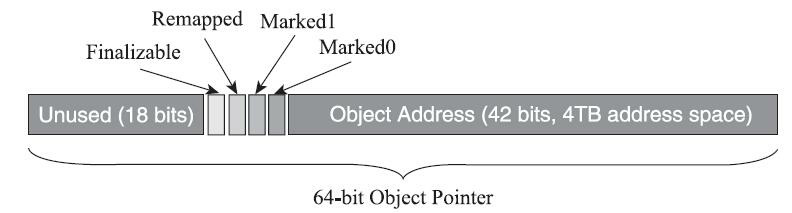

虽然染色指针有4TB的内存限制，不能支持32位平台，不能支持压缩指针（`-XX：+UseCompressedOops`）等诸多约束，但它带来的收益也是非常可观的，在JEP 333的描述页[7]中， ZGC的设计者Per Liden在“描述”小节里花了全文过半的篇幅来陈述染色指针的三大优势：

* 染色指针可以使得一旦某个Region的存活对象被移走之后，这个Region立即就能够被释放和重用掉，而不必等待整个堆中所有指向该Region的引用都被修正后才能清理。这点相比起Shenandoah是一个颇大的优势，使得理论上只要还有一个空闲Region，ZGC就能完成收集，而Shenandoah需要等到引用更新阶段结束以后才能释放回收集中的Region，这意味着堆中几乎所有对象都存活的极端情况，需要1∶1复制对象到新Region的话，就必须要有一半的空闲Region来完成收集。至于为什么染色指针能够导致这样的结果，笔者将在后续解释其“自愈”特性的时候进行解释。

* 染色指针可以大幅减少在垃圾收集过程中内存屏障的使用数量，设置内存屏障，尤其是写屏障的目的通常是为了记录对象引用的变动情况，如果将这些信息直接维护在指针中，显然就可以省去一些专门的记录操作。实际上，到目前为止ZGC都并未使用任何写屏障，只使用了读屏障（一部分是染色指针的功劳，一部分是ZGC现在还不支持分代收集，天然就没有跨代引用的问题）。内存屏障对程序运行时性能的损耗在前面章节中已经讲解过，能够省去一部分的内存屏障，显然对程序运行效率是大有裨益的，所以ZGC对吞吐量的影响也相对较低。

* 染色指针可以作为一种可扩展的存储结构用来记录更多与对象标记、重定位过程相关的数据，以便日后进一步提高性能。现在Linux下的64位指针还有前18位并未使用，它们虽然不能用来寻址，却可以通过其他手段用于信息记录。如果开发了这18位，既可以腾出已用的4个标志位，将ZGC可支持的最大堆内存从4TB拓展到64TB，也可以利用其余位置再存储更多的标志，譬如存储一些追踪信息来让垃圾收集器在移动对象时能将低频次使用的对象移动到不常访问的内存区域。

不过，要顺利应用染色指针有一个必须解决的前置问题：Java虚拟机作为一个普普通通的进程，这样随意重新定义内存中某些指针的其中几位，操作系统是否支持？处理器是否支持？这是很现实的问题，无论中间过程如何，程序代码最终都要转换为机器指令流交付给处理器去执行，处理器可不会管指令流中的指针哪部分存的是标志位，哪部分才是真正的寻址地址，只会把整个指针都视作一个内存地址来对待。这个问题在Solaris/SPARC平台上比较容易解决，因为SPARC硬件层面本身就支持虚拟地址掩码，设置之后其机器指令直接就可以忽略掉染色指针中的标志位。但在x86-64平台上并没有提供类似的黑科技，ZGC设计者就只能采取其他的补救措施了，这里面的解决方案要涉及虚拟内存映射技术，让我们先来复习一下这个x86计算机体系中的经典设计。

在远古时代的x86计算机系统里面，所有进程都是共用同一块物理内存空间的，这样会导致不同进程之间的内存无法相互隔离，当一个进程污染了别的进程内存后，就只能对整个系统进行复位后才能得以恢复。为了解决这个问题，从Intel 80386处理器开始，提供了“保护模式”用于隔离进程。在保护模式下，386处理器的全部32条地址寻址线都有效，进程可访问最高也可达4GB的内存空间，但此时已不同于之前实模式下的物理内存寻址了，处理器会使用分页管理机制把线性地址空间和物理地址空间分别划分为大小相同的块，这样的内存块被称为“页”（Page）。通过在线性虚拟空间的页与物理地址空间的页之间建立的映射表，分页管理机制会进行线性地址到物理地址空间的映射，完成线性地址到物理地址的转换[8]。如果读者对计算机结构体系了解不多的话，不妨设想这样一个场景来类比：假如你要去“中山一路3号”这个地址拜访一位朋友，根据你所处城市的不同，譬如在广州或者在上海，是能够通过这个“相同的地址”定位到两个完全独立的物理位置的，这时地址与物理位置是一对多关系映射。

不同层次的虚拟内存到物理内存的转换关系可以在硬件层面、操作系统层面或者软件进程层面实现，如何完成地址转换，是一对一、多对一还是一对多的映射，也可以根据实际需要来设计。Linux/x86-64平台上的ZGC使用了多重映射（Multi-Mapping）将多个不同的虚拟内存地址映射到同一个物理内存地址上，这是一种多对一映射，意味着ZGC在虚拟内存中看到的地址空间要比实际的堆内存容量来得更大。把染色指针中的标志位看作是地址的分段符，那只要将这些不同的地址段都映射到同一个物理内存空间，经过多重映射转换后，就可以使用染色指针正常进行寻址了，效果如图3-21所示。

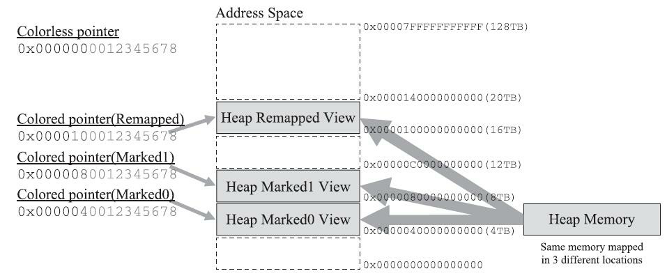

在某些场景下，多重映射技术确实可能会带来一些诸如复制大对象时会更容易这样的额外好处，可从根源上讲，ZGC的多重映射只是它采用染色指针技术的伴生产物，并不是专门为了实现其他某种特性需求而去做的。

接下来，我们来学习ZGC收集器是如何工作的。ZGC的运作过程大致可划分为以下四个大的阶段。全部四个阶段都是可以并发执行的，仅是两个阶段中间会存在短暂的停顿小阶段，这些小阶段，譬如初始化GC Root直接关联对象的Mark Start，与之前G1和Shenandoah的Initial Mark阶段并没有什么差异，笔者就不再单独解释了。ZGC的运作过程具体如图3-22所示。

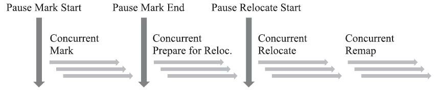

1. **并发标记（`Concurrent Mark`）**：与G1、Shenandoah一样，并发标记是遍历对象图做可达性分析的阶段，前后也要经过类似于G1、Shenandoah的初始标记、最终标记（尽管ZGC中的名字不叫这些）的 短暂停顿，而且这些停顿阶段所做的事情在目标上也是相类似的。与G1、Shenandoah不同的是，ZGC 的标记是在指针上而不是在对象上进行的，标记阶段会更新染色指针中的Marked 0、Marked 1标志位。

2. **并发预备重分配（`Concurrent Prepare for Relocate`）**：这个阶段需要根据特定的查询条件统计得出本次收集过程要清理哪些Region，将这些Region组成重分配集（Relocation Set）。重分配集与G1收集器的回收集（Collection Set）还是有区别的，ZGC划分Region的目的并非为了像G1那样做收益优先的增量回收。相反，ZGC每次回收都会扫描所有的Region，用范围更大的扫描成本换取省去G1中记忆集的 维护成本。因此，ZGC的重分配集只是决定了里面的存活对象会被重新复制到其他的Region中，里面的Region会被释放，而并不能说回收行为就只是针对这个集合里面的Region进行，因为标记过程是针对全堆的。此外，在JDK 12的ZGC中开始支持的类卸载以及弱引用的处理，也是在这个阶段中完成的。

3. **并发重分配（`Concurrent Relocate`）**：重分配是ZGC执行过程中的核心阶段，这个过程要把重分配集中的存活对象复制到新的Region上，并为重分配集中的每个Region维护一个转发表（Forward Table），记录从旧对象到新对象的转向关系。得益于染色指针的支持，ZGC收集器能仅从引用上就明确得知一个对象是否处于重分配集之中，如果用户线程此时并发访问了位于重分配集中的对象，这次访问将会被预置的内存屏障所截获，然后立即根据Region上的转发表记录将访问转发到新复制的对象上，并同时修正更新该引用的值，使其直接指向新对象，ZGC将这种行为称为指针的“自愈”（Self-Healing）能力。这样做的好处是只有第一次访问旧对象会陷入转发，也就是只慢一次，对比Shenandoah的Brooks转发指针，那是每次对象访问都必须付出的固定开销，简单地说就是每次都慢，因此ZGC对用户程序的运行时负载要比Shenandoah来得更低一些。还有另外一个直接的好处是由于染色指针的存在，一旦重分配集中某个Region的存活对象都复制完毕后，这个Region就可以立即释放用于新对象的分配（但是转发表还得留着不能释放掉），哪怕堆中还有很多指向这个对象的未更新指针也没有关系，这些旧指针一旦被使用，它们都是可以自愈的。

4. **并发重映射（`Concurrent Remap`）**：重映射所做的就是修正整个堆中指向重分配集中旧对象的所有引用，这一点从目标角度看是与Shenandoah并发引用更新阶段一样的，但是ZGC的并发重映射并不是一个必须要“迫切”去完成的任务，因为前面说过，即使是旧引用，它也是可以自愈的，最多只是第一次使用时多一次转发和修正操作。重映射清理这些旧引用的主要目的是为了不变慢（还有清理结束后可以释放转发表这样的附带收益），所以说这并不是很“迫切”。因此，ZGC很巧妙地把并发重映射阶段要做的工作，合并到了下一次垃圾收集循环中的并发标记阶段里去完成，反正它们都是要遍历所有对象的，这样合并就节省了一次遍历对象图[9]的开销。一旦所有指针都被修正之后，原来记录新旧对象关系的转发表就可以释放掉了。

ZGC的设计理念与Azul System公司的PGC和C4收集器一脉相承[10]，是迄今垃圾收集器研究的最前沿成果，它与Shenandoah一样做到了几乎整个收集过程都全程可并发，短暂停顿也只与GC Roots大小相关而与堆内存大小无关，因而同样实现了任何堆上停顿都小于十毫秒的目标。

相比G1、Shenandoah等先进的垃圾收集器，ZGC在实现细节上做了一些不同的权衡选择，譬如G1需要通过写屏障来维护记忆集，才能处理跨代指针，得以实现Region的增量回收。记忆集要占用大量的内存空间，写屏障也对正常程序运行造成额外负担，这些都是权衡选择的代价。ZGC就完全没有使用记忆集，它甚至连分代都没有，连像CMS中那样只记录新生代和老年代间引用的卡表也不需要，因而完全没有用到写屏障，所以给用户线程带来的运行负担也要小得多。可是，必定要有优有劣才会称作权衡，ZGC的这种选择[11]也限制了它能承受的对象分配速率不会太高，可以想象以下场景来理解ZGC的这个劣势：ZGC准备要对一个很大的堆做一次完整的并发收集，假设其全过程要持续十分钟以上（请读者切勿混淆并发时间与停顿时间，ZGC立的Flag是停顿时间不超过十毫秒），在这段时间里面，由于应用的对象分配速率很高，将创造大量的新对象，这些新对象很难进入当次收集的标记范围，通常就只能全部当作存活对象来看待——尽管其中绝大部分对象都是朝生夕灭的，这就产生了大 量的浮动垃圾。如果这种高速分配持续维持的话，每一次完整的并发收集周期都会很长，回收到的内存空间持续小于期间并发产生的浮动垃圾所占的空间，堆中剩余可腾挪的空间就越来越小了。目前唯一的办法就是尽可能地增加堆容量大小，获得更多喘息的时间。但是若要从根本上提升ZGC能够应对的对象分配速率，还是需要引入分代收集，让新生对象都在一个专门的区域中创建，然后专门针对这个区域进行更频繁、更快的收集。Azul的C4收集器实现了分代收集后，能够应对的对象分配速率就比不分代的PGC收集器提升了十倍之多。

ZGC还有一个常在技术资料上被提及的优点是支持“NUMA-Aware”的内存分配。NUMA（Non-Uniform Memory Access，非统一内存访问架构）是一种为多处理器或者多核处理器的计算机所设计的内存架构。由于摩尔定律逐渐失效，现代处理器因频率发展受限转而向多核方向发展，以前原本在北桥芯片中的内存控制器也被集成到了处理器内核中，这样每个处理器核心所在的裸晶（DIE）[12]都有属于自己内存管理器所管理的内存，如果要访问被其他处理器核心管理的内存，就必须通过Inter-Connect通道来完成，这要比访问处理器的本地内存慢得多。在NUMA架构下，ZGC收集器会优先尝试在请求线程当前所处的处理器的本地内存上分配对象，以保证高效内存访问。在ZGC之前的收集器就只有针对吞吐量设计的Parallel Scavenge支持NUMA内存分配[13]，如今ZGC也成为另外一个选择。

在性能方面，尽管目前还处于实验状态，还没有完成所有特性，稳定性打磨和性能调优也仍在进行，但即使是这种状态下的ZGC，其性能表现已经相当亮眼，从官方给出的测试结果[14]来看，用“令人震惊的、革命性的ZGC”来形容都不为过。

图3-23和图3-24是ZGC与Parallel Scavenge、G1三款收集器通过SPECjbb 2015[15]的测试结果。在 ZGC的“弱项”吞吐量方面，以低延迟为首要目标的ZGC已经达到了以高吞吐量为目标Parallel Scavenge 的99%，直接超越了G1。如果将吞吐量测试设定为面向SLA（Service Level Agreements）应用的“Critical Throughput”的话[16]，ZGC的表现甚至还反超了Parallel Scavenge收集器。

而在ZGC的强项停顿时间测试上，它就毫不留情地与Parallel Scavenge、G1拉开了两个数量级的差 距。不论是平均停顿，还是95%停顿、99%停顿、99.9%停顿，抑或是最大停顿时间，ZGC均能毫不费 劲地控制在十毫秒之内，以至于把它和另外两款停顿数百近千毫秒的收集器放到一起对比，就几乎显 示不了ZGC的柱状条（图3-24a），必须把结果的纵坐标从线性尺度调整成对数尺度（图3-24b，纵坐标轴的尺度是对数增长的）才能观察到ZGC的测试结果。

 ZGC原本是Oracle作为一项商业特性（如同JFR、JMC这些功能）来设计和实现的，只不过在它横 空出世的JDK 11时期，正好适逢Oracle调整许可证授权，把所有商业特性都开源给了OpenJDK（详情 见第1章Java发展史），所以用户对其商业性并没有明显的感知。ZGC有着令所有开发人员趋之若鹜的 优秀性能，让以前大多数人只是听说，但从未用过的“Azul式的垃圾收集器”一下子飞入寻常百姓家， 笔者相信它完全成熟之后，将会成为服务端、大内存、低延迟应用的首选收集器的有力竞争者。

[1] 这里的“实验性质”特指ZGC目前尚未具备全部商用收集器应有的特征，如暂不提供全平台的支持 （目前仅支持Linux/x86-64），暂不支持类卸载（JDK 11时不支持，JDK 12的ZGC已经支持），暂不 支持新的Graal编译器配合工作等，但这些局限主要是人力资源与工作量上的限制，可能读者在阅读到 这部分内容的时候已经有了新的变化。

[2] 在JEP 333中把ZGC的“吞吐量下降不大”明确量化为相比起使用G1收集器，吞吐量下降不超过 15%。不过根据Oracle公开的现阶段SPECjbb 2015测试结果来看，ZGC在这方面要比Shenandoah优秀得 多，测得的吞吐量居然比G1还高，甚至已经接近了Parallel Scavenge的成绩。

[3] 1EB=1024PB，1PB=1024TB。

[4] AMD64这个名字的意思不是指只有AMD的处理器使用，它就是现在主流的x86-64架构，由于Intel Itanium的失败，现行的64位标准是由AMD公司率先制定的，Intel通过交叉授权获得该标准的授权，所 以叫作AMD64。

[5] JDK 13计划是要扩展到最大支持16TB的，本章撰写时JDK 13尚未正式发布，还没有明确可靠的信 息，所以这里按照ZGC目前的状态来介绍。

[6] 此图片以及后续关于ZGC执行阶段的几张图片，均来自Per Liden在Jfokus VM 2018大会上的演讲： 《The Z Garbage Collector：Low Latency GC for OpenJDK》。

[7] 页面地址：https://openjdk.java.net/jeps/333。

[8] 实际上现代的x86操作系统中的虚拟地址是操作系统加硬件两级翻译的，在进程中访问的逻辑地址 要通过MMU中的分段单元翻译为线性地址，然后再通过分页单元翻译成物理地址。这部分并非本书所关注的话题，读者简单了解即可。

[9] 如果不是由于两个阶段合并考虑，其实做重映射不需要按照对象图的顺序去做，只需线性地扫描整 个堆来清理旧引用即可。

[10] 笔者心中的词语其实是“一模一样”，只是这怎么听起来似乎像是对Oracle的嘲讽？Oracle公司也并 未在任何公开资料中承认参考过Azul System的论文或者实现。

[11] 根据Per Liden的解释，目前ZGC不分代完全是从节省工作量角度所做出的选择，并非单纯技术上 的权衡。来源：https://www.zhihu.com/question/287945354/answer/458761494。

[12] 裸晶这个名字用的较少，通常都直接称呼为DIE： https://en.wikipedia.org/wiki/Die_(integrated_circuit)。

[13] 当“JEP 345：NUMA-Aware Memory Allocation for G1”被纳入某个版本的JDK发布范围后，G1也 会支持NUMA分配。

[14] 数据来自Jfokus VM 2018中Per liden的演讲《The Z Garbage Collector：Low Latency GC for OpenJDK》。

[15] http://spec.org/jbb2015/。

[16] Critical Throughput就是要求最大延迟不超过某个设置值（10毫秒到100毫秒）下测得的吞吐量。


## 3.7 选择合适的垃圾收集器

HotSpot虚拟机提供了种类繁多的垃圾收集器，选择太多反而令人踌躇难决，若只挑最先进的显然不可能满足全部应用场景，但只用一句“必须因地制宜，按需选用”又未免有敷衍的嫌疑，本节我们就来探讨一下如何选择合适的垃圾收集器。

### 3.7.1 Epsilon收集器

在G1、Shenandoah或者ZGC这些越来越复杂、越来越先进的垃圾收集器相继出现的同时，也有一个“反其道而行”的新垃圾收集器出现在JDK 11的特征清单中——Epsilon，这是一款以不能够进行垃圾收集为“卖点”的垃圾收集器，这种话听起来第一感觉就十分违反逻辑，这种“不干活”的收集器要它何用？

Epsilon收集器由RedHat公司在JEP 318中提出，在此提案里Epsilon被形容成一个无操作的收集器（A No-Op Garbage Collector），而事实上只要Java虚拟机能够工作，垃圾收集器便不可能是真正“无操作”的。原因是“垃圾收集器”这个名字并不能形容它全部的职责，更贴切的名字应该是本书为这一部分所取的标题——“自动内存管理子系统”。一个垃圾收集器除了垃圾收集这个本职工作之外，它还要负责堆的管理与布局、对象的分配、与解释器的协作、与编译器的协作、与监控子系统协作等职责，其中至少堆的管理和对象的分配这部分功能是Java虚拟机能够正常运作的必要支持，是一个最小化功能的垃圾收集器也必须实现的内容。从JDK 10开始，为了隔离垃圾收集器与Java虚拟机解释、编译、监控等子系统的关系，RedHat提出了垃圾收集器的统一接口，即JEP 304提案，Epsilon是这个接口的有效性验证和参考实现，同时也用于需要剥离垃圾收集器影响的性能测试和压力测试。

在实际生产环境中，不能进行垃圾收集的Epsilon也仍有用武之地。很长一段时间以来，Java技术体系的发展重心都在面向长时间、大规模的企业级应用和服务端应用，尽管也有移动平台（指JavaME而不是Android）和桌面平台的支持，但使用热度上与前者相比要逊色不少。可是近年来大型系统从传统单体应用向微服务化、无服务化方向发展的趋势已越发明显，Java在这方面比起Golang等后起之秀来确实有一些先天不足，使用率正渐渐下降。传统Java有着内存占用较大，在容器中启动时间长，即时编译需要缓慢优化等特点，这对大型应用来说并不是什么太大的问题，但对短时间、小规模的服务形式就有诸多不适。为了应对新的技术潮流，最近几个版本的JDK逐渐加入了提前编译、面向应用的类数据共享等支持。Epsilon也是有着类似的目标，如果读者的应用只要运行数分钟甚至数秒，只要Java虚拟机能正确分配内存，在堆耗尽之前就会退出，那显然运行负载极小、没有任何回收行为的Epsilon便是很恰当的选择。

### 3.7.2 收集器的权衡

如果算上Epsilon，本书中已经介绍过十款HotSpot虚拟机的垃圾收集器了，此外还涉及Azul System公司的PGC、C4等收集器，再加上本章中并没有出现，但其实也颇为常用的OpenJ9中的垃圾收集器，把这些收集器罗列出来就仿佛是一幅琳琅画卷、一部垃圾收集的技术演进史。现在可能有读者要犯选择困难症了，我们应该如何选择一款适合自己应用的收集器呢？这个问题的答案主要受以下三个因素影响：

* 应用程序的主要关注点是什么？如果是数据分析、科学计算类的任务，目标是能尽快算出结果，那吞吐量就是主要关注点；如果是SLA应用，那停顿时间直接影响服务质量，严重的甚至会导致事务超时，这样延迟就是主要关注点；而如果是客户端应用或者嵌入式应用，那垃圾收集的内存占用则是不可忽视的。
* 运行应用的基础设施如何？譬如硬件规格，要涉及的系统架构是x86-32/64、SPARC还是ARM/Aarch64；处理器的数量多少，分配内存的大小；选择的操作系统是Linux、Solaris还是Windows 等。

* 使用JDK的发行商是什么？版本号是多少？是ZingJDK/Zulu、OracleJDK、Open-JDK、OpenJ9抑或是其他公司的发行版？该JDK对应了《Java虚拟机规范》的哪个版本？

一般来说，收集器的选择就从以上这几点出发来考虑。举个例子，假设某个直接面向用户提供服务的B/S系统准备选择垃圾收集器，一般来说延迟时间是这类应用的主要关注点，那么：

* 如果你有充足的预算但没有太多调优经验，那么一套带商业技术支持的专有硬件或者软件解决方案是不错的选择，Azul公司以前主推的Vega系统和现在主推的Zing VM是这方面的代表，这样你就可以使用传说中的C4收集器了。

* 如果你虽然没有足够预算去使用商业解决方案，但能够掌控软硬件型号，使用较新的版本，同时又特别注重延迟，那ZGC很值得尝试。

* 如果你对还处于实验状态的收集器的稳定性有所顾虑，或者应用必须运行在Win-dows操作系统下，那ZGC就无缘了，试试Shenandoah吧。

* 如果你接手的是遗留系统，软硬件基础设施和JDK版本都比较落后，那就根据内存规模衡量一下，对于大概4GB到6GB以下的堆内存，CMS一般能处理得比较好，而对于更大的堆内存，可重点考察一下G1。

当然，以上都是仅从理论出发的分析，实战中切不可纸上谈兵，根据系统实际情况去测试才是选择收集器的最终依据。

### 3.7.3 虚拟机及垃圾收集器日志

阅读分析虚拟机和垃圾收集器的日志是处理Java虚拟机内存问题必备的基础技能，垃圾收集器日志是一系列人为设定的规则，多少有点随开发者编码时的心情而定，没有任何的“业界标准”可言，换句话说，每个收集器的日志格式都可能不一样。除此以外还有一个麻烦，在JDK 9以前，HotSpot并没有提供统一的日志处理框架，虚拟机各个功能模块的日志开关分布在不同的参数上，日志级别、循环 日志大小、输出格式、重定向等设置在不同功能上都要单独解决。直到JDK 9，这种混乱不堪的局面才终于消失，HotSpot所有功能的日志都收归到了“-Xlog”参数上，这个参数的能力也相应被极大拓展了：

```shell
-Xlog[:[selector][:[output][:[decorators][:output-options]]]]
```

命令行中最关键的参数是选择器（Selector），它由标签（Tag）和日志级别（Level）共同组成。 标签可理解为虚拟机中某个功能模块的名字，它告诉日志框架用户希望得到虚拟机哪些功能的日志输出。垃圾收集器的标签名称为“gc”，由此可见，垃圾收集器日志只是HotSpot众多功能日志的其中一项，全部支持的功能模块标签名如下所示：

```shell
add，age，alloc，annotation，aot，arguments，attach，barrier，biasedlocking，blocks，bot，breakpoint，bytecode，censu
```

日志级别从低到高，共有Trace，Debug，Info，Warning，Error，Off六种级别，日志级别决定了输出信息的详细程度，默认级别为Info，HotSpot的日志规则与Log4j、SLF4j这类Java日志框架大体上是一致的。另外，还可以使用修饰器（Decorator）来要求每行日志输出都附加上额外的内容，支持附加在日志行上的信息包括：

| 修饰器       | 描述                                                         |
| ------------ | ------------------------------------------------------------ |
| time         | 当前日期和时间。                                             |
| uptime       | 虚拟机启动到现在经过的时间，以秒为单位。                     |
| timemillis   | 当前时间的毫秒数，相当于`System.currentTimeMillis()`的输出。 |
| uptimemillis | 虚拟机启动到现在经过的毫秒数。                               |
| timenanos    | 当前时间的纳秒数，相当于`System.nanoTime()`的输出。          |
| uptimenanos  | 虚拟机启动到现在经过的纳秒数。                               |
| pid          | 进程ID。                                                     |
| tid          | 线程ID。                                                     |
| level        | 日志级别。                                                   |
| tags         | 日志输出的标签集。                                           |

如果不指定，默认值是uptime、level、tags这三个，此时日志输出类似于以下形式：

```shell
[3.080s][info][gc,cpu] GC(5) User=0.03s Sys=0.00s Real=0.01s
```


下面笔者举几个例子，展示在JDK 9统一日志框架前、后是如何获得垃圾收集器过程的相关信息，以下均以JDK 9的G1收集器（JDK 9下默认收集器就是G1，所以命令行中没有指定收集器）为例。

1. 查看GC基本信息，在JDK 9之前使用`-XX：+PrintGC`，JDK 9后使用`-Xlog：gc`：

```shell
bash-3.2$ java -Xlog:gc GCTest
[0.222s][info][gc] Using G1
[2.825s][info][gc] GC(0) Pause Young (G1 Evacuation Pause) 26M->5M(256M) 355.623ms [3.096s][info][gc] GC(1) Pause Young (G1 Evacuation Pause) 14M->7M(256M) 50.030ms [3.385s][info][gc] GC(2) Pause Young (G1 Evacuation Pause) 17M->10M(256M) 40.576ms
```

2. 查看GC详细信息，在JDK 9之前使用`-XX：+PrintGCDetails`，在JDK 9之后使用`-X-log：gc*`， 用通配符`*`将GC标签下所有细分过程都打印出来，如果把日志级别调整到Debug或者Trace（基于版面篇幅考虑，例子中并没有），还将获得更多细节信息：

```shell
bash-3.2$ java -Xlog:gc* GCTest
[0.233s][info][gc,heap] Heap region size: 1M
[0.383s][info][gc ] Using G1
[0.383s][info][gc,heap,coops] Heap address: 0xfffffffe50400000, size: 4064 MB, Compressed Oops mode: Non-zero ba 0xfffffffe50000000, Oop shift amount: 3
[3.064s][info][gc,start ] GC(0) Pause Young (G1 Evacuation Pause)
gc,task ] GC(0) Using 23 workers of 23 for evacuation
[3.420s][info][gc,phases ] GC(0) Pre Evacuate Collection Set: 0.2ms
[3.421s][info][gc,phases ] GC(0) Evacuate Collection Set: 348.0ms
gc,phases ] GC(0) Post Evacuate Collection Set: 6.2ms
[3.421s][info][gc,phases ] GC(0) Other: 2.8ms
gc,heap ] GC(0) Eden regions: 24->0(9)
[3.421s][info][gc,heap ] GC(0) Survivor regions: 0->3(3)
[3.421s][info][gc,heap ] GC(0) Old regions: 0->2
[3.421s][info][gc,heap ] GC(0) Humongous regions: 2->1
[3.421s][info][gc,metaspace ] GC(0) Metaspace: 4719K->4719K(1056768K)
[3.421s][info][gc ] GC(0) Pause Young (G1 Evacuation Pause) 26M->5M(256M) 357.743ms
[3.422s][info][gc,cpu ] GC(0) User=0.70s Sys=5.13s Real=0.36s
[3.648s][info][gc,start ] GC(1) Pause Young (G1 Evacuation Pause)
[3.648s][info][gc,task ] GC(1) Using 23 workers of 23 for evacuation
[3.699s][info][gc,phases ] GC(1) Pre Evacuate Collection Set: 0.3ms
gc,phases ] GC(1) Evacuate Collection Set: 45.6ms
gc,phases ] GC(1) Post Evacuate Collection Set: 3.4ms
gc,phases ] GC(1) Other: 1.7ms
gc,heap ] GC(1) Eden regions: 9->0(10)
[3.699s][info][gc,heap ] GC(1) Survivor regions: 3->2(2)
[3.699s][info][gc,heap ] GC(1) Old regions: 2->5
[3.700s][info][gc,heap ] GC(1) Humongous regions: 1->1
[3.700s][info][gc,metaspace ] GC(1) Metaspace: 4726K->4726K(1056768K)
[3.700s][info][gc ] GC(1) Pause Young (G1 Evacuation Pause) 14M->7M(256M) 51.872ms
[3.700s][info][gc,cpu ] GC(1) User=0.56s Sys=0.46s Real=0.05s
```

3. 查看GC前后的堆、方法区可用容量变化，在JDK 9之前使用`-XX：+PrintHeapAtGC`，JDK 9之 后使用`-Xlog：gc+heap=debug`：

```shell
bash-3.2$ java -Xlog:gc+heap=debug GCTest
[0.113s][info][gc,heap] Heap region size: 1M
[0.113s][debug][gc,heap] Minimum heap 8388608 Initial heap 268435456 Maximum heap 4261412864 [2.529s][debug][gc,heap] GC(0) Heap before GC invocations=0 (full 0):
[2.529s][debug][gc,heap] GC(0) garbage-first heap total 262144K, used 26624K [0xfffffffe50400000, 0xfffffffe5050 0xffffffff4e400000)
[2.529s][debug][gc,heap] GC(0) region size 1024K, 24 young (24576K), 0 survivors (0K)
[2.530s][debug][gc,heap] GC(0) Metaspace used 4719K, capacity 4844K, committed 5120K, reserved 1056768K
[2.530s][debug][gc,heap] GC(0) class space used 413K, capacity 464K, committed 512K, reserved 1048576K
[2.892s][info ][gc,heap] GC(0) Eden regions: 24->0(9)
[2.892s][info ][gc,heap] GC(0) Survivor regions: 0->3(3)
[2.892s][info ][gc,heap] GC(0) Old regions: 0->2
[2.892s][info ][gc,heap] GC(0) Humongous regions: 2->1
[2.893s][debug][gc,heap] GC(0) Heap after GC invocations=1 (full 0):
[2.893s][debug][gc,heap] GC(0) garbage-first heap total 262144K, used 5850K [0xfffffffe50400000, 0xfffffffe50500 [2.893s][debug][gc,heap] GC(0) region size 1024K, 3 young (3072K), 3 survivors (3072K)
[2.893s][debug][gc,heap] GC(0) Metaspace used 4719K, capacity 4844K, committed 5120K, reserved 1056768K
[2.893s][debug][gc,heap] GC(0) class space used 413K, capacity 464K, committed 512K, reserved 1048576K
```

4. 查看GC过程中用户线程并发时间以及停顿的时间，在JDK 9之前使用`-XX：+Print-GCApplicationConcurrentTime`以及`-XX：+PrintGCApplicationStoppedTime`，JDK 9之后使用`-Xlog： safepoint`：

```shell
bash-3.2$ java -Xlog:safepoint GCTest
[1.376s][info][safepoint] Application time: 0.3091519 seconds
[1.377s][info][safepoint] Total time for which application threads were stopped: 0.0004600 seconds, Stopping thr 
0.0002648 seconds
[2.386s][info][safepoint] Application time: 1.0091637 seconds
[2.387s][info][safepoint] Total time for which application threads were stopped: 0.0005217 seconds, Stopping thr
0.0002297 seconds
```

5. 查看收集器Ergonomics机制（自动设置堆空间各分代区域大小、收集目标等内容，从Parallel收集器开始支持）自动调节的相关信息。在JDK 9之前使用`-XX：+PrintAdaptive-SizePolicy`，JDK 9之后 使用`-Xlog：gc+ergo*=trace`：

```shell
bash-3.2$ java -Xlog:gc+ergo*=trace GCTest [0.122s][debug][gc,ergo,refine] Initial Refinement Zones: green: 23, 69, red: 115, min yellow size: 46
[0.142s][debug][gc,ergo,heap ] Expand the heap. requested expansion amount:268435456B expansion amount:268435456 [2.475s][trace][gc,ergo,cset ] GC(0) Start choosing CSet. pending cards: 0 predicted base time: 10.00ms remainin 190.00ms target pause time: 200.00ms
[2.476s][trace][gc,ergo,cset ] GC(0) Add young regions to CSet. eden: 24 regions, survivors: 0 regions, predicte region time: 367.19ms, target pause time: 200.00ms
[2.476s][debug][gc,ergo,cset ] GC(0) Finish choosing CSet. old: 0 regions, predicted old region time: 0.00ms, ti remaining: 0.00
[2.826s][debug][gc,ergo ] GC(0) Running G1 Clear Card Table Task using 1 workers for 1 units of work for 24 regi [2.827s][debug][gc,ergo ] GC(0) Running G1 Free Collection Set using 1 workers for collection set length 24
[2.828s][trace][gc,ergo,refine] GC(0) Updating Refinement Zones: update_rs time: 0.004ms, update_rs buffers: 0, goal time: 19.999ms
```

6. 查看熬过收集后剩余对象的年龄分布信息，在JDK 9前使用`-XX：+PrintTenuring-Distribution`， JDK 9之后使用`-Xlog：gc+age=trace`：

```shell
bash-3.2$ java -Xlog:gc+age=trace GCTest
[2.406s][debug][gc,age] GC(0) Desired survivor size 1572864 bytes, new threshold 15 (max threshold 15) 
[2.745s][trace][gc,age] GC(0) Age table with threshold 15 (max threshold 15)
[2.745s][trace][gc,age] GC(0) - age 1: 3100640 bytes, 3100640 total
[4.700s][debug][gc,age] GC(5) Desired survivor size 2097152 bytes, new threshold 15 (max threshold 15)
[4.810s][trace][gc,age] GC(5) Age table with threshold 15 (max threshold 15)
[4.810s][trace][gc,age] GC(5) - age 1: 2658280 bytes, 2658280 total 
[4.810s][trace][gc,age] GC(5) - age 2: 1527360 bytes, 4185640 total
```

 囿于篇幅原因，不再一一列举，表3-3给出了全部在JDK 9中被废弃的日志相关参数及它们在JDK 9后使用`-Xlog`的代替配置形式。

### 3.7.4 垃圾收集器参数总结

HotSpot虚拟机中的各种垃圾收集器到此全部介绍完毕，在描述过程中提到了很多虚拟机非稳定的运行参数，下面表3-4中整理了这些参数，供读者实践时参考。


| 参数                           | 描述                                                         |
| ------------------------------ | ------------------------------------------------------------ |
| `UseSerialGC`                  | 虚拟机运行在Client模式下的默认值，打开此开关后，使用Serial+Serial Old的收集器组合进行内存回收 |
| `UseParNewGC`                  | 打开此开关后，使用`ParNew + Serial Old`的收集器组合进行内存回收，在JDK 9后不再支持 |
| `UserConcMarkSweepGC`          | 打开此开关后，使用`ParNew` + `CMS`+`Serial Old`的收集器组合进行内存回收。`Serial Old`收集器将作为`CMS`收集器出现`"Concurrent Mode Failure"`失败后的后备收集器使用。 |
| UseParallelGC                  | JDK 9之前虚拟机运行在Server模式下的默认值，打开此开关后，使用Parallel Scavenge + Serial Old(PS MarkSweep)的收集器组合进行内存回收 |
| UseParallecOldGC               | 打开此开关后，使用Parallec Scavenge + Parallel Old的收集器组合进行内存回收 |
| SurvivorRatio                  | 新生代中Eden区域与Survivor区域的容量比值，默认为8，代表Eden:Survivor=8:1 |
| PretenureSizeThreshold         | 直接晋升到老年代的对象大小，设置这个参数后，大于这个参数的对象将直接在老年代分配 |
| MaxTenuringThreshold           | 晋升到老年代的对象年龄。每个对象在坚持过一次Minor GC之后，年龄就增加1，当超过这个参数值时就进行老年代 |
| UseAdaptiveSizePolicy          | 动态调整Java堆中各个区域的大小以及进入老年代的年龄           |
| HandlePromotionFailure         | 是否允许分配担保失败，即老年代的剩余空间不足以应付新生代的整个Edan和Survivor区的所有对象都存活的极端情况 |
| ParallelGCThreads              | 设置并行GC时进行内存回收的线程数                             |
| GCTimeRatio                    | GC时间点总时间的比率，默认值为99，即允许1%的GC时间。仅在使用Parallel Scavenge收集器时生效 |
| MaxGCPauseMillis               | 设置GC的最大停顿时间。仅在使用Parallel Scavenge收集器时有效  |
| CMSInitiatingOccupancyFraction | 设置CMS收集器在老年代空间被使用多少后触发垃圾收集。默认值为68%，仅在使用CMS收集器时生效。 |
| UseCMSCompactAtFullCollection  | 设置CMS收集器在完成垃圾收集后是否需要进行一次内存碎片整理。仅在使用CMS收集器时生效，此参数从JDK 9开始废弃 |
| CMSFullGCsBeforeCompaction     | 设置CMS收集器在进行若干次垃圾收集后再启动一次内存碎片整理。仅在使用CMS收集器时生效，此参数从JDK 9开始废弃 |
| UseG1GC                        | 使用G1收集器，这个是JDK 9后的Server模式默认值                |
| G1HeapRegionSize=n             | 设置Region大小，并非最终值                                   |
| MaxGCPauseMillis               | 设置G1收集过程目标时间，默认值是200ms，不是硬性条件          |
| G1NewSozePercent               | 新生代最小值，默认值是5%                                     |
| G1MaxNewSizePrecent            | 新生代最大值，默认值是60%                                    |
| ParallelGCThreads              | 用户线程冻结期间并行执行的收集器线程数                       |
| ConcGCThreads                  | 并发标记、并发整理的执行线程数，对不同的收集器，根据其能够并发的阶段，有不同的含义 |
| InitiatingHeapOccupancyPercent | 设置触发标记周期的Java堆占用率，对不同的收集器，根据其能够并发的阶段，有不同的含义 |
| UseShenandoahGC                | 设置触发标记周期的Java堆占用率阀值。默认值是45%。这里的Java堆占比指的是non_young_capacity_bytes，包括old+humongous |
| ShenandoahGCHeuristics         | 使用Shenandoah收集器。这个选项在OracleJDK中不被支持，只能在OpenJDK 12或者某些支持Shenandoah的Backport发行版本使用。目前仍然要配合-XX:+UnlockExperimentalVMOptions使用 |
| UseZGC                         | 使用ZGC收集器，目前仍然要配合-XX:+UnlockExperimentalVMOptions使用 |
| UseNUMA                        | 启用NUMA内存分配支持，目前只有Parallel和ZGC支持，以后G1收集器可能也会支持该选项 |


##  3.8 实战：内存分配与回收策略

Java技术体系的自动内存管理，最根本的目标是自动化地解决两个问题：**自动给对象分配内存**以及**自动回收分配给对象的内存**。关于回收内存这方面，笔者已经使用了大量篇幅去介绍虚拟机中的垃圾收集器体系以及运作原理，现在我们来探讨一下关于给对象分配内存的那些事儿。

对象的内存分配，从概念上讲，应该都是在堆上分配（而实际上也有可能经过即时编译后被拆散为标量类型并间接地在栈上分配[^栈上分配]）。在经典分代的设计下，新生对象通常会分配在新生代中，少数情况下（例如对象大小超过一定阈值）也可能会直接分配在老年代。对象分配的规则并不是固定的， 《Java虚拟机规范》并未规定新对象的创建和存储细节，这取决于虚拟机当前使用的是哪一种垃圾收集器，以及虚拟机中与内存相关的参数的设定。

接下来的几小节内容，笔者将会讲解若干最基本的内存分配原则，并通过代码去验证这些原则。 本节出现的代码如无特别说明，均使用HotSpot虚拟机，以客户端模式运行。由于并未指定收集器组合，因此，本节验证的实际是使用Serial加Serial Old客户端默认收集器组合下的内存分配和回收的策略，这种配置和收集器组合也许是开发人员做研发时的默认组合（其实现在研发时很多也默认用服务端虚拟机了），但在生产环境中一般不会这样用，所以大家主要去学习的是分析方法，而列举的分配规则反而只是次要的。读者也不妨根据自己项目中使用的收集器编写一些程序去实践验证一下使用其他几种收集器的内存分配规则。

[^栈上分配]: 即时编译器的栈上分配优化可参见第11章。

### 3.8.1 对象优先在Eden分配

大多数情况下，对象在新生代Eden区中分配。当Eden区没有足够空间进行分配时，虚拟机将发起一次Minor GC。

HotSpot虚拟机提供了`-XX：+PrintGCDetails`这个收集器日志参数，告诉虚拟机在发生垃圾收集行为时打印内存回收日志，并且在进程退出的时候输出当前的内存各区域分配情况。在实际的问题排查中，收集器日志常会打印到文件后通过工具进行分析，不过本节实验的日志并不多，直接阅读就能看得很清楚。

在代码清单3-7的`testAllocation()`方法中，尝试分配三个2MB大小和一个4MB大小的对象，在运行时通过`-Xms20M`、`-Xmx20M`、`-Xmn10M`这三个参数限制了Java堆大小为20MB，不可扩展，其中10MB分配给新生代，剩下的10MB分配给老年代。`-XX：Survivor-Ratio=8`决定了新生代中Eden区与一 个Survivor区的空间比例是8∶1，从输出的结果也清晰地看到“eden space 8192K、from space 1024K、to space 1024K”的信息，新生代总可用空间为9216KB（Eden区+1个Survivor区的总容量）。

执行`testAllocation()`中分配`allocation4`对象的语句时会发生一次Minor GC，这次回收的结果是新生代6651KB变为148KB，而总内存占用量则几乎没有减少（因为allocation1、2、3三个对象都是存活 的，虚拟机几乎没有找到可回收的对象）。产生这次垃圾收集的原因是为`allocation4`分配内存时，发现Eden已经被占用了6MB，剩余空间已不足以分配`allocation4`所需的4MB内存，因此发生Minor GC。垃圾收集期间虚拟机又发现已有的三个2MB大小的对象全部无法放入Survivor空间（Survivor空间只有1MB大小），所以只好通过分配担保机制提前转移到老年代去。

这次收集结束后，4MB的`allocation4`对象顺利分配在Eden中。因此程序执行完的结果是Eden占用 4MB（被allocation4占用），Survivor空闲，老年代被占用6MB（被allocation1、2、3占用）。通过GC日志可以证实这一点。

* 代码清单3-7　新生代Minor GC

```java
public class MinorGC {
    private static final int MB = 1024 * 1024;

    /**
     * VM参数：-verbose:gc -Xms20M -Xmx20M -Xmn10M -XX:+PrintGCDetails -XX:SurvivorRatio=8
     * @param args
     */
    public static void main(String[] args) {
        byte[] allocation1 = new byte[2 * MB];
        byte[] allocation2 = new byte[2 * MB];
        byte[] allocation3 = new byte[2 * MB];
        // 出现一次Moinor GC
        byte[] allocation4 = new byte[4 * MB];
    }
}
```

* 运行结果

```shell
[GC (Allocation Failure) [PSYoungGen: 6865K->1003K(9216K)] 6865K->3407K(19456K), 0.0029298 secs] [Times: user=0.01 sys=0.01, real=0.00 secs] 
Heap
 PSYoungGen      total 9216K, used 5421K [0x00000007bf600000, 0x00000007c0000000, 0x00000007c0000000)
  eden space 8192K, 53% used [0x00000007bf600000,0x00000007bfa50858,0x00000007bfe00000)
  from space 1024K, 98% used [0x00000007bfe00000,0x00000007bfefaef8,0x00000007bff00000)
  to   space 1024K, 0% used [0x00000007bff00000,0x00000007bff00000,0x00000007c0000000)
 ParOldGen       total 10240K, used 6499K [0x00000007bec00000, 0x00000007bf600000, 0x00000007bf600000)
  object space 10240K, 63% used [0x00000007bec00000,0x00000007bf258d18,0x00000007bf600000)
 Metaspace       used 3075K, capacity 4496K, committed 4864K, reserved 1056768K
  class space    used 336K, capacity 388K, committed 512K, reserved 1048576K
```

### 3.8.2 大对象直接进入老年代

大对象就是指需要大量连续内存空间的Java对象，最典型的大对象便是那种很长的字符串，或者元素数量很庞大的数组，本节例子中的byte[]数组就是典型的大对象。大对象对虚拟机的内存分配来说就是一个不折不扣的坏消息，比遇到一个大对象更加坏的消息就是遇到一群“朝生夕灭”的“短命大对象”，我们写程序的时候应注意避免。在Java虚拟机中要避免大对象的原因是，在分配空间时，它容易导致内存明明还有不少空间时就提前触发垃圾收集，以获取足够的连续空间才能安置好它们，而当复制对象时，大对象就意味着高额的内存复制开销。HotSpot虚拟机提供了`-XX：PretenureSizeThreshold` 参数，指定大于该设置值的对象直接在老年代分配，这样做的目的就是避免在Eden区及两个Survivor区之间来回复制，产生大量的内存复制操作。

执行代码清单3-8中的`testPretenureSizeThreshold()`方法后，我们看到Eden空间几乎没有被使用，而老年代的10MB空间被使用了40%，也就是4MB的allocation对象直接就分配在老年代中，这是因为`-XX：PretenureSizeThreshold`被设置为3MB（就是3145728，这个参数不能与-Xmx之类的参数一样直接写3MB），因此超过3MB的对象都会直接在老年代进行分配。

> **注意**　`-XX：PretenureSizeThreshold`参数只对Serial和ParNew两款新生代收集器有效，HotSpot 的其他新生代收集器，如`Parallel Scavenge`并不支持这个参数。如果必须使用此参数进行调优，可考虑 ParNew加CMS的收集器组合。

* 代码清单3-8　大对象直接进入老年代

```java
public class PretenureSizeThreshold {
    private static final int MB = 1024 * 1024;

    /**
     * VM参数：-verbose:gc -Xms20M -Xmx20M -Xmn10M -XX:+PrintGCDetails -XX:SurvivorRatio=8 -XX:PretenureSizeThreshold=3145728
     * @param args
     */
    public static void main(String[] args) {
        byte[] allocation1 = new byte[4 * MB];
    }
}

```

* 运行结果

```shell
Heap
 PSYoungGen      total 9216K, used 4981K [0x00000007bf600000, 0x00000007c0000000, 0x00000007c0000000)
  eden space 8192K, 60% used [0x00000007bf600000,0x00000007bfadd770,0x00000007bfe00000)
  from space 1024K, 0% used [0x00000007bff00000,0x00000007bff00000,0x00000007c0000000)
  to   space 1024K, 0% used [0x00000007bfe00000,0x00000007bfe00000,0x00000007bff00000)
 ParOldGen       total 10240K, used 4096K [0x00000007bec00000, 0x00000007bf600000, 0x00000007bf600000)
  object space 10240K, 40% used [0x00000007bec00000,0x00000007bf000010,0x00000007bf600000)
 Metaspace       used 3045K, capacity 4496K, committed 4864K, reserved 1056768K
  class space    used 330K, capacity 388K, committed 512K, reserved 1048576K

```

### 3.8.3 长期存活的对象将进入老年代

HotSpot虚拟机中多数收集器都采用了分代收集来管理堆内存，那内存回收时就必须能决策哪些存活对象应当放在新生代，哪些存活对象放在老年代中。为做到这点，虚拟机给每个对象定义了一个对象年龄（Age）计数器，存储在对象头中（详见第2章）。对象通常在Eden区里诞生，如果经过第一次 Minor GC后仍然存活，并且能被Survivor容纳的话，该对象会被移动到Survivor空间中，并且将其对象年龄设为1岁。对象在Survivor区中每熬过一次Minor GC，年龄就增加1岁，当它的年龄增加到一定程度（默认为15），就会被晋升到老年代中。对象晋升老年代的年龄阈值，可以通过参数`-XX：MaxTenuringThreshold`设置。

读者可以试试分别以`-XX：MaxTenuringThreshold=1`和`-XX：MaxTenuringThreshold=15`两种设置来执行代码清单3-9中的`testTenuringThreshold()`方法，此方法中`allocation1`对象需要256KB内存，Survivor 空间可以容纳。当`-XX：MaxTenuringThreshold=1`时，`allocation1`对象在第二次GC发生时进入老年代，新生代已使用的内存在垃圾收集以后非常干净地变成0KB。而当`-XX：MaxTenuringThreshold=15`时， 第二次GC发生后，`allocation1`对象则还留在新生代Survivor空间，这时候新生代仍然有404KB被占用。

* 代码清单3-9　长期存活的对象进入老年代

```java

```


1. 以-XX：MaxTenuringThreshold=1参数来运行的结果：

```shell
[GC (Allocation Failure) 
Desired survivor size 1048576 bytes, new threshold 1 (max 1)
[PSYoungGen: 5268K->1003K(9216K)] 13460K->9777K(19456K), 0.0025570 secs] [Times: user=0.01 sys=0.01, real=0.00 secs] 
Heap
 PSYoungGen      total 9216K, used 5266K [0x00000007bf600000, 0x00000007c0000000, 0x00000007c0000000)
  eden space 8192K, 52% used [0x00000007bf600000,0x00000007bfa29b88,0x00000007bfe00000)
  from space 1024K, 98% used [0x00000007bfe00000,0x00000007bfefaf08,0x00000007bff00000)
  to   space 1024K, 0% used [0x00000007bff00000,0x00000007bff00000,0x00000007c0000000)
 ParOldGen       total 10240K, used 8774K [0x00000007bec00000, 0x00000007bf600000, 0x00000007bf600000)
  object space 10240K, 85% used [0x00000007bec00000,0x00000007bf491818,0x00000007bf600000)
 Metaspace       used 3154K, capacity 4496K, committed 4864K, reserved 1056768K
  class space    used 342K, capacity 388K, committed 512K, reserved 1048576K

```

2. 以-XX：MaxTenuringThreshold=15参数来运行的结果：

```shell
[GC (Allocation Failure) 
Desired survivor size 1048576 bytes, new threshold 7 (max 15)
[PSYoungGen: 5081K->1003K(9216K)] 13273K->9740K(19456K), 0.0017931 secs] [Times: user=0.00 sys=0.00, real=0.00 secs] 
Heap
 PSYoungGen      total 9216K, used 5264K [0x00000007bf600000, 0x00000007c0000000, 0x00000007c0000000)
  eden space 8192K, 52% used [0x00000007bf600000,0x00000007bfa29178,0x00000007bfe00000)
  from space 1024K, 98% used [0x00000007bfe00000,0x00000007bfefaf08,0x00000007bff00000)
  to   space 1024K, 0% used [0x00000007bff00000,0x00000007bff00000,0x00000007c0000000)
 ParOldGen       total 10240K, used 8736K [0x00000007bec00000, 0x00000007bf600000, 0x00000007bf600000)
  object space 10240K, 85% used [0x00000007bec00000,0x00000007bf488388,0x00000007bf600000)
 Metaspace       used 3113K, capacity 4496K, committed 4864K, reserved 1056768K
  class space    used 337K, capacity 388K, committed 512K, reserved 1048576K
```

### 3.8.4 动态对象年龄判定

为了能更好地适应不同程序的内存状况，HotSpot虚拟机并不是永远要求对象的年龄必须达到`-XX：MaxTenuringThreshold`才能晋升老年代，如果在Survivor空间中相同年龄所有对象大小的总和大于 Survivor空间的一半，年龄大于或等于该年龄的对象就可以直接进入老年代，无须等到`-XX：MaxTenuringThreshold`中要求的年龄。

执行代码清单3-10中的`testTenuringThreshold2()`方法，并将设置`-XX：MaxTenuring-Threshold=15`， 发现运行结果中Survivor占用仍然为0%，而老年代比预期增加了6%，也就是说`allocation1`、`allocation2`对象都直接进入了老年代，并没有等到15岁的临界年龄。因为这两个对象加起来已经到达了512KB， 并且它们是同年龄的，满足同年对象达到Survivor空间一半的规则。我们只要注释掉其中一个对象的new操作，就会发现另外一个就不会晋升到老年代了。

* 代码清单3-10　动态对象年龄判定

### 3.8.5 空间分配担保

在发生Minor GC之前，虚拟机必须先检查老年代最大可用的连续空间是否大于新生代所有对象总空间，如果这个条件成立，那这一次Minor GC可以确保是安全的。如果不成立，则虚拟机会先查看`-XX：HandlePromotionFailure`参数的设置值是否允许担保失败（Handle Promotion Failure）；如果允许，那会继续检查老年代最大可用的连续空间是否大于历次晋升到老年代对象的平均大小，如果大于，将尝试进行一次Minor GC，尽管这次Minor GC是有风险的；如果小于，或者`-XX：HandlePromotionFailure`设置不允许冒险，那这时就要改为进行一次Full GC。

解释一下“冒险”是冒了什么风险：前面提到过，新生代使用复制收集算法，但为了内存利用率，只使用其中一个Survivor空间来作为轮换备份，因此当出现大量对象在Minor GC后仍然存活的情况——最极端的情况就是内存回收后新生代中所有对象都存活，需要老年代进行分配担保，把Survivor无法容纳的对象直接送入老年代，这与生活中贷款担保类似。老年代要进行这样的担保，前提是老年代本身还有容纳这些对象的剩余空间，但一共有多少对象会在这次回收中活下来在实际完成内存回收之前是无法明确知道的，所以只能取之前每一次回收晋升到老年代对象容量的平均大小作为经验值，与老年代的剩余空间进行比较，决定是否进行Full GC来让老年代腾出更多空间。

取历史平均值来比较其实仍然是一种赌概率的解决办法，也就是说假如某次Minor GC存活后的对象突增，远远高于历史平均值的话，依然会导致担保失败。如果出现了担保失败，那就只好老老实实地重新发起一次Full GC，这样停顿时间就很长了。虽然担保失败时绕的圈子是最大的，但通常情况下都还是会将`-XX：HandlePromotionFailure`开关打开，避免Full GC过于频繁。参见代码清单3-11，请读者先以JDK 6 Update 24之前的HotSpot运行测试代码。

* 代码清单3-11　空间分配担保

1. 以`-XX：HandlePromotionFailure=false`参数来运行的结果：

2. 以`-XX：HandlePromotionFailure=true`参数来运行的结果：

在JDK 6 Update 24之后，这个测试结果就有了差异，`-XX：HandlePromotionFailure`参数不会再影响到虚拟机的空间分配担保策略，观察OpenJDK中的源码变化（见代码清单3-12），虽然源码中还定义了`-XX：HandlePromotionFailure`参数，但是在实际虚拟机中已经不会再使用它。JDK 6 Update 24之后的规则变为只要老年代的连续空间大于新生代对象总大小或者历次晋升的平均大小，就会进行Minor GC，否则将进行Full GC。

* 代码清单3-12　HotSpot中空间分配检查的代码片段

## 3.9 本章小结

本章介绍了垃圾收集的算法、若干款HotSpot虚拟机中提供的垃圾收集器的特点以及运作原理。通过代码实例验证了Java虚拟机中自动内存分配及回收的主要规则。

垃圾收集器在许多场景中都是影响系统停顿时间和吞吐能力的重要因素之一，虚拟机之所以提供多种不同的收集器以及大量的调节参数，就是因为只有根据实际应用需求、实现方式选择最优的收集方式才能获取最好的性能。没有固定收集器、参数组合，没有最优的调优方法，虚拟机也就没有什么必然的内存回收行为。因此学习虚拟机内存知识，如果要到实践调优阶段，必须了解每个具体收集器的行为、优势劣势、调节参数。在接下来的两章中，作者将会介绍内存分析的工具和一些具体调优的案例。


